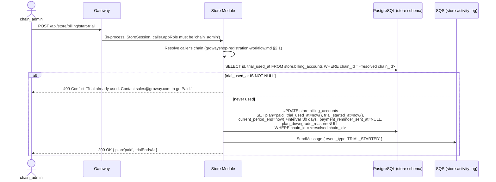
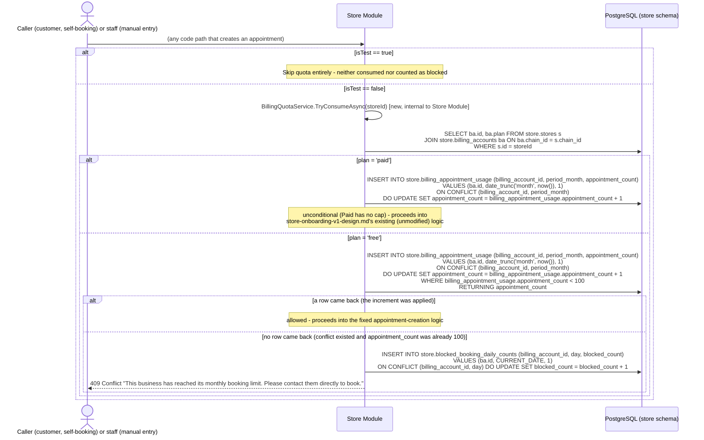
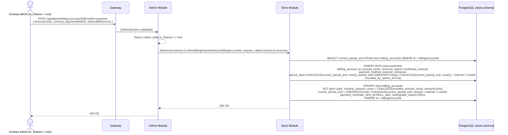
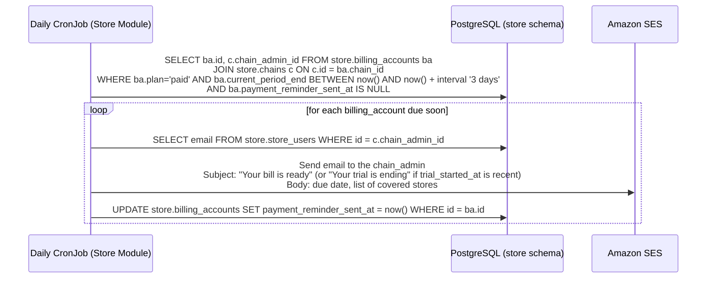
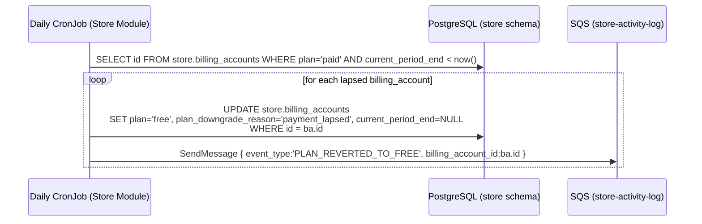
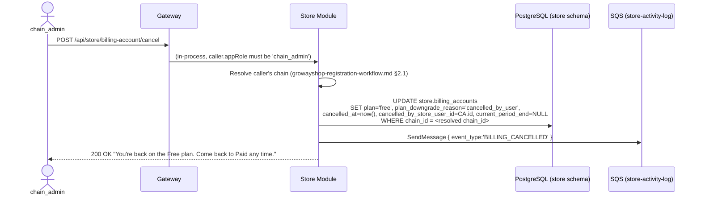

# Groway Billing Workflow — V1 (Free / Paid, Manual Payment Confirmation)

**Architecture:** see `groway-v1-architecture.md`. Lives entirely inside the **Store Module**, `store` schema — no new module, no new Gateway route group beyond what Store/Admin already have.

**Relationship to other documents:**
- `growayshop-registration-workflow.md` — creates the `billing_accounts` row at **chain creation time** (§7.1 there), anchored to `chain_id`. Login is **not affected by billing at all** — see §3 below for why.
- `growayadmin-registration-workflow.md` — same `is_finance` capability as before: only such an admin may confirm a payment.
- `groway-store-notifications-workflow.md` — a separate document that turns the blocked-booking counters defined here (§4) into a daily in-app message + email, sent to the chain's `chain_admin` only.
- `store-onboarding-v1-design.md` — fixed reference for `store.stores`/`store.appointments`, **not modified**. One additive call is inserted at the start of the appointment-creation code path (§4); `store.appointments.is_test` (defined there) is read by that same call.

**Terminology (2026-09-28):** billing is anchored to the **chain** (`store.chains`), never to an individual **store** or to any specific account. A store has no billing concept of its own.

**Supersedes:** this replaces the previous version of this document, which anchored billing to `store_admin_id` and then, in an intermediate revision, to merchants directly. Both are superseded now that `store.chains` is a first-class entity (`growayshop-registration-workflow.md`) — billing anchors to `chain_id` directly, which is simpler than either prior approach.

**Scope:** the two-plan model (Free/Paid), the one-time self-service Paid trial, manual monthly payment confirmation, and the appointment quota that makes Free meaningfully limited. All self-service billing actions are **`chain_admin`-only** — a `store_admin` has no billing visibility or capability whatsoever. Out of scope: automated payment collection (still no payment-gateway integration in V1); AI add-on billing (schema is a placeholder only, §9.1).

---

## 1. One billing account per chain, created at chain-creation time

```text
store.chains (1) ──chain_id (UNIQUE)──> store.billing_accounts (1)
      │
      └── store.stores (many) ── 100-appointment/month quota pooled across ALL stores in the chain (§4)
```

`billing_accounts.chain_id` is `UNIQUE NOT NULL` — exactly one billing account per chain, created in the same call that creates the chain (`growayshop-registration-workflow.md` §6.1), never inferred or backfilled after the fact. This is simpler than the two approaches this document went through before `store.chains` existed as a real entity: no "resolve which billing account these stores belong to" logic is needed anywhere, because the chain (and therefore its one billing account) is known at creation time, not derived later.

- **Only two plans: `free` and `paid`.** No Studio/Growth split.
- **Neither plan limits the number of stores or staff.** A five-store chain can sit on Free (and will simply share one 100-appointment/month quota across all five, §4). Each store still gets exactly one operational `store_admin` (`growayshop-registration-workflow.md` §2).
- **The only technical difference between the two plans is the appointment quota** (§4) and the feature rows already shown on the pricing page (member management, marketing tools) — nothing here introduces enforcement for those feature rows; they're a frontend/UI concern, not modeled in this document.
- **A store has no billing concept of its own.** Every self-service billing action in this document is `chain_admin`-only (§3, §7) — a `store_admin` cannot see or touch billing state at all, even for their own store.

---

## 2. Every chain starts on Free, permanently — there is no forced trial

`billing_accounts` rows are created with `plan='free'` and no expiry, at the same moment the chain itself is created. A chain can stay on Free forever. Nothing here automatically pushes anyone toward Paid or toward being locked out — the only route onto Paid is a deliberate action by the `chain_admin` (§3).

---

## 3. Self-service Paid trial — one-time, chain-wide, soft downgrade at the end, `chain_admin`-only



**Why `chain_admin`-only:** billing is a chain-wide concern, and `chain_admin` is the one account that exists specifically to act at that scope. A `store_admin` managing one store's day-to-day operations has no reason to be able to trigger a chain-wide plan change — and since a store has no billing concept of its own (§1), there is no "start a trial for just my store" to design in the first place.

**Why one flag (`trial_used_at`) is enough:** the trial can only ever be triggered once per chain, for the lifetime of that `billing_account` — checked before anything else happens. This does **not** mean the chain can never go Paid again after the trial lapses — only that they can't self-serve into a *second free trial*; going Paid a second time (or after ever lapsing) always goes through the manual `confirm-payment` path (§5). Resetting `trial_used_at` for a genuine exception is a direct, manual action by a Groway admin — not a designed endpoint, deliberately.

**Why this is chain-wide:** the trial flips `plan` on the one `billing_account` row that covers every store in the chain — every location gets unlimited quota the instant the trial starts, and every location reverts together when it ends (§6.2).

---

## 4. Appointment quota — the thing that actually makes Free limited

### 4.1 What counts, and where it's pooled

- **Free:** 100 appointments per calendar month, **shared across every store in the chain** (not 100 per store).
- **Paid:** unlimited.
- **An appointment counts the instant a row is inserted into `store.appointments`** — regardless of who created it (a customer self-booking, or staff entering a walk-in/phone booking) and regardless of what happens to it afterward (cancelled, no-show, rescheduled). Counting is by creation event, not by current status.
- **Exception: `store.appointments.is_test = TRUE`** (staff-marked test bookings, `store-onboarding-v1-design.md` §5) never counts, in either direction — it neither consumes quota nor triggers a blocked-booking count. This is the one carve-out `pricing-tiers-v1.md` calls for.

### 4.2 Where the check lives

`store-onboarding-v1-design.md` owns the `appointments` table and its creation logic, and stays fixed. The **only** change anywhere near it is one call inserted at the very start of every code path that creates an appointment (the public booking API and any staff-facing manual booking path alike), before that fixed logic runs:



**This has to be one statement, not read-then-write.** An earlier version of this diagram did `SELECT appointment_count` first, then decided whether to `INSERT`/`UPDATE` based on that value in application code — under concurrent requests near the boundary, two requests can both read `99`, both decide "allowed," and both increment, landing on `101`. The `INSERT ... ON CONFLICT DO UPDATE ... WHERE ... RETURNING` form above makes the read, the threshold check, and the write a single atomic operation: Postgres evaluates the `WHERE` clause and applies the update under the same row lock, so two concurrent callers hitting the same row are serialized by Postgres itself, and only one of them can ever be the one that pushes the count past 99. No advisory lock is needed — the conditional upsert already gives the same guarantee with one round trip instead of a separate lock/unlock step.

`TryConsumeAsync` is a plain `internal` class inside `Groway.Store` — not a cross-module call (billing, stores, and appointments all live in the same module/schema), so it needs no `CallerContext`/`*.Contracts` boundary.

### 4.3 What each side sees when blocked

- **The customer** gets an explicit, honest message (above) — never a silent failure or a generic error.
- **The `chain_admin`** sees only an aggregate count ("12 potential bookings were turned away today") via `groway-store-notifications-workflow.md` — never which customer, never any booking detail, and never the individual `store_admin` at the affected store (§6). `store.blocked_booking_daily_counts` is deliberately shaped to make this the only thing it *can* expose: it has no customer-identifying column at all.

---

## 5. Manual payment confirmation — one endpoint for both "first time going Paid" and "renewing"



This one endpoint covers every case that used to need separate handling: a Free chain paying to go Paid directly, a chain finishing its self-service trial and confirming payment before it lapses, a chain that already lapsed back to Free (§6.2) coming back later, and ordinary month-to-month renewal indefinitely. `GREATEST(now(), ...)` keeps the same meaning throughout: renewing early doesn't lose already-paid time; renewing late doesn't grant free days.

---

## 6. Daily scheduled job (Kubernetes CronJob, same pattern as before)

### 6.1 Advance reminder — "Your bill is ready" (reused for both trial-ending and renewal-due)



One job, one field (`payment_reminder_sent_at`) — a trial ending in 3 days and a monthly renewal due in 3 days are the same event from this job's point of view. `confirm-payment` (§5) resets the flag every time, so the next due date gets its own reminder. Exactly one recipient per chain now (`chain_admin`), since billing has exactly one accountable account per chain (§1) — no "could be more than one admin" branching needed, unlike an earlier version of this document.

### 6.2 Revert to Free — the one place trial-lapse and non-renewal are literally the same code



No login is touched, no Cognito call is made, no store/staff account is deactivated — the chain simply stops being unlimited and rejoins the shared 100/month pool (§4) starting the next appointment it tries to create. `plan_downgrade_reason='payment_lapsed'` distinguishes this from a voluntary cancel (§7's `'cancelled_by_user'`) for later reporting only; it has no behavioral effect.

---

## 7. Self-service cancel (voluntary, immediate downgrade — not a deactivation), `chain_admin`-only



There is no "locked out" state, so cancelling is no longer a scarier action than it needs to be — it just means "stop being Paid, right now," landing exactly on the same Free plan every chain starts on. Coming back is §5's `confirm-payment` endpoint; nothing else to design.

---

## 8. Endpoints

| Method & path | Caller | Purpose |
|---|---|---|
| `POST /api/store/billing/start-trial` | `chain_admin` only | One-time, chain-wide 30-day Paid trial (§3) |
| `GET /api/store/billing/status` | `chain_admin` only | Current plan, trial/period dates, this month's appointment usage — powers the in-app quota banner |
| `POST /api/admin/billing-accounts/{id}/confirm-payment` | Groway admin, `is_finance = true` | Confirm a payment; go/stay Paid for another month (§5) |
| `POST /api/store/billing-account/cancel` | `chain_admin` only | Immediately downgrade to Free (§7) |

Login (`POST /api/store/auth/login`) is completely unchanged — billing state never affects it, for any app role.

---

## 9. Database schema (`store` schema)

```sql
CREATE TABLE store.billing_accounts (
    id                             UUID PRIMARY KEY DEFAULT gen_random_uuid(),
    chain_id                       UUID NOT NULL UNIQUE REFERENCES store.chains(id),  -- the anchor (§1) - not store_admin_id, not any individual store
    plan                           VARCHAR(10) NOT NULL DEFAULT 'free' CHECK (plan IN ('free', 'paid')),
    plan_downgrade_reason          VARCHAR(20) CHECK (plan_downgrade_reason IN ('payment_lapsed', 'cancelled_by_user')),  -- NULL while plan='paid'
    trial_used_at                  TIMESTAMPTZ,             -- set once, forever - self-service trial is one-shot (§3)
    trial_started_at               TIMESTAMPTZ,
    current_period_end             TIMESTAMPTZ,             -- NULL while plan='free'; the trial end date or the next renewal due date while plan='paid'
    -- Payment fields, present now even though collection is manual in V1 - so
    -- wiring in a real payment processor later doesn't require a schema change.
    monthly_amount_cents           INT,
    currency                       VARCHAR(3)  NOT NULL DEFAULT 'CAD',
    payment_processor_customer_id  VARCHAR(255),
    default_payment_method_ref     VARCHAR(255),
    payment_reminder_sent_at       TIMESTAMPTZ,             -- idempotency guard for §6.1, reset on every confirm-payment/trial-start
    cancelled_at                   TIMESTAMPTZ,
    cancelled_by_store_user_id     UUID REFERENCES store.store_users(id),
    created_at                     TIMESTAMPTZ NOT NULL DEFAULT now(),
    updated_at                     TIMESTAMPTZ NOT NULL DEFAULT now()
);

CREATE INDEX idx_billing_accounts_current_period_end ON store.billing_accounts(current_period_end) WHERE plan = 'paid';

-- One row per confirmed payment. In V1 every row is entered manually by a
-- finance admin; a future automated integration would insert rows here from
-- a payment-processor webhook instead - same table, no migration needed.
CREATE TABLE store.payments (
    id                    UUID PRIMARY KEY DEFAULT gen_random_uuid(),
    billing_account_id    UUID NOT NULL REFERENCES store.billing_accounts(id),
    amount_cents          INT  NOT NULL,
    currency              VARCHAR(3) NOT NULL DEFAULT 'CAD',
    status                VARCHAR(20) NOT NULL DEFAULT 'confirmed_manual' CHECK (status IN ('confirmed_manual', 'paid', 'failed', 'refunded')),
    payment_method        VARCHAR(20) NOT NULL DEFAULT 'manual' CHECK (payment_method IN ('manual', 'card', 'bank_transfer', 'other')),
    external_reference    VARCHAR(255),
    period_start          TIMESTAMPTZ NOT NULL,
    period_end            TIMESTAMPTZ NOT NULL,
    recorded_by_admin_id  UUID,
    created_at            TIMESTAMPTZ NOT NULL DEFAULT now()
);

CREATE INDEX idx_payments_billing_account_id ON store.payments(billing_account_id);

-- Appointment quota usage, pooled per chain per calendar month (§4.1).
-- One row per (billing_account, month); upserted on every non-test appointment creation.
CREATE TABLE store.billing_appointment_usage (
    billing_account_id  UUID NOT NULL REFERENCES store.billing_accounts(id),
    period_month         DATE NOT NULL,   -- always the 1st of the month, e.g. '2026-09-01'
    appointment_count    INT  NOT NULL DEFAULT 0,
    updated_at           TIMESTAMPTZ NOT NULL DEFAULT now(),
    PRIMARY KEY (billing_account_id, period_month)
);

-- Blocked-booking counts, aggregated per day - deliberately has no customer
-- identity column at all (§4.3). Feeds groway-store-notifications-workflow.md.
CREATE TABLE store.blocked_booking_daily_counts (
    billing_account_id  UUID NOT NULL REFERENCES store.billing_accounts(id),
    day                  DATE NOT NULL,
    blocked_count        INT  NOT NULL DEFAULT 0,
    PRIMARY KEY (billing_account_id, day)
);

-- Groway admins gain one capability flag, unchanged from earlier versions of
-- this document.
ALTER TABLE admin.admins ADD COLUMN is_finance BOOLEAN NOT NULL DEFAULT FALSE;
```

### 9.1 AI add-on services — placeholder only, no functionality in V1

Same "build the shape now, wire it up later" principle as the payment-processor fields above. No AI feature exists yet; this table exists only so a future AI add-on doesn't need a schema migration to bill for itself.

```sql
CREATE TABLE store.ai_addon_subscriptions (
    id                    UUID PRIMARY KEY DEFAULT gen_random_uuid(),
    billing_account_id    UUID NOT NULL REFERENCES store.billing_accounts(id),
    addon_type            VARCHAR(30) NOT NULL CHECK (addon_type IN ('smart_frontdesk', 'gap_filling', 'customer_recall', 'after_hours')),
    pricing_model         VARCHAR(20) NOT NULL CHECK (pricing_model IN ('flat_monthly', 'commission', 'per_success')),
    monthly_amount_cents  INT,             -- used when pricing_model = 'flat_monthly'
    commission_bps        INT,             -- basis points, e.g. 1000 = 10%; used when pricing_model = 'commission'
    status                VARCHAR(20) NOT NULL DEFAULT 'inactive' CHECK (status IN ('inactive', 'active', 'cancelled')),
    activated_at          TIMESTAMPTZ,
    cancelled_at          TIMESTAMPTZ,
    created_at            TIMESTAMPTZ NOT NULL DEFAULT now()
);
```

Nothing reads or writes this table anywhere else in this version — no endpoint, no job, no enforcement.

---

## 10. Test data

```sql
-- Selah Head Spa's billing account - one row for the whole chain (both stores),
-- used the self-service trial once via its chain_admin, now an ordinary Paid
-- customer, one payment recorded by Maria Ops (is_finance).
INSERT INTO store.billing_accounts (id, chain_id, plan, trial_used_at, trial_started_at, current_period_end, monthly_amount_cents, currency, payment_reminder_sent_at, created_at)
VALUES ('bb111111-1111-1111-1111-111111111111',
        'cc111111-1111-1111-1111-111111111111',  -- the chain, from growayshop-registration-workflow.md test data
        'paid', '2026-08-20 10:00:00-04', '2026-08-20 10:00:00-04', '2026-10-20 10:00:00-04',
        9900, 'CAD', NULL, '2026-08-20 10:00:00-04');

INSERT INTO store.payments (billing_account_id, amount_cents, currency, status, payment_method, external_reference, period_start, period_end, recorded_by_admin_id)
VALUES ('bb111111-1111-1111-1111-111111111111', 9900, 'CAD', 'confirmed_manual', 'bank_transfer', 'ETR-20260920-001',
        '2026-09-20 10:00:00-04', '2026-10-20 10:00:00-04', 'a2222222-2222-2222-2222-222222222222');

-- A second, unrelated, hypothetical chain (no real store.chains/stores rows
-- back it in these fixtures): used its one-shot trial back in August, didn't
-- pay, got reverted to Free by §6.2's job, and has already used most of this
-- month's shared 100-appointment quota. Test case for §4.2's "blocked" branch.
INSERT INTO store.billing_accounts (id, chain_id, plan, plan_downgrade_reason, trial_used_at, trial_started_at, current_period_end, created_at)
VALUES ('bb222222-2222-2222-2222-222222222222',
        'cc999999-9999-9999-9999-999999999999',  -- a different, hypothetical chain
        'free', 'payment_lapsed', '2026-08-10 00:00:00-04', '2026-08-10 00:00:00-04', NULL, '2026-08-10 00:00:00-04');

INSERT INTO store.billing_appointment_usage (billing_account_id, period_month, appointment_count)
VALUES ('bb222222-2222-2222-2222-222222222222', '2026-09-01', 100);

INSERT INTO store.blocked_booking_daily_counts (billing_account_id, day, blocked_count)
VALUES ('bb222222-2222-2222-2222-222222222222', '2026-09-28', 7);
```

*The second chain (`bb222222...`) demonstrates the full soft-downgrade lifecycle: trial used once, never converted to Paid, auto-reverted to Free, now pooling its 100/month quota across its stores and already turning away customers (7 blocked today) — this is the exact scenario `groway-store-notifications-workflow.md`'s daily digest is built to surface, and it will reach exactly one person: that chain's `chain_admin`.*

---

## 11. Open questions

1. **What happens to a customer's already-booked appointment** when a chain drops from Paid to Free mid-month, if that pushes the chain over the 100/month quota retroactively — not designed. Current behavior: existing appointments are untouched; only *new* creation attempts are checked (§4.2).
2. **Currency is hardcoded to a single value per account** (`CAD` default) — fine for a single-country V1; multi-currency isn't designed.
3. **No proration or partial-month handling** beyond the `GREATEST()` rule in §5.
4. **Resetting `trial_used_at` for a one-off exception** is a direct manual action (§3), not a designed endpoint.
5. **Merging two already-separate chains' billing accounts** (e.g. two independently-onboarded chains turn out to be the same owner) isn't designed — expected to be rare enough to handle by hand if it ever comes up.
6. **Selah Head Spa's own arrangement**: Steven has noted Selah Head Spa and Groway are effectively one company, so no real money changes hands there in practice. Nothing in this schema special-cases that — Groway admin can simply call `confirm-payment` with `amountCents=0` to keep that chain on Paid indefinitely. Test data (§10) shows it as an ordinary paid account for illustration only.
