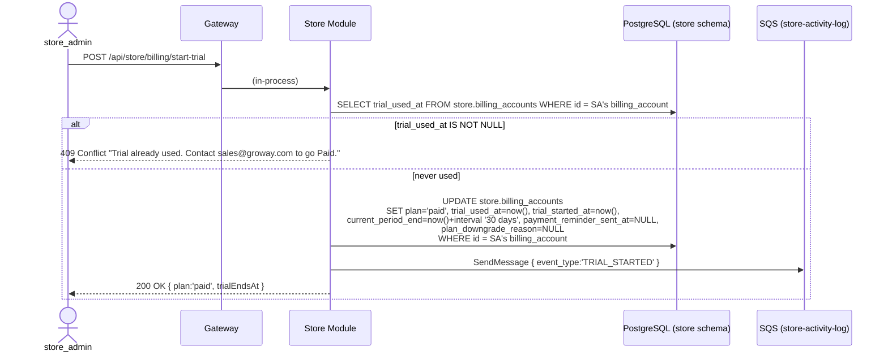
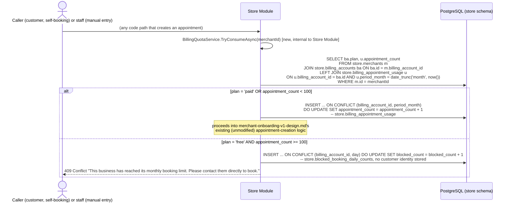
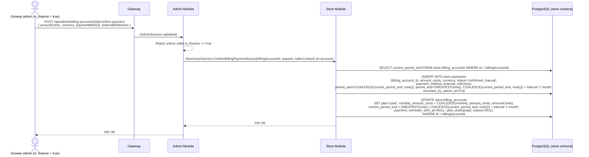
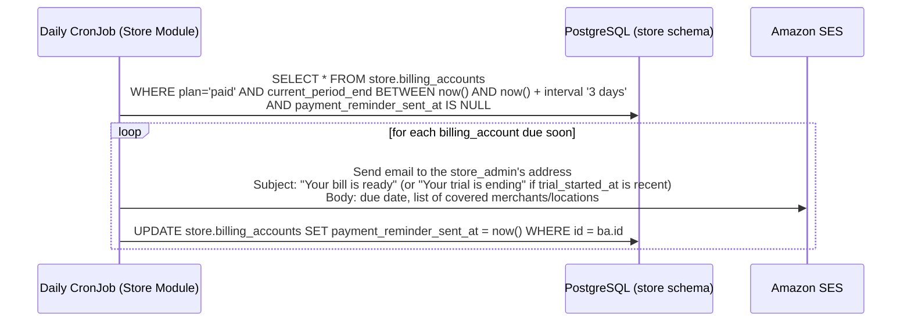
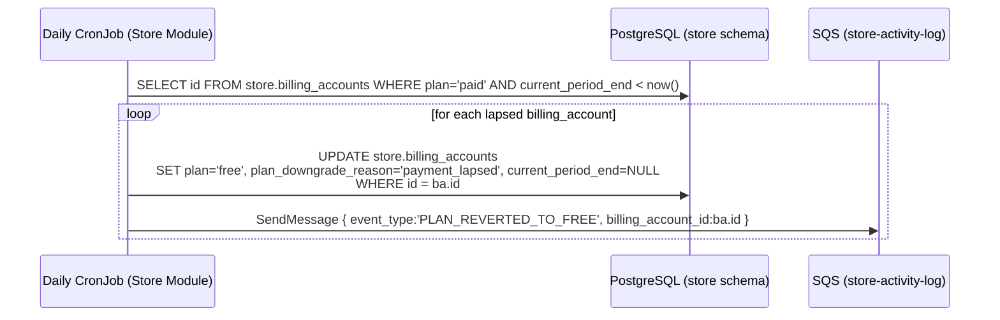
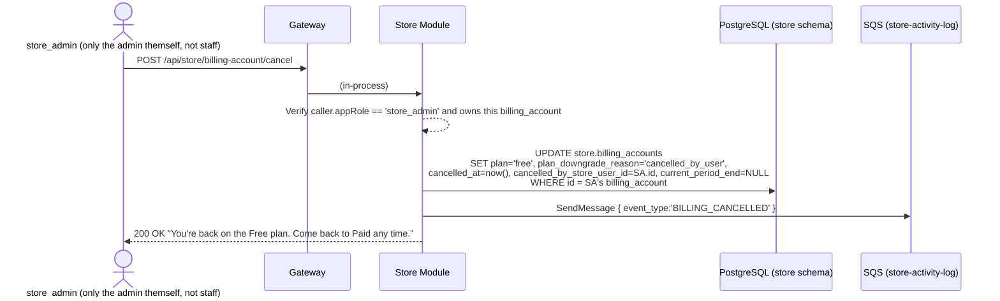

# Groway Billing Workflow — V1 (Free / Paid, Manual Payment Confirmation)

**Architecture:** see `groway-v1-architecture.md`. Lives entirely inside the **Store Module**, `store` schema — no new module, no new Gateway route group beyond what Store/Admin already have.

**Relationship to other documents:**
- `growayshop-registration-workflow.md` — creating a `store_admin` account still creates the `billing_accounts` row that governs it (§6.1 there). It now defaults to `plan='free'` with no expiry, instead of a 1-month trial. Login (§6.3 there) is **no longer affected by billing at all** — see §3 below for why.
- `growayadmin-registration-workflow.md` — same `is_finance` capability as the previous version of this document: only such an admin may confirm a payment.
- `groway-store-notifications-workflow.md` — a separate, new document that turns the blocked-booking counters defined here (§4) into a daily in-app message + email. This document only produces the counters; it does not design the message board itself.
- `merchant-onboarding-v1-design.md` — fixed reference, **not modified**. One additive call is inserted at the start of its appointment-creation code path (§4); no change to its tables or its own logic.

**Supersedes:** this replaces the previous version of this document entirely — rewritten from scratch, not patched. The underlying pricing model changed (a single-tier, hard-expiry 1-month trial became a permanent Free plan + a one-time self-service Paid trial + soft downgrade), so most of the old mechanism (login-blocking, `access_expires_at` as a security gate, `inactive_reason`) no longer applies.

**Scope:** the two-plan model (Free/Paid), the one-time self-service Paid trial, manual monthly payment confirmation, and the appointment quota that makes Free meaningfully limited. Out of scope: automated payment collection (still no payment-gateway integration in V1); AI add-on billing (schema is a placeholder only, §7).

---

## 1. Two plans, no store/staff-count limits on either

```text
store_admin (1) ──── billing_account (1) ──── merchants (many)
```

One `billing_account` per chain (per `store_admin`), same as before — a chain pays once for everything it manages, never store-by-store. What's different this time:

- **Only two plans: `free` and `paid`.** No Studio/Growth split.
- **Neither plan limits the number of stores or staff.** The "1 store / 1 person" language on the public pricing page describes the *typical* Free customer, not a technical cap — a five-location chain can sit on Free (and will simply share one 100-appointment/month quota across all five, §4).
- **The only technical difference between the two plans is the appointment quota** (§4) and the feature rows already shown on the pricing page (member management, marketing tools) — nothing here introduces enforcement for those feature rows; they're a frontend/UI concern, not modeled in this document.

---

## 2. Every chain starts on Free, permanently — there is no forced trial

New `billing_accounts` rows are created with `plan='free'` and no expiry (§6.1 of `growayshop-registration-workflow.md`, updated). A chain can stay on Free forever. Nothing here automatically pushes anyone toward Paid or toward being locked out — the only route onto Paid is a deliberate action (§3).

---

## 3. Self-service Paid trial — one-time, chain-wide, soft downgrade at the end



**Why one flag (`trial_used_at`) is enough:** the trial can only ever be triggered once per chain, for the lifetime of that `billing_account` — checked before anything else happens. This is a hard, permanent lock at the self-service layer. It does **not** mean the chain can never go Paid again after the trial lapses — only that they can't self-serve into a *second free trial*; going Paid a second time (or after ever lapsing) always goes through the manual `confirm-payment` path (§5), same as it would for a brand-new Paid customer. Resetting `trial_used_at` for a genuine exception is a direct, manual action by a Groway admin — not a designed endpoint, deliberately (this should stay rare and visible, not a self-service button).

**Why this is chain-wide, not per-merchant:** the trial flips `plan` on the one `billing_account` row that already covers every merchant under that `store_admin` — every location gets full features and unlimited quota the instant the trial starts, and every location reverts together when it ends (§4.2). There's no per-merchant trial state to design, because there's no per-merchant billing state to begin with (§1).

---

## 4. Appointment quota — the thing that actually makes Free limited

### 4.1 What counts, and where it's pooled

- **Free:** 100 appointments per calendar month, **shared across every merchant in the chain** (not 100 per store).
- **Paid:** unlimited.
- **An appointment counts the instant a row is inserted into `store.appointments`** — regardless of who created it (a customer self-booking, or staff entering a walk-in/phone booking) and regardless of what happens to it afterward (cancelled, no-show, rescheduled). Counting is by creation event, not by current status.

### 4.2 Where the check lives

`merchant-onboarding-v1-design.md` owns the `appointments` table and its creation logic, and stays fixed. The **only** change anywhere near it is one call inserted at the very start of every code path that creates an appointment (the public booking API and any staff-facing manual booking path alike), before that fixed logic runs:



`TryConsumeAsync` is a plain `internal` class inside `Groway.Store` — not a cross-module call (billing, merchants, and appointments all live in the same module/schema), so it needs no `CallerContext`/`*.Contracts` boundary.

### 4.3 What each side sees when blocked

- **The customer** gets an explicit, honest message (above) — never a silent failure or a generic error.
- **The merchant** sees only an aggregate count ("12 potential bookings were turned away today") via `groway-store-notifications-workflow.md` — never which customer, never any booking detail. `store.blocked_booking_daily_counts` is deliberately shaped to make this the only thing it *can* expose: it has no customer-identifying column at all.

---

## 5. Manual payment confirmation — one endpoint for both "first time going Paid" and "renewing"



This one endpoint covers every case that used to need separate handling:

- A Free chain that never used the self-service trial, paying to go Paid directly (`current_period_end` was `NULL`, so `COALESCE(..., now())` starts the period from today).
- A chain finishing its self-service trial and confirming payment before it lapses (extends from `current_period_end`, no lost days).
- A chain that already lapsed back to Free (§4.2's revert job) coming back later — this is the same call, not a separate "reactivate" endpoint, because paying again is paying again regardless of why access had lapsed.
- Ordinary month-to-month renewal, indefinitely, for as long as the chain stays Paid.

`GREATEST(now(), ...)` keeps the same meaning as before: renewing early doesn't lose already-paid time; renewing late doesn't grant free days.

---

## 6. Daily scheduled job (Kubernetes CronJob, same pattern as before)

### 6.1 Advance reminder — "Your bill is ready" (reused for both trial-ending and renewal-due)



One job, one field (`payment_reminder_sent_at`) — a trial ending in 3 days and a monthly renewal due in 3 days are the same event from this job's point of view: "`plan='paid'` and `current_period_end` is close." `confirm-payment` (§5) resets the flag every time, so the next due date gets its own reminder.

### 6.2 Revert to Free — the one place trial-lapse and non-renewal are literally the same code



No login is touched, no Cognito call is made, no store/staff account is deactivated — the chain simply stops being unlimited and rejoins the shared 100/month pool (§4) starting the next appointment it tries to create. `plan_downgrade_reason='payment_lapsed'` distinguishes this from a voluntary cancel (§7's `'cancelled_by_user'`) for later reporting only; it has no behavioral effect.

---

## 7. Self-service cancel (voluntary, immediate downgrade — not a deactivation)



There is no "locked out" state anymore, so cancelling is no longer a scarier action than it needs to be — it just means "stop being Paid, right now," landing exactly on the same Free plan everyone starts on. Coming back is §5's `confirm-payment` endpoint (or, if `trial_used_at` was never set — unusual, since starting a trial sets it immediately — the trial endpoint); nothing else to design.

---

## 8. Endpoints

| Method & path | Caller | Purpose |
|---|---|---|
| `POST /api/store/billing/start-trial` | `store_admin` (self) | One-time, chain-wide 30-day Paid trial (§3) |
| `GET /api/store/billing/status` | `store_admin` | Current plan, trial/period dates, this month's appointment usage — powers the in-app quota banner |
| `POST /api/admin/billing-accounts/{id}/confirm-payment` | Groway admin, `is_finance = true` | Confirm a payment; go/stay Paid for another month (§5) |
| `POST /api/store/billing-account/cancel` | `store_admin` (self) | Immediately downgrade to Free (§7) |

Login (`POST /api/store/auth/login`) is completely unchanged — billing state no longer affects it at all, unlike the previous version of this document.

---

## 9. Database schema (`store` schema)

```sql
CREATE TABLE store.billing_accounts (
    id                             UUID PRIMARY KEY DEFAULT gen_random_uuid(),
    store_admin_id                 UUID NOT NULL REFERENCES store.store_users(id),
    plan                           VARCHAR(10) NOT NULL DEFAULT 'free' CHECK (plan IN ('free', 'paid')),
    plan_downgrade_reason          VARCHAR(20) CHECK (plan_downgrade_reason IN ('payment_lapsed', 'cancelled_by_user')),  -- NULL while plan='paid'
    trial_used_at                  TIMESTAMPTZ,             -- set once, forever - self-service trial is one-shot (§3)
    trial_started_at               TIMESTAMPTZ,
    current_period_end             TIMESTAMPTZ,             -- NULL while plan='free'; the trial end date or the next renewal due date while plan='paid'
    -- Payment fields, present now even though collection is manual in V1 - so
    -- wiring in a real payment processor later doesn't require a schema change.
    monthly_amount_cents           INT,
    currency                       VARCHAR(3)  NOT NULL DEFAULT 'CAD',
    payment_processor_customer_id  VARCHAR(255),
    default_payment_method_ref     VARCHAR(255),
    payment_reminder_sent_at       TIMESTAMPTZ,             -- idempotency guard for §6.1, reset on every confirm-payment/trial-start
    cancelled_at                   TIMESTAMPTZ,
    cancelled_by_store_user_id     UUID REFERENCES store.store_users(id),
    created_at                     TIMESTAMPTZ NOT NULL DEFAULT now(),
    updated_at                     TIMESTAMPTZ NOT NULL DEFAULT now()
);

CREATE INDEX idx_billing_accounts_current_period_end ON store.billing_accounts(current_period_end) WHERE plan = 'paid';

-- merchants gains a link to the one billing account covering it (unchanged from before).
ALTER TABLE store.merchants ADD COLUMN billing_account_id UUID REFERENCES store.billing_accounts(id);

-- One row per confirmed payment. In V1 every row is entered manually by a
-- finance admin; a future automated integration would insert rows here from
-- a payment-processor webhook instead - same table, no migration needed.
CREATE TABLE store.payments (
    id                    UUID PRIMARY KEY DEFAULT gen_random_uuid(),
    billing_account_id    UUID NOT NULL REFERENCES store.billing_accounts(id),
    amount_cents          INT  NOT NULL,
    currency              VARCHAR(3) NOT NULL DEFAULT 'CAD',
    status                VARCHAR(20) NOT NULL DEFAULT 'confirmed_manual' CHECK (status IN ('confirmed_manual', 'paid', 'failed', 'refunded')),
    payment_method        VARCHAR(20) NOT NULL DEFAULT 'manual' CHECK (payment_method IN ('manual', 'card', 'bank_transfer', 'other')),
    external_reference    VARCHAR(255),
    period_start          TIMESTAMPTZ NOT NULL,
    period_end            TIMESTAMPTZ NOT NULL,
    recorded_by_admin_id  UUID,
    created_at            TIMESTAMPTZ NOT NULL DEFAULT now()
);

CREATE INDEX idx_payments_billing_account_id ON store.payments(billing_account_id);

-- Appointment quota usage, pooled per chain per calendar month (§4.1).
-- One row per (billing_account, month); upserted on every appointment creation.
CREATE TABLE store.billing_appointment_usage (
    billing_account_id  UUID NOT NULL REFERENCES store.billing_accounts(id),
    period_month         DATE NOT NULL,   -- always the 1st of the month, e.g. '2026-09-01'
    appointment_count    INT  NOT NULL DEFAULT 0,
    updated_at           TIMESTAMPTZ NOT NULL DEFAULT now(),
    PRIMARY KEY (billing_account_id, period_month)
);

-- Blocked-booking counts, aggregated per day - deliberately has no customer
-- identity column at all (§4.3). Feeds groway-store-notifications-workflow.md.
CREATE TABLE store.blocked_booking_daily_counts (
    billing_account_id  UUID NOT NULL REFERENCES store.billing_accounts(id),
    day                  DATE NOT NULL,
    blocked_count        INT  NOT NULL DEFAULT 0,
    PRIMARY KEY (billing_account_id, day)
);

-- Groway admins gain one capability flag, unchanged from the previous version
-- of this document.
ALTER TABLE admin.admins ADD COLUMN is_finance BOOLEAN NOT NULL DEFAULT FALSE;
```

### 9.1 AI add-on services — placeholder only, no functionality in V1

Same "build the shape now, wire it up later" principle as the payment-processor fields above. No AI feature exists yet; this table exists only so a future AI add-on doesn't need a schema migration to bill for itself.

```sql
CREATE TABLE store.ai_addon_subscriptions (
    id                    UUID PRIMARY KEY DEFAULT gen_random_uuid(),
    billing_account_id    UUID NOT NULL REFERENCES store.billing_accounts(id),
    addon_type            VARCHAR(30) NOT NULL CHECK (addon_type IN ('smart_frontdesk', 'gap_filling', 'customer_recall', 'after_hours')),
    pricing_model         VARCHAR(20) NOT NULL CHECK (pricing_model IN ('flat_monthly', 'commission', 'per_success')),
    monthly_amount_cents  INT,             -- used when pricing_model = 'flat_monthly'
    commission_bps        INT,             -- basis points, e.g. 1000 = 10%; used when pricing_model = 'commission'
    status                VARCHAR(20) NOT NULL DEFAULT 'inactive' CHECK (status IN ('inactive', 'active', 'cancelled')),
    activated_at          TIMESTAMPTZ,
    cancelled_at          TIMESTAMPTZ,
    created_at            TIMESTAMPTZ NOT NULL DEFAULT now()
);
```

Nothing reads or writes this table anywhere else in this version — no endpoint, no job, no enforcement. It's here purely so the column shapes exist before the first real AI feature needs them.

---

## 10. Test data

```sql
-- Selah Head Spa owner's billing account - used the self-service trial once,
-- is now an ordinary Paid customer, one payment recorded by Maria Ops (is_finance).
INSERT INTO store.billing_accounts (id, store_admin_id, plan, trial_used_at, trial_started_at, current_period_end, monthly_amount_cents, currency, payment_reminder_sent_at, created_at)
VALUES ('bb111111-1111-1111-1111-111111111111',
        'c1111111-1111-1111-1111-111111111111',  -- the owner, from growayshop-registration-workflow.md test data
        'paid', '2026-08-20 10:00:00-04', '2026-08-20 10:00:00-04', '2026-10-20 10:00:00-04',
        9900, 'CAD', NULL, '2026-08-20 10:00:00-04');

UPDATE store.merchants SET billing_account_id = 'bb111111-1111-1111-1111-111111111111'
WHERE id IN ('99999999-0000-0000-0000-000000000001', '99999999-0000-0000-0000-000000000002');

INSERT INTO store.payments (billing_account_id, amount_cents, currency, status, payment_method, external_reference, period_start, period_end, recorded_by_admin_id)
VALUES ('bb111111-1111-1111-1111-111111111111', 9900, 'CAD', 'confirmed_manual', 'bank_transfer', 'ETR-20260920-001',
        '2026-09-20 10:00:00-04', '2026-10-20 10:00:00-04', 'a2222222-2222-2222-2222-222222222222');

-- A second, unrelated chain: used its one-shot trial back in August, didn't pay,
-- got reverted to Free by §6.2's job, and has already used most of this month's
-- shared 100-appointment quota. Test case for §4.2's "blocked" branch.
INSERT INTO store.billing_accounts (id, store_admin_id, plan, plan_downgrade_reason, trial_used_at, trial_started_at, current_period_end, created_at)
VALUES ('bb222222-2222-2222-2222-222222222222',
        'c9999999-9999-9999-9999-999999999999',  -- a different, hypothetical store_admin
        'free', 'payment_lapsed', '2026-08-10 00:00:00-04', '2026-08-10 00:00:00-04', NULL, '2026-08-10 00:00:00-04');

INSERT INTO store.billing_appointment_usage (billing_account_id, period_month, appointment_count)
VALUES ('bb222222-2222-2222-2222-222222222222', '2026-09-01', 100);

INSERT INTO store.blocked_booking_daily_counts (billing_account_id, day, blocked_count)
VALUES ('bb222222-2222-2222-2222-222222222222', '2026-09-28', 7);
```

*The second chain (`bb222222...`) demonstrates the full soft-downgrade lifecycle: trial used once, never converted to Paid, auto-reverted to Free, now pooling its 100/month quota across its merchants and already turning away customers (7 blocked today) — this is the exact scenario `groway-store-notifications-workflow.md`'s daily digest is built to surface.*

---

## 11. Open questions

1. **What happens to a customer's already-booked appointment** when their merchant's chain drops from Paid to Free mid-month, if that pushes the chain over the 100/month quota retroactively — not designed. Current behavior: existing appointments are untouched; only *new* creation attempts are checked (§4.2), so no existing booking is ever cancelled by a plan change.
2. **Currency is hardcoded to a single value per account** (`CAD` default) — fine for a single-country V1; multi-currency isn't designed.
3. **No proration or partial-month handling** beyond the `GREATEST()` rule in §5.
4. **Resetting `trial_used_at` for a one-off exception** is a direct manual action (§3), not a designed endpoint — if this becomes a recurring support request, it should get a proper admin-facing endpoint instead of a database edit.
5. **Selah Head Spa's own arrangement**: Steven has noted Selah Head Spa and Groway are effectively one company, so no real money changes hands there in practice. Nothing in this schema special-cases that — Groway admin can simply call `confirm-payment` with `amountCents=0` (or any agreed value) to keep that chain on Paid indefinitely, the same mechanism as any other customer. Test data (§10) shows it as an ordinary paid account for illustration only.
