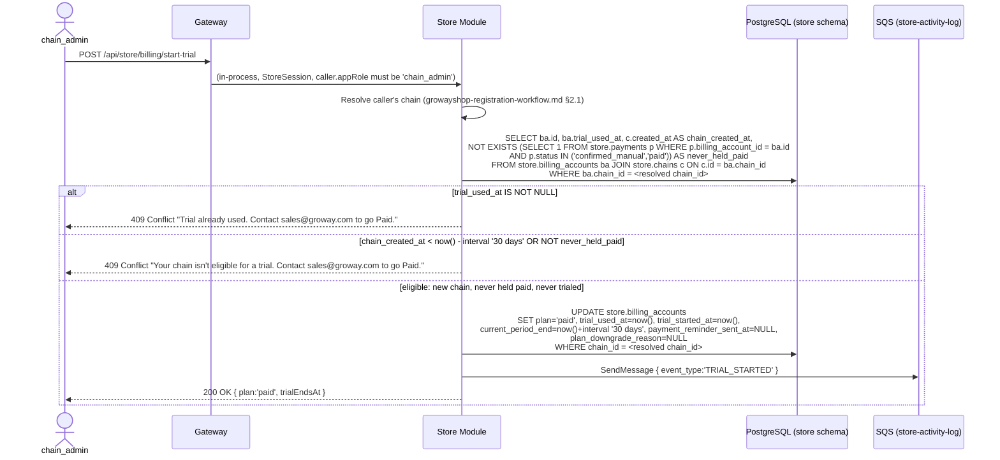
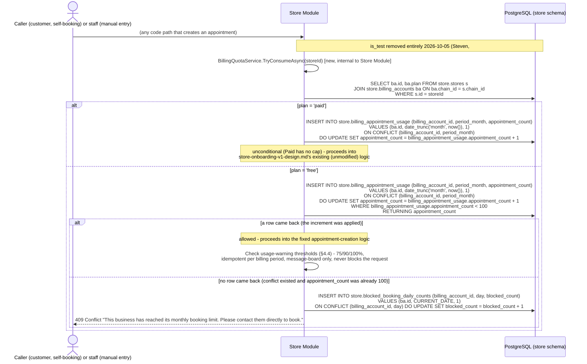
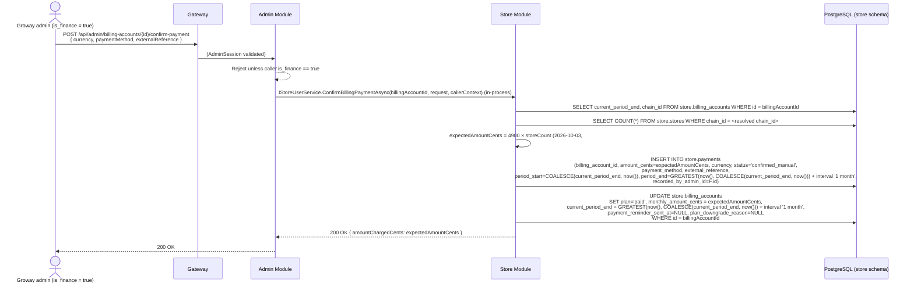
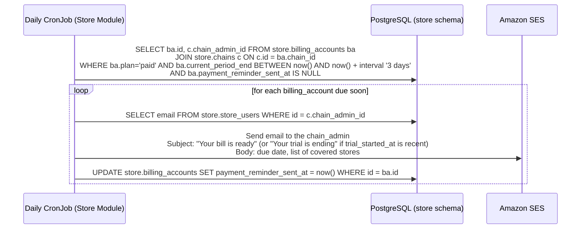
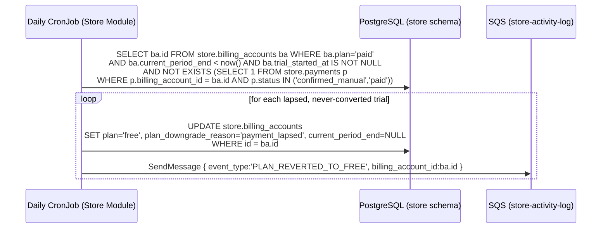

# Groway Billing Workflow — V1 (Free / Paid, Manual Payment Confirmation)

**Architecture:** see `groway-v1-architecture.md`. Lives entirely inside the **Store Module**, `store` schema — no new module, no new Gateway route group beyond what Store/Admin already have.

**Relationship to other documents:**
- `growayshop-registration-workflow.md` — creates the `billing_accounts` row at **chain creation time** (§7.1 there), anchored to `chain_id`. Login is **not affected by billing at all** — see §3 below for why.
- `growayadmin-registration-workflow.md` — same `is_finance` capability as before: only such an admin may confirm a payment.
- `groway-store-notifications-workflow.md` — a separate document that turns each blocked-booking event into a real-time, escalating in-app toast (2026-10-03, #16 — replaces an earlier daily-digest design), sent to the chain's `chain_admin` and every `store_admin` in the chain.
- `store-onboarding-v1-design.md` — fixed reference for `store.stores`/`store.appointments`, **not modified**. One additive call is inserted at the start of the appointment-creation code path (§4) — a plain quota check that reads no `is_test` column, because none exists: `store.appointments.is_test` **was removed entirely 2026-10-05 (Steven)** — not deferred, as an earlier revision of this line said; see §4.1.
- `beauty-map-postgis-schema-design.md` — **2026-10-03: `store.stores.is_test` is dropped entirely** (Steven, #6) — no longer a dependency of this document. The store-level quota exemption that used to read it (§4.1/§4.2) is removed, not deferred. (The appointment-level `is_test` flag discussed in the bullet above is a separate, second mechanism, also now removed — see §4.1.)

**Terminology (2026-09-28):** billing is anchored to the **chain** (`store.chains`), never to an individual **store** or to any specific account. A store has no billing concept of its own.

**Supersedes:** this replaces the previous version of this document, which anchored billing to `store_admin_id` and then, in an intermediate revision, to merchants directly. Both are superseded now that `store.chains` is a first-class entity (`growayshop-registration-workflow.md`) — billing anchors to `chain_id` directly, which is simpler than either prior approach.

**Scope:** the two-plan model (Free/Paid), the one-time self-service Paid trial, manual monthly payment confirmation, and the appointment quota that makes Free meaningfully limited. All self-service billing actions are **`chain_admin`-only** — a `store_admin` has no billing visibility or capability whatsoever. Out of scope: automated payment collection (still no payment-gateway integration in V1); AI add-on billing (schema is a placeholder only, §9.1).

---

## 1. One billing account per chain, created at chain-creation time

```text
store.chains (1) ──chain_id (UNIQUE)──> store.billing_accounts (1)
      │
      └── store.stores (many) ── 100-appointment/month quota pooled across ALL stores in the chain (§4)
```

`billing_accounts.chain_id` is `UNIQUE NOT NULL` — exactly one billing account per chain, created in the same call that creates the chain (`growayshop-registration-workflow.md` §6.1), never inferred or backfilled after the fact. This is simpler than the two approaches this document went through before `store.chains` existed as a real entity: no "resolve which billing account these stores belong to" logic is needed anywhere, because the chain (and therefore its one billing account) is known at creation time, not derived later.

- **Only two plans: `free` and `paid`.** No Studio/Growth split.
- **Neither plan limits the number of stores or staff.** A five-store chain can sit on Free (and will simply share one 100-appointment/month quota across all five, §4). Each store still gets exactly one operational `store_admin` (`growayshop-registration-workflow.md` §2).
- **The only technical difference between the two plans is the appointment quota** (§4) and the feature rows already shown on the pricing page (member management, marketing tools) — nothing here introduces enforcement for those feature rows; they're a frontend/UI concern, not modeled in this document.
- **A store has no billing concept of its own.** Every self-service billing action in this document is `chain_admin`-only (§3, §7) — a `store_admin` cannot see or touch billing state at all, even for their own store.

---

## 1a. Plan derivation — the single source for badges and feature gating (2026-10-03, Steven, #7/#17)

```text
derive_plan(chain_id):
    ba = SELECT plan FROM store.billing_accounts WHERE chain_id = :chain_id
    if ba.plan = 'free': return 'free'
    has_ai = EXISTS(SELECT 1 FROM store.ai_addon_subscriptions
                     WHERE billing_account_id = ba.id AND status = 'active')
    return 'paid_ai' if has_ai else 'paid'
```

Never stored — recomputed at render/check time from `billing_accounts.plan` and `ai_addon_subscriptions.status` (the latter table already exists, §9.1, as a documented placeholder with no V1 writer — `derive_plan` is its first reader, but nothing in V1 ever sets a row to `status='active'`, so `'paid_ai'` is a correctly-wired, currently-unreachable outcome; only `'free'`/`'paid'` ever actually return in V1). Upgrade/downgrade is automatic because there's no stored UI state to update — a plan change takes effect the instant `billing_accounts.plan` changes.

**Two consumers, same function, never two implementations:**
- **Plan badges (#7):** back-office header/sidebar, the billing page, and the Groway admin chain/store list render `Free` (gray) / `Paid` (brand color) / `Paid + AI` (purple + ✨) from this exact return value. **Never shown on any customer-facing surface** — a business's plan tier is never badged to its own customers. Naming is `Free`/`Paid`/`Paid + AI` everywhere, English-only (#22); a future marketing rename changes in one place.
- **Deposit/pre-auth feature gating (#17):** `payment-deposit-preauth-design.md` §1/§5 calls `derive_plan(chain_id) != 'free'` as its gate. See that document for the enforcement detail — deposit collection itself is V1.1+ backlog; only this gating rule is recorded now.

---

## 2. Every chain starts on Free, permanently — there is no forced trial

`billing_accounts` rows are created with `plan='free'` and no expiry, at the same moment the chain itself is created. A chain can stay on Free forever. Nothing here automatically pushes anyone toward Paid or toward being locked out — the only route onto Paid is a deliberate action by the `chain_admin` (§3).

---

## 3. Self-service Paid trial — one-time, chain-wide, soft downgrade at the end, `chain_admin`-only, **eligibility tightened 2026-10-05**



**Why `chain_admin`-only:** billing is a chain-wide concern, and `chain_admin` is the one account that exists specifically to act at that scope. A `store_admin` managing one store's day-to-day operations has no reason to be able to trigger a chain-wide plan change — and since a store has no billing concept of its own (§1), there is no "start a trial for just my store" to design in the first place.

**Eligibility now requires three conditions at once, all checked before the one-shot flag even matters (2026-10-05, Steven):** the chain was created ≤30 days ago, it has never held `plan='paid'`, and it has never used a trial (`trial_used_at IS NULL`). An existing Free chain that's simply been running for a while — the thing this endpoint originally let through — no longer qualifies: **old Free users upgrading go straight to manual `confirm-payment` (§5), no trial, full stop.** This isn't a restriction invented from nothing — Free itself is already evaluation (§2); a 1-month trial stacked on top of an already-indefinite free evaluation was never buying a chain that's been on the platform for months and simply hasn't converted anything it didn't already have. The trial is an acquisition tool for genuinely new chains, not a retention discount for existing ones.

**Why two distinct `409`s, not one shared message:** a chain whose trial is already spent (`TRIAL_ALREADY_USED`) and a chain that was never eligible for one in the first place (`TRIAL_NOT_ELIGIBLE` — too old, or has held Paid before) are different situations needing different framing: the first already got real trial value and is being asked to pay now; the second may never have tried Paid at all and shouldn't be told "already used" when they weren't. Both land on the same downstream action (contact `sales@groway.com` to go Paid directly) — only the diagnosis differs.

**Why `NOT EXISTS` against `store.payments`, not a new column:** `start-trial` never writes to `store.payments` — only `confirm-payment` (§5) ever inserts a row there, and it's the *only* way `plan` ever becomes `'paid'` outside of a trial. So "never held Paid" and "never had a successful payment" are the same fact, already fully derivable from the existing table — a dedicated `ever_paid_at` column would be a second, redundant source of the same truth that needs keeping in sync on every payment, for zero new information. `billing_accounts.plan`'s current value is deliberately not used for this check either — it only ever reflects the *current* state, not history, so it would wrongly admit a chain that paid once and was later manually downgraded back to Free (§6.2b, §7).

**Why one flag (`trial_used_at`) is still enough for the one-shot rule:** the trial can only ever be triggered once per chain, for the lifetime of that `billing_account` — checked before anything else happens, same as before today's change. This does **not** mean the chain can never go Paid again after the trial lapses — only that they can't self-serve into a *second free trial*; going Paid a second time (or after ever lapsing) always goes through the manual `confirm-payment` path (§5). Resetting `trial_used_at` for a genuine exception is a direct, manual action by a Groway admin — not a designed endpoint, deliberately. The two new eligibility conditions above are additive to this flag, not a replacement for it — they gate who can ever reach the flag's "never used" branch in the first place.

**Why this is chain-wide:** the trial flips `plan` on the one `billing_account` row that covers every store in the chain — every location gets unlimited quota the instant the trial starts, and every location reverts together when it ends (§6.2a).

**Rationale (2026-10-05, Steven):**
1. Free itself is already evaluation; the trial is an acquisition tool, not a retention discount — it exists to get a genuinely new chain to try Paid, not to give an already-evaluating Free chain a second honeymoon.
2. This design has no automatic charging, no soft-downgrade-then-surprise-bill — the trial is a pure, unconditional gift, and today's change only narrows *who* it's spent on, to chains that genuinely need to evaluate Paid for the first time.
3. Zero pilot impact: the product hasn't launched, so there are no existing Free users yet to grandfather — this rule is being set for steady-state before any real chain is affected by it, which is the cheapest possible time to set it, and will be the cheapest possible time to adjust it later if it turns out to be wrong.

---

## 4. Appointment quota — the thing that actually makes Free limited

### 4.1 What counts, and where it's pooled

- **Free:** 100 appointments per calendar month, **shared across every store in the chain** (not 100 per store).
- **Paid:** unlimited.
- **An appointment counts the instant a row is inserted into `store.appointments`** — regardless of who created it (a customer self-booking, or staff entering a walk-in/phone booking) and regardless of what happens to it afterward (cancelled, no-show, rescheduled). Counting is by creation event, not by current status.
- ~~Exception: `store.appointments.is_test = TRUE`... or the appointment's store has `store.stores.is_test = TRUE`~~ — **removed 2026-10-05 (Steven).** `store.stores.is_test` was dropped entirely 2026-10-03 (#6, no competitor — Fresha/Vagaro/Mindbody/Booker/Square/GlossGenius — has a test-store concept). `appointments.is_test` — previously retained-but-deferred (2026-10-03) — is now removed outright, not merely deferred: no competitor has a test-appointment concept either, the complexity was real (a quota-exemption branch, a slot-occupancy carve-out, a calendar badge, a future reporting-query branch — all to support a training-practice use case the 100/month pilot quota already tolerates), and if it's ever genuinely needed later, adding a boolean column plus one branch is half a day's work, with the full prior design preserved in git history. **Every appointment counts toward quota, no exemptions** — this was already V1's actual behavior since the 2026-10-03 deferral; today's change is a design/documentation change, not a behavior change.

### 4.2 Where the check lives

`store-onboarding-v1-design.md` owns the `appointments` table and its creation logic, and stays fixed. The **only** change anywhere near it is one call inserted at the very start of every code path that creates an appointment (the public booking API and any staff-facing manual booking path alike), before that fixed logic runs:



**This has to be one statement, not read-then-write.** An earlier version of this diagram did `SELECT appointment_count` first, then decided whether to `INSERT`/`UPDATE` based on that value in application code — under concurrent requests near the boundary, two requests can both read `99`, both decide "allowed," and both increment, landing on `101`. The `INSERT ... ON CONFLICT DO UPDATE ... WHERE ... RETURNING` form above makes the read, the threshold check, and the write a single atomic operation: Postgres evaluates the `WHERE` clause and applies the update under the same row lock, so two concurrent callers hitting the same row are serialized by Postgres itself, and only one of them can ever be the one that pushes the count past 99. No advisory lock is needed — the conditional upsert already gives the same guarantee with one round trip instead of a separate lock/unlock step.

`TryConsumeAsync` is a plain `internal` class inside `Groway.Store` — not a cross-module call (billing, stores, and appointments all live in the same module/schema), so it needs no `CallerContext`/`*.Contracts` boundary.

### 4.3 What each side sees when blocked

- **The customer** gets an explicit, honest message (above) — never a silent failure or a generic error.
- **The `chain_admin`** sees only an aggregate count ("12 potential bookings were turned away today") via `groway-store-notifications-workflow.md` — never which customer, never any booking detail, and never the individual `store_admin` at the affected store (§6). `store.blocked_booking_daily_counts` is deliberately shaped to make this the only thing it *can* expose: it has no customer-identifying column at all.

### 4.4 Proactive usage warnings — 75% / 90% / 100%, before the block ever happens

§4.3 is reactive (a real-time toast per bookings already turned away, 2026-10-03 #16). This is the before-the-fact counterpart, specifically to avoid the block itself being a surprise — matching COSReady's own three-tier pattern (background in `beauty-map-*`-adjacent competitive notes, not reproduced here). Runs only in the `plan='free'` branch above, right after a successful quota consume (`plan='paid'` has no cap, so there's nothing to warn about).

- Idempotency guard: three columns on `billing_accounts` — `quota_warn_75_sent_at`, `quota_warn_90_sent_at`, `quota_warn_100_sent_at`. A threshold fires once per billing period: `sent_at IS NULL OR sent_at < period_month` (reusing `billing_appointment_usage.period_month`, the first of the current month — no separate "cycle start" column, and deliberately no reset job to clear these at month-end; a reset job that silently fails is a worse failure mode than a comparison that doesn't need resetting at all).
- `appointment_count` just incremented past `75`/`90`/`100` (of the 100-unit cap) → post the corresponding `quota_warning_75`/`_90`/`_100` message (`groway-store-notifications-workflow.md` §3a), addressed to `chain_admin`, in-app + email.
- **The `100%` message's CTA is eligibility-routed (2026-10-05, Steven — merges Item 1's trial-eligibility split with Item 5's cancel removal):** an eligible chain (new, never held Paid, never trialed — §3) sees **"Start trial,"** landing on `start-trial`; an ineligible chain (everyone else) sees **"Upgrade to Paid"** instead, landing directly on `confirm-payment` (§5) — never a trial link that would just `409` them. Neither button is `cancel`: that self-service endpoint no longer exists (§7) — a chain that just hit its quota ceiling has no reason to be shown a way to downgrade.
- Never blocks the request that triggered it — this is a side effect of a successful consume, not a gate.

---

## 5. Manual payment confirmation — one endpoint for both "first time going Paid" and "renewing"

**Pricing rule (2026-10-03, Steven, #3): paid pricing is per store, not per chain.** `monthly_amount_cents = 49_00 × (count of stores in this chain)` — a 1-store chain owes CA$49.00/month, a 5-store chain owes CA$245.00/month. The billing account and invoice stay chain-level (§1, unchanged) — only the dollar amount scales with store count. The free 100-appointment/month quota stays chain-shared, untouched by this rule. This is the per-store price point from `pricing-tiers-v1.md`, made explicit here as the actual derivation.

**The expected amount is server-derived, never admin-typed.** `confirm-payment` no longer accepts an `amountCents` the admin enters — it computes `expectedAmountCents` itself from the chain's current store count at confirmation time, and that's what gets written to `monthly_amount_cents` and the `payments` row. "Manual" in "V1 billing is manual" describes the *confirm action* (a human clicks confirm after verifying money actually arrived) — not a human doing the multiplication. The Groway-admin confirm UI displays the derived expected amount (e.g. "Expected: $245.00 — 5 stores × $49.00") so the finance admin can sanity-check it against whatever payment reference they're reconciling, but the number itself is never freehand-entered.



This one endpoint covers every case that used to need separate handling: a Free chain paying to go Paid directly, a chain finishing its self-service trial and confirming payment before it lapses, a chain that already lapsed back to Free (§6.2) coming back later, and ordinary month-to-month renewal indefinitely. `GREATEST(now(), ...)` keeps the same meaning throughout: renewing early doesn't lose already-paid time; renewing late doesn't grant free days. `monthly_amount_cents` is now **always overwritten** on every confirm (not `COALESCE`'d) — the whole point of deriving it live is that it reflects the chain's *current* store count, which can have changed since the last billing period; a chain that added a 6th store since its last payment gets the new, correct amount the next time payment is confirmed, with no separate "recalculate" step.

---

## 6. Daily scheduled job (Kubernetes CronJob, same pattern as before)

### 6.1 Advance reminder — "Your bill is ready" (reused for both trial-ending and renewal-due)



One job, one field (`payment_reminder_sent_at`) — a trial ending in 3 days and a monthly renewal due in 3 days are the same event from this job's point of view. `confirm-payment` (§5) resets the flag every time, so the next due date gets its own reminder. Exactly one recipient per chain now (`chain_admin`), since billing has exactly one accountable account per chain (§1) — no "could be more than one admin" branching needed, unlike an earlier version of this document.

### 6.2 Revert to Free, split by cause (2026-10-05, Steven — supersedes "trial-lapse and non-renewal are literally the same code")

~~The one place trial-lapse and non-renewal are literally the same code~~ — true through 2026-10-04, no longer true today: V1's one remaining automatic downgrade is reserved for an unconverted trial lapsing (6.2a); a paid renewal lapsing gets no automatic downgrade at all (6.2b, Item 5). Both run as part of the same daily CronJob as before — they're presented as two sub-sections because they now do genuinely different things, not two different jobs.

#### 6.2a Trial lapses, never converted → auto-revert to Free (unchanged behavior, narrowed condition)



No login is touched, no Cognito call is made, no store/staff account is deactivated — the chain simply stops being unlimited and rejoins the shared 100/month pool (§4) starting the next appointment it tries to create. `plan_downgrade_reason='payment_lapsed'` distinguishes this from a voluntary cancel (§7's `'cancelled_by_user'`) for later reporting only; it has no behavioral effect. **This auto-revert is the one load-bearing piece of automation V1 keeps** — it's what makes "no credit card, decide at the end" (§3) actually safe to offer: without it, an un-decided trial would simply sit Paid forever, which isn't a trial at all.

The `NOT EXISTS` clause (the same signal §3's eligibility check uses) is what distinguishes "this chain never paid — the trial simply ran out" from "this chain paid at least once and is now overdue on a *renewal*" — the latter is 6.2b's concern, not this job's, even though both kinds of row satisfy `plan='paid' AND current_period_end < now()` on their own.

#### 6.2b Paid renewal lapses → no automatic downgrade; human follow-up (NEW, 2026-10-05, Steven)

The complement of 6.2a's condition — `plan='paid' AND current_period_end < now()`, and *either* `trial_started_at IS NULL` (an old Free user who upgraded directly, no trial involved) *or* at least one successful payment already exists for this account (a chain that converted from trial, or paid directly, and is now simply late on a renewal) — gets **no plan flip at all**. `plan` stays `'paid'`, the chain keeps unlimited bookings, until a Groway admin manually resolves it.

Instead, these overdue accounts become visible on the existing Groway-admin chain/store list (`pricing-tiers-v1.md`'s plan-badge surface) via a live, derived query (`plan='paid' AND current_period_end < now()`) — no new table, no new stored flag, no new SQS event; the same "derive it live, never store it" philosophy as the plan badge itself (§1a). A Groway admin works this list by hand: take the payment the normal way (§5's `confirm-payment`, which resets `current_period_end` forward as usual), or escalate to a manual cancel (§7) if the chain confirms they want to stop paying.

**Rationale (2026-10-05, Steven):** V1 has no payment gateway — collection was always going to be a human calling someone; dunning was already manual in spirit even while the *downgrade* was automatic. Making the downgrade manual too just means the system never cuts off a paying customer's service over a renewal that's a few days late — a worse failure mode than a slightly-overdue invoice. A chain whose booking flow silently breaks mid-renewal doesn't read that as "billing hiccup" — it reads as "this product stopped working," which is a much harder thing to win back from than an apologetic phone call, and avoids misfiring against a normal customer who's simply running a few days behind on an otherwise-healthy renewal.

---

## 7. Cancelling Paid — human-handled in V1 (no self-service downgrade) (rewritten 2026-10-05, Steven)

~~Self-service cancel (voluntary, immediate downgrade — not a deactivation), `chain_admin`-only~~ — **there is no self-service cancel endpoint in V1.** `POST /api/store/billing-account/cancel` and its sequence diagram are removed, not deferred (§8's endpoint table drops the row to match). **V1 provides no self-service downgrade, full stop** — this is a policy sentence, not a placeholder for a future one. The one piece of this section's original design that survives unchanged is its spirit: cancelling still isn't a scarier action than it needs to be.

**What happens instead:** the billing page's button for this reads **"Contact us to cancel,"** not "Cancel" — it opens a contact flow (email/chat to `sales@groway.com`, the same address §3's two `409` messages already point to), not an API call. A Groway admin who hears from the chain verifies the request is genuine, then manually runs:

```sql
UPDATE store.billing_accounts
SET plan='free', plan_downgrade_reason='cancelled_by_user', cancelled_at=now()
WHERE chain_id = <the chain in question>;
```

This is **deliberately a manual action, not a designed endpoint** — the same posture as §3's "resetting `trial_used_at` for a one-off exception" precedent. It's immediate and crude on purpose: no period-end scheduling, no proration, no refund logic, no new code at all — just the same two state columns (`plan`, `plan_downgrade_reason`) a self-service endpoint would have set, now set by a human instead of an API call. `cancelled_at` is still recorded, for the same reporting reason it always was. **`cancelled_by_store_user_id` is dropped (2026-10-05, §9) — not repointed, removed.** Once the self-service endpoint is gone, nothing in V1 ever writes it; repointing it at whichever Groway admin processed the request isn't possible either, since V1 deliberately has no admin-identity FK anywhere in this schema (`store.payments.recorded_by_admin_id`, §9, is FK-less for the exact same reason).

There is no automatic refund in V1 — a billing dispute (e.g. "I asked to cancel two weeks ago and was still charged") is handled by hand, the same way every other manual-billing edge case in this document already is.

Coming back is still §5's `confirm-payment` endpoint, unchanged — nothing else to design there.

**Why no self-service cancel, and no deactivation lifecycle either (rationale, 2026-10-05, Steven):**
1. Commitment is expressed through policy, not code: "V1 provides no self-service downgrade" is a sentence a `chain_admin` can be told, not a button they can press. Manual billing is already friction on the way in — there's no one-click upgrade toggle either — so nobody churns idly through a process that already requires a human conversation to even start.
2. At V1's scale, a cancellation is one phone call, and that same call doubles as a free save-attempt. The system loses nothing by not having an instant-cancel button: there's no mid-period settlement problem (remaining days, refunds) to solve in code, because there was never an automated path that could create one.
3. A real deactivation lifecycle — unpublishing the store's public page, handling customers with future appointments against a chain that just "went away" (the standing rule that the system never auto-cancels a booking still applies), data retention, reactivation — is a materially bigger and more expensive thing to design than a downgrade. This section's original "not a deactivation" framing was already deliberate before today; today's change just removes the one piece (self-service immediacy) that made it *look* close to a deactivation in the first place. V1 doesn't pay for a lifecycle it was never actually building toward.

---

## 8. Endpoints

| Method & path | Caller | Purpose |
|---|---|---|
| `POST /api/store/billing/start-trial` | `chain_admin` only | One-time, chain-wide 30-day Paid trial (§3) |
| `GET /api/store/billing/status` | `chain_admin` only | Current plan, trial/period dates, this month's appointment usage — powers the in-app quota banner |
| `POST /api/admin/billing-accounts/{id}/confirm-payment` | Groway admin, `is_finance = true` | Confirm a payment; go/stay Paid for another month. Amount is server-derived from store count, never client-supplied (§5, 2026-10-03 #3) |

~~`POST /api/store/billing-account/cancel` | `chain_admin` only | Immediately downgrade to Free~~ — **removed 2026-10-05 (Steven, §7).** V1 has no self-service downgrade endpoint; cancellation is a manual Groway-admin action, not an API call.

Login (`POST /api/store/auth/login`) is completely unchanged — billing state never affects it, for any app role.

---

## 9. Database schema (`store` schema)

```sql
CREATE TABLE store.billing_accounts (
    id                             UUID PRIMARY KEY DEFAULT gen_random_uuid(),
    chain_id                       UUID NOT NULL UNIQUE REFERENCES store.chains(id),  -- the anchor (§1) - not store_admin_id, not any individual store
    plan                           VARCHAR(10) NOT NULL DEFAULT 'free' CHECK (plan IN ('free', 'paid')),
    plan_downgrade_reason          VARCHAR(20) CHECK (plan_downgrade_reason IN ('payment_lapsed', 'cancelled_by_user')),  -- NULL while plan='paid'
    trial_used_at                  TIMESTAMPTZ,             -- set once, forever - self-service trial is one-shot (§3)
    trial_started_at               TIMESTAMPTZ,
    current_period_end             TIMESTAMPTZ,             -- NULL while plan='free'; the trial end date or the next renewal due date while plan='paid'
    -- Payment fields, present now even though collection is manual in V1 - so
    -- wiring in a real payment processor later doesn't require a schema change.
    monthly_amount_cents           INT,
    currency                       VARCHAR(3)  NOT NULL DEFAULT 'CAD',
    payment_processor_customer_id  VARCHAR(255),
    default_payment_method_ref     VARCHAR(255),
    payment_reminder_sent_at       TIMESTAMPTZ,             -- idempotency guard for §6.1, reset on every confirm-payment/trial-start
    -- Proactive usage-warning guards (§4.4) - compared against billing_appointment_usage.period_month,
    -- no reset job needed. Only ever set while plan='free'; irrelevant once Paid (no cap to warn about).
    quota_warn_75_sent_at          TIMESTAMPTZ,
    quota_warn_90_sent_at          TIMESTAMPTZ,
    quota_warn_100_sent_at         TIMESTAMPTZ,
    cancelled_at                   TIMESTAMPTZ,
    -- cancelled_by_store_user_id DROPPED 2026-10-05 (Steven): had no writer
    -- left once §7's self-service cancel endpoint was removed; not repointed
    -- at an admin table because V1 deliberately has no admin-identity FK
    -- anywhere in this schema (see recorded_by_admin_id below, FK-less for
    -- the same reason). cancelled_at is still set, now by the admin's manual
    -- UPDATE (§7) instead of by the endpoint this column used to belong to.
    created_at                     TIMESTAMPTZ NOT NULL DEFAULT now(),
    updated_at                     TIMESTAMPTZ NOT NULL DEFAULT now()
);

CREATE INDEX idx_billing_accounts_current_period_end ON store.billing_accounts(current_period_end) WHERE plan = 'paid';

-- One row per confirmed payment. In V1 every row is entered manually by a
-- finance admin; a future automated integration would insert rows here from
-- a payment-processor webhook instead - same table, no migration needed.
CREATE TABLE store.payments (
    id                    UUID PRIMARY KEY DEFAULT gen_random_uuid(),
    billing_account_id    UUID NOT NULL REFERENCES store.billing_accounts(id),
    amount_cents          INT  NOT NULL,
    currency              VARCHAR(3) NOT NULL DEFAULT 'CAD',
    status                VARCHAR(20) NOT NULL DEFAULT 'confirmed_manual' CHECK (status IN ('confirmed_manual', 'paid', 'failed', 'refunded')),
    payment_method        VARCHAR(20) NOT NULL DEFAULT 'manual' CHECK (payment_method IN ('manual', 'card', 'bank_transfer', 'other')),
    external_reference    VARCHAR(255),
    period_start          TIMESTAMPTZ NOT NULL,
    period_end            TIMESTAMPTZ NOT NULL,
    recorded_by_admin_id  UUID,
    created_at            TIMESTAMPTZ NOT NULL DEFAULT now()
);

CREATE INDEX idx_payments_billing_account_id ON store.payments(billing_account_id);

-- Appointment quota usage, pooled per chain per calendar month (§4.1).
-- One row per (billing_account, month); upserted on every non-test appointment creation.
CREATE TABLE store.billing_appointment_usage (
    billing_account_id  UUID NOT NULL REFERENCES store.billing_accounts(id),
    period_month         DATE NOT NULL,   -- always the 1st of the month, e.g. '2026-09-01'
    appointment_count    INT  NOT NULL DEFAULT 0,
    updated_at           TIMESTAMPTZ NOT NULL DEFAULT now(),
    PRIMARY KEY (billing_account_id, period_month)
);

-- Blocked-booking counts, aggregated per day - deliberately has no customer
-- identity column at all (§4.3). Feeds groway-store-notifications-workflow.md.
CREATE TABLE store.blocked_booking_daily_counts (
    billing_account_id  UUID NOT NULL REFERENCES store.billing_accounts(id),
    day                  DATE NOT NULL,
    blocked_count        INT  NOT NULL DEFAULT 0,
    PRIMARY KEY (billing_account_id, day)
);

-- Groway admins gain one capability flag, unchanged from earlier versions of
-- this document.
ALTER TABLE admin.admins ADD COLUMN is_finance BOOLEAN NOT NULL DEFAULT FALSE;
```

### 9.1 AI add-on services — placeholder only, no functionality in V1

Same "build the shape now, wire it up later" principle as the payment-processor fields above. No AI feature exists yet; this table exists only so a future AI add-on doesn't need a schema migration to bill for itself. **2026-10-03 update:** `derive_plan()` (§1a) reads `status='active'` here as part of the "Paid + AI" badge condition — this table now has exactly one reader, but still zero writers in V1, so that branch never actually fires.

```sql
CREATE TABLE store.ai_addon_subscriptions (
    id                    UUID PRIMARY KEY DEFAULT gen_random_uuid(),
    billing_account_id    UUID NOT NULL REFERENCES store.billing_accounts(id),
    addon_type            VARCHAR(30) NOT NULL CHECK (addon_type IN ('smart_frontdesk', 'gap_filling', 'customer_recall', 'after_hours')),
    pricing_model         VARCHAR(20) NOT NULL CHECK (pricing_model IN ('flat_monthly', 'commission', 'per_success')),
    monthly_amount_cents  INT,             -- used when pricing_model = 'flat_monthly'
    commission_bps        INT,             -- basis points, e.g. 1000 = 10%; used when pricing_model = 'commission'
    status                VARCHAR(20) NOT NULL DEFAULT 'inactive' CHECK (status IN ('inactive', 'active', 'cancelled')),
    activated_at          TIMESTAMPTZ,
    cancelled_at          TIMESTAMPTZ,
    created_at            TIMESTAMPTZ NOT NULL DEFAULT now()
);
```

Nothing reads or writes this table anywhere else in this version — no endpoint, no job, no enforcement.

---

## 10. Test data

```sql
-- Selah Head Spa's billing account - one row for the whole chain (both stores:
-- King West + Yorkville), used the self-service trial once via its chain_admin,
-- now an ordinary Paid customer. monthly_amount_cents = 2 stores x $49.00 = $98.00
-- (2026-10-03, #3 - per-store derivation, not an arbitrary admin-typed figure),
-- one payment recorded by Maria Ops (is_finance).
INSERT INTO store.billing_accounts (id, chain_id, plan, trial_used_at, trial_started_at, current_period_end, monthly_amount_cents, currency, payment_reminder_sent_at, created_at)
VALUES ('bb111111-1111-1111-1111-111111111111',
        'cc111111-1111-1111-1111-111111111111',  -- the chain, from growayshop-registration-workflow.md test data
        'paid', '2026-08-20 10:00:00-04', '2026-08-20 10:00:00-04', '2026-10-20 10:00:00-04',
        9800, 'CAD', NULL, '2026-08-20 10:00:00-04');

INSERT INTO store.payments (billing_account_id, amount_cents, currency, status, payment_method, external_reference, period_start, period_end, recorded_by_admin_id)
VALUES ('bb111111-1111-1111-1111-111111111111', 9800, 'CAD', 'confirmed_manual', 'bank_transfer', 'ETR-20260920-001',
        '2026-09-20 10:00:00-04', '2026-10-20 10:00:00-04', 'a2222222-2222-2222-2222-222222222222');

-- A second, unrelated, hypothetical chain (no real store.chains/stores rows
-- back it in these fixtures): used its one-shot trial back in August, didn't
-- pay, got reverted to Free by §6.2's job, and has already used most of this
-- month's shared 100-appointment quota. Test case for §4.2's "blocked" branch.
INSERT INTO store.billing_accounts (id, chain_id, plan, plan_downgrade_reason, trial_used_at, trial_started_at, current_period_end, created_at)
VALUES ('bb222222-2222-2222-2222-222222222222',
        'cc999999-9999-9999-9999-999999999999',  -- a different, hypothetical chain
        'free', 'payment_lapsed', '2026-08-10 00:00:00-04', '2026-08-10 00:00:00-04', NULL, '2026-08-10 00:00:00-04');

INSERT INTO store.billing_appointment_usage (billing_account_id, period_month, appointment_count)
VALUES ('bb222222-2222-2222-2222-222222222222', '2026-09-01', 100);

INSERT INTO store.blocked_booking_daily_counts (billing_account_id, day, blocked_count)
VALUES ('bb222222-2222-2222-2222-222222222222', '2026-09-28', 7);
```

*The second chain (`bb222222...`) demonstrates the full soft-downgrade lifecycle: trial used once, never converted to Paid, auto-reverted to Free, now pooling its 100/month quota across its stores and already turning away customers (7 blocked today) — this is the exact scenario `groway-store-notifications-workflow.md`'s quota-blocked toast (2026-10-03, #16) is built to surface, and it reaches both that chain's `chain_admin` and every `store_admin` in the chain.*

---

## 11. Open questions

1. **What happens to a customer's already-booked appointment** when a chain drops from Paid to Free mid-month, if that pushes the chain over the 100/month quota retroactively — not designed. Current behavior: existing appointments are untouched; only *new* creation attempts are checked (§4.2).
2. **Currency is hardcoded to a single value per account** (`CAD` default) — fine for a single-country V1; multi-currency isn't designed.
3. **No proration or partial-month handling** beyond the `GREATEST()` rule in §5.
4. **Resetting `trial_used_at` for a one-off exception** is a direct manual action (§3), not a designed endpoint.
5. **Merging two already-separate chains' billing accounts** (e.g. two independently-onboarded chains turn out to be the same owner) isn't designed — expected to be rare enough to handle by hand if it ever comes up.
6. ~~Selah Head Spa's own arrangement: ... Groway admin can simply call `confirm-payment` with `amountCents=0`...~~ — **rewritten 2026-10-05 (Steven); the `amountCents=0` claim above was already wrong even before today** (§5 removed the ability to type *any* `amountCents` — the amount is always server-derived from store count, never client-supplied). **Selah Head Spa is a deliberate, permanent billing canary, not a special case.** Steven and Groway are effectively one company, so no real money changes hands there in practice — the economics are still "our own product doesn't charge us" — but the chain runs the *identical* trial → reminder → manual `confirm-payment` → Paid flow as any outside merchant, at the same real, server-derived $49/store/month (§5), on purpose: it's the one chain this billing flow gets exercised against continuously, end to end, with no whitelist and no code-level exception anywhere in this document. The money circulates inside the company's own books (Steven doesn't personally bear the cost) rather than being zeroed out, which is exactly what keeps it indistinguishable, in code, from a real paying customer — there is no `is_owned` flag, no amount override, nothing for a future engineer to accidentally special-case. Test data (§10) already shows it as an ordinary Paid account at the real derived amount ($98.00 for its 2 stores) — that was already correct; this item was the one place still describing something else.
