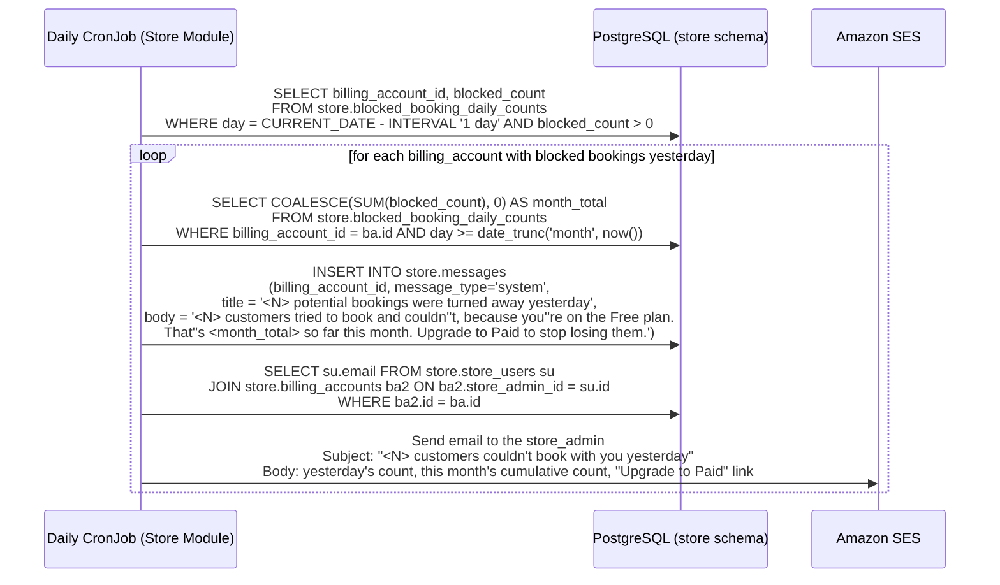
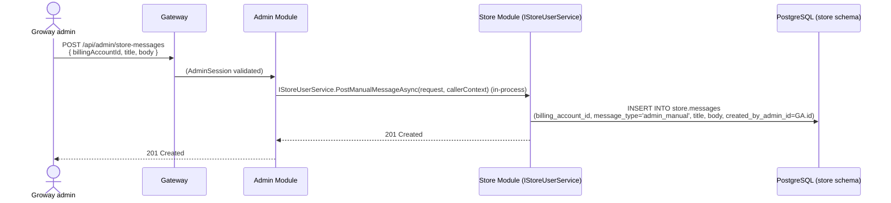
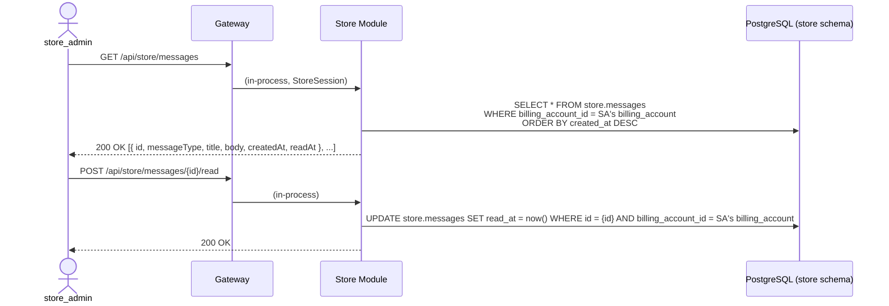

# Store Module — Notifications ("Message Board") Workflow

**Architecture:** see `groway-v1-architecture.md`. Lives entirely inside the **Store Module**, `store` schema — no new module, no new infrastructure. The daily job reuses the same Kubernetes CronJob pattern already used for billing reminders (`groway-billing-workflow.md` §6).

**Relationship to other documents:**
- `groway-billing-workflow.md` — this document's only system-generated message type in V1 (§3) is produced from `store.blocked_booking_daily_counts`, a table owned and written by that document (§4). This document only reads it.
- `growayadmin-registration-workflow.md` — a Groway admin can author a manual message onto a Chain's board (§4); this reuses the existing `AdminSession`/`/api/admin/*` pattern, no new capability flag needed.

**Scope:** a general-purpose, Chain-scoped message board (`store.messages`) — built generically now (per Steven's explicit request) even though V1 only populates it with one system-generated message type. Out of scope this version: a full Groway-admin compose UI for manual messages (the endpoint and schema exist; the UI doesn't have to).

---

## 1. Why this is generic, not a single-purpose "blocked bookings" widget

The table and API are shaped to hold **any** future message type — billing reminders, product announcements, a manual note from Groway support — not just the one use case that motivated it. Two message types exist in the schema from day one:

- **`system`** — generated by a scheduled job or an internal event. The only one actually produced in V1 is §3's daily blocked-booking digest.
- **`admin_manual`** — authored directly by a Groway admin (§4). Schema and a write endpoint exist now; there is no requirement to build a compose UI for it this version.

A Chain's message board is scoped to its `billing_account_id` — the same granularity as billing itself (§1 of `groway-billing-workflow.md`) — so a `store_admin` managing a five-location Chain sees one shared board, not one per store.

---

## 2. Who sees it

Only `store_admin` — the same reasoning as billing visibility (`groway-billing-workflow.md`): `staff` accounts don't see billing state, so they don't see billing-driven messages either. If a future message type needs staff visibility, that's a new `audience` concept, not designed here.

---

## 3. The one system message type in V1: daily blocked-booking digest

### 3.1 How "today" is reported

The board doesn't run a separate live counter — the daily message itself, once it lands, *is* both the "real-time" number the store sees and a permanent history entry (satisfying "must be able to see past messages" with one mechanism instead of two). The CronJob runs once daily, shortly after midnight, summarizing the day that just ended:



Both the in-app message and the email lead with **yesterday's** count (the most recently completed day, so the number is final rather than a partial in-progress count) — the email additionally carries the month-to-date cumulative figure, per Steven's confirmation that the running total belongs in the email, not the banner.

### 3.2 What it deliberately never includes

No customer name, contact info, or booking detail — `store.blocked_booking_daily_counts` (owned by `groway-billing-workflow.md`) has no such column to begin with, so there's nothing here that *could* leak it. The message is always an aggregate count, nothing more.

---

## 4. Manual message from a Groway admin (schema + endpoint only, this version)



No approval step, no template, no audience targeting beyond one `billing_account_id` at a time — deliberately minimal, since building the Groway-side compose experience isn't in scope this version.

---

## 5. Reading the board (store back office)



Full history is always returned (no pagination designed yet — fine at V1 volume, one row per Chain per day at most); the client decides how to render unread vs. read.

---

## 6. Endpoints

| Method & path | Caller | Purpose |
|---|---|---|
| `GET /api/store/messages` | `store_admin` | List the Chain's message board, newest first (§5) |
| `POST /api/store/messages/{id}/read` | `store_admin` | Mark one message read (§5) |
| `POST /api/admin/store-messages` | Groway admin | Post a manual message to a Chain's board (§4) — endpoint/schema only, no compose UI required this version |

---

## 7. Database schema (`store` schema)

```sql
CREATE TABLE store.messages (
    id                    UUID PRIMARY KEY DEFAULT gen_random_uuid(),
    billing_account_id    UUID NOT NULL REFERENCES store.billing_accounts(id),
    message_type          VARCHAR(20) NOT NULL DEFAULT 'system' CHECK (message_type IN ('system', 'admin_manual')),
    title                 VARCHAR(200) NOT NULL,
    body                  TEXT NOT NULL,
    created_by_admin_id   UUID,   -- cross-schema reference to admin.admins.id, not enforced (architecture doc §5); NULL means system-generated
    created_at            TIMESTAMPTZ NOT NULL DEFAULT now(),
    read_at               TIMESTAMPTZ
);

CREATE INDEX idx_messages_billing_account_id_created_at ON store.messages(billing_account_id, created_at DESC);
```

---

## 8. Test data

```sql
-- The lapsed Chain from groway-billing-workflow.md's test data (bb222222...) -
-- yesterday's digest, matching its blocked_booking_daily_counts row.
INSERT INTO store.messages (billing_account_id, message_type, title, body, created_at)
VALUES ('bb222222-2222-2222-2222-222222222222', 'system',
        '7 potential bookings were turned away yesterday',
        '7 customers tried to book and couldn''t, because you''re on the Free plan. That''s 7 so far this month. Upgrade to Paid to stop losing them.',
        '2026-09-29 00:05:00-04');

-- A manual note from a Groway admin to Selah Head Spa's board - schema
-- demonstration for §4, unrelated to the billing digest.
INSERT INTO store.messages (billing_account_id, message_type, title, body, created_by_admin_id, created_at)
VALUES ('bb111111-1111-1111-1111-111111111111', 'admin_manual',
        'Thanks for being an early Groway partner!',
        'Reach out any time if you need anything.',
        'a2222222-2222-2222-2222-222222222222', '2026-09-15 09:00:00-04');
```

---

## 9. Open questions

1. **No pagination** — fine at expected V1 volume (roughly one system message per Chain per day, plus occasional manual ones); would need to be added before message count grows unbounded.
2. **No "audience" concept beyond `store_admin`** — if a future message type needs to reach `staff` too, that's new schema, not covered here.
3. **Groway-admin compose UI** is explicitly out of scope this version (§4) — the endpoint exists so it isn't a schema migration later, but nothing calls it yet outside test data.
4. **Digest timing (midnight rollover, "yesterday")** was chosen so the reported number is always final rather than a live in-progress count — if Steven wants a true intraday running counter instead, that's a different (and more complex) mechanism than what's designed here.
