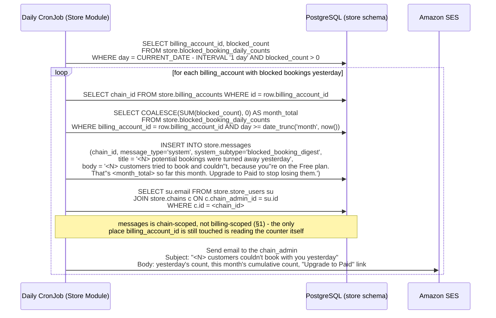
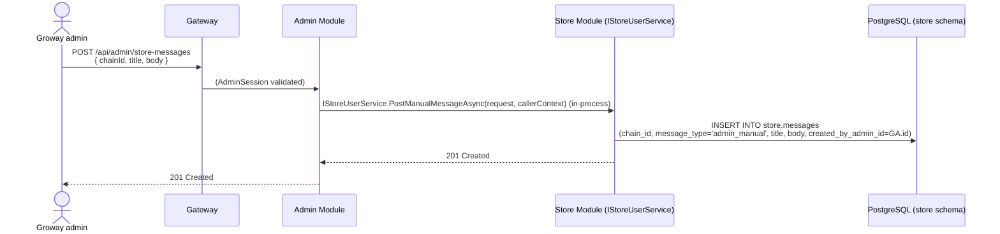
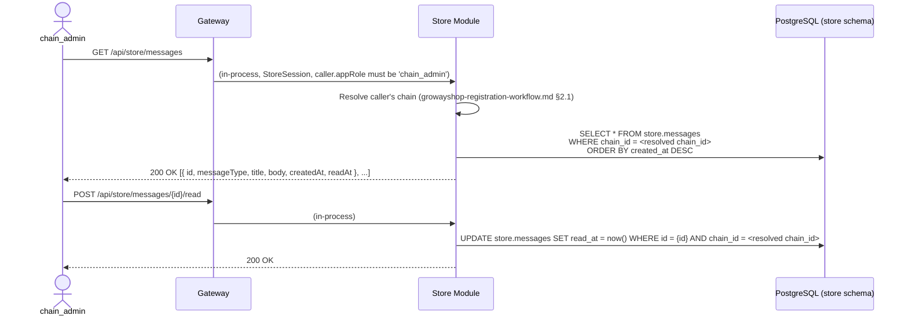

# Store Module — Notifications ("Message Board") Workflow

**Architecture:** see `groway-v1-architecture.md`. Lives entirely inside the **Store Module**, `store` schema — no new module, no new infrastructure. The daily job reuses the same Kubernetes CronJob pattern already used for billing reminders (`groway-billing-workflow.md` §6).

**Relationship to other documents:**
- `groway-billing-workflow.md` — the daily blocked-booking digest (§3) is produced from `store.blocked_booking_daily_counts`, a table owned and written by that document (§4). This document only reads it.
- `growayadmin-registration-workflow.md` — a Groway admin can author a manual message onto a chain's board (§4); this reuses the existing `AdminSession`/`/api/admin/*` pattern, no new capability flag needed.
- `create-appointment-transaction-design.md` — §3b's `booking_pending_review` message is triggered by that document's `appointment.created` outbox event (§12 there) whenever a public-channel booking is forced to `pending` by non-empty `customer_notes` (its §1 decision 15).

**Scope:** a general-purpose, chain-scoped message board (`store.messages`) — built generically now (per Steven's explicit request) even though V1 only populates it with one system-generated message type. Out of scope this version: a full Groway-admin compose UI for manual messages (the endpoint and schema exist; the UI doesn't have to).

---

## 1. Why this is generic, not a single-purpose "blocked bookings" widget

The table and API are shaped to hold **any** future message type — billing reminders, product announcements, a manual note from Groway support — not just the one use case that motivated it. Two message types exist in the schema from day one:

- **`system`** — generated by a scheduled job or an internal event. §3's daily blocked-booking digest, §3a's proactive quota-usage warnings, and §4a's admin-impersonation notice are all `system` messages, distinguished by a `system_subtype` column (§7) — `message_type` tracks *who authored it* (a job/event vs. a human admin), not *what kind* of system message it is; conflating those two would mean widening one enum every time a new system-generated message appears.
- **`admin_manual`** — authored directly by a Groway admin (§4). Schema and a write endpoint exist now; there is no requirement to build a compose UI for it this version.

**General rule for any new message type, system or otherwise: resolve the recipient to `chain_admin`.** A store can have `store_admin_id = NULL` (`growayshop-registration-workflow.md` §6.2, revised) — nothing here or anywhere that posts to this board should assume a store-level contact exists. If a future message type's natural audience is phrased as "the store," read that as `chain_admin`, never literally "whoever `store_admin_id` points to." This board's recipient resolution is already always `chain_admin` (§2) — this note exists for other documents that reference "notifying the store" and need a single place to point back to for what that actually means.

A chain's message board is scoped to its `chain_id` directly — **not** to `billing_account_id`. An earlier version of this schema keyed `store.messages` off `billing_account_id`, which coupled a supposedly general-purpose message board to the billing subsystem for no real reason — nothing stops a future message type from having nothing to do with billing at all (a product announcement, a support note), and there was never a need to join through `billing_accounts` just to find a chain. `store.chains.id` is the correct, minimal scope: a five-store chain has one shared board, not one per store, and the board has no dependency on `groway-billing-workflow.md` beyond reading its blocked-booking counters for one specific message type (§3).

---

## 2. Who sees it

Only `chain_admin` — the same reasoning as billing visibility (`groway-billing-workflow.md`): a store has no billing concept of its own, so neither `store_admin` nor `staff` see billing-driven messages. If a future message type needs broader visibility, that's a new `audience` concept, not designed here.

---

## 3. The one system message type in V1: daily blocked-booking digest

### 3.1 How "today" is reported

The board doesn't run a separate live counter — the daily message itself, once it lands, *is* both the "real-time" number the `chain_admin` sees and a permanent history entry (satisfying "must be able to see past messages" with one mechanism instead of two). The CronJob runs once daily, shortly after midnight, summarizing the day that just ended:



Both the in-app message and the email lead with **yesterday's** count (the most recently completed day, so the number is final rather than a partial in-progress count) — the email additionally carries the month-to-date cumulative figure, per Steven's confirmation that the running total belongs in the email, not the banner.

### 3.2 What it deliberately never includes

No customer name, contact info, or booking detail — `store.blocked_booking_daily_counts` (owned by `groway-billing-workflow.md`) has no such column to begin with, so there's nothing here that *could* leak it. The message is always an aggregate count, nothing more.

---

## 3a. Proactive quota usage warnings (new): the before-the-fact counterpart to §3

§3 is reactive — it reports bookings already turned away. These three fire *before* that happens, at 75%/90%/100% of the Free-plan monthly quota, specifically so the eventual block is never the first the `chain_admin` hears of it. Triggered from `groway-billing-workflow.md` §4.4, right after a successful quota consume in the `plan='free'` branch — this document doesn't poll or schedule anything new for it.

| `system_subtype` | Title | Fires when |
|---|---|---|
| `quota_warning_75` | "You've used 75% of this month's free bookings" | `appointment_count` crosses 75 |
| `quota_warning_90` | "You've used 90% of this month's free bookings" | crosses 90 |
| `quota_warning_100` | "This month's free bookings are used up" | crosses 100 (same moment the next booking attempt would be blocked) |

- In-app + email, same dual-channel pattern as §3's digest.
- The `100%` message's CTA links directly to the billing self-service page (`groway-billing-workflow.md` §8: `start-trial`/`cancel`/`status`).
- Idempotency (one send per threshold per billing period) is `groway-billing-workflow.md` §4.4's concern (`quota_warn_75/90/100_sent_at` on `billing_accounts`) — this document only renders and delivers what it's told to post.

---

## 3b. Booking needs review (new, 2026-10-03 Part C)

A new booking on the **public channel** whose non-empty `customer_notes` forced it to `pending` (`create-appointment-transaction-design.md` §1 decision 15) needs a human look before it takes effect — this message is how the store finds out. Triggered from the create transaction's outbox consumer (`appointment.created` already carries `status` and the row's `customer_notes`, §12 there — no new outbox event needed, this is one more thing an existing event's consumer checks for).

| `system_subtype` | Title | Fires when |
|---|---|---|
| `booking_pending_review` | "New booking needs review" | `channel='public_web'` **and** `customer_notes IS NOT NULL` **and** the created `status='pending'` |

Body: `New booking needs review — {customer_name} booked {service_summary} for {date_time} with a note: "{notes}". Tap to review and confirm.`

**Fires only for this one case — deliberately narrow:**
- A staff-manual booking with notes does **not** fire this — the staff member entering it already knows (`staff-manual-booking-calendar-design.md` §6 item 6; decision 15 never applies to that channel in the first place).
- An ordinary `auto_confirm=true` public booking with no notes does **not** fire this — nothing needs a look, and firing one message per booking would drown out the signal this exists to carry.
- An `auto_confirm=false` store's ordinary pending booking (no notes) does **not** fire this either — that store already has its own "pending queue" UI (`staff-manual-booking-calendar-design.md` §2) for exactly that case; this message is specifically for the notes-forced-pending case a store wouldn't otherwise know to look for.

In-app + email, same dual-channel pattern as §3/§3a; whichever channel this document's existing store-facing notifications treat as highest-urgency applies here too — this is a same-day, needs-action message, not a daily digest.

---

## 4a. Admin impersonation notice (new)

Posted after every action taken via `groway-admin-impersonation-design.md`'s "Login as" (§5 there) — not a bespoke direct-send email, specifically so it inherits this document's existing `chain_admin`-only recipient resolution (§1's general rule) and audit trail automatically, rather than a second piece of code having to re-decide who "the store" means.

| `system_subtype` | Title | Fires when |
|---|---|---|
| `admin_impersonation` | "Groway support accessed your account" | Every allow-listed impersonated action (`groway-admin-impersonation-design.md` §2), regardless of ticket status |

Body: "Groway support accessed your account at {time} regarding ticket #{ticket_ref}." (or "for an emergency support reason" when `ticket_ref` is absent, `groway-admin-impersonation-design.md` §4). No consent is required beforehand; this notice is mandatory and cannot be suppressed.

---

## 4. Manual message from a Groway admin (schema + endpoint only, this version)



No approval step, no template, no audience targeting beyond one `chainId` at a time — deliberately minimal, since building the Groway-side compose experience isn't in scope this version. Note this endpoint never touches billing at all, which is exactly the point of keying the board on `chain_id`: a Groway admin can send a chain a purely informational note with no `billing_accounts` row in the picture.

---

## 5. Reading the board (store back office)



Full history is always returned (no pagination designed yet — fine at V1 volume, one row per chain per day at most); the client decides how to render unread vs. read.

---

## 6. Endpoints

| Method & path | Caller | Purpose |
|---|---|---|
| `GET /api/store/messages` | `chain_admin` only | List the chain's message board, newest first (§5) |
| `POST /api/store/messages/{id}/read` | `chain_admin` only | Mark one message read (§5) |
| `POST /api/admin/store-messages` | Groway admin | Post a manual message to a chain's board (§4) — endpoint/schema only, no compose UI required this version |

---

## 7. Database schema (`store` schema)

```sql
CREATE TABLE store.messages (
    id                    UUID PRIMARY KEY DEFAULT gen_random_uuid(),
    chain_id              UUID NOT NULL REFERENCES store.chains(id),  -- scope is the chain, not billing (§1) - a message need not have anything to do with billing
    message_type          VARCHAR(20) NOT NULL DEFAULT 'system' CHECK (message_type IN ('system', 'admin_manual')),
    -- Which kind of system message this is - only meaningful when message_type='system'.
    -- message_type itself stays about *who authored it*; this is about *what it's about*,
    -- so a new system-generated message kind (§3a, §4a) never requires widening message_type's enum.
    system_subtype        VARCHAR(30) CHECK (system_subtype IN (
        'blocked_booking_digest', 'quota_warning_75', 'quota_warning_90',
        'quota_warning_100', 'admin_impersonation', 'booking_pending_review'
    )),
    title                 VARCHAR(200) NOT NULL,
    body                  TEXT NOT NULL,
    created_by_admin_id   UUID,   -- cross-schema reference to admin.admins.id, not enforced (architecture doc §5); NULL means system-generated
    created_at            TIMESTAMPTZ NOT NULL DEFAULT now(),
    read_at               TIMESTAMPTZ
);

CREATE INDEX idx_messages_chain_id_created_at ON store.messages(chain_id, created_at DESC);
```

---

## 8. Test data

```sql
-- The lapsed, hypothetical chain from groway-billing-workflow.md's test data
-- (billing_account bb222222..., chain_id cc999999...) - yesterday's digest,
-- matching its blocked_booking_daily_counts row.
INSERT INTO store.messages (chain_id, message_type, title, body, created_at)
VALUES ('cc999999-9999-9999-9999-999999999999', 'system',
        '7 potential bookings were turned away yesterday',
        '7 customers tried to book and couldn''t, because you''re on the Free plan. That''s 7 so far this month. Upgrade to Paid to stop losing them.',
        '2026-09-29 00:05:00-04');

-- A manual note from a Groway admin to Selah Head Spa's board - schema
-- demonstration for §4, unrelated to billing entirely (chain_id, no
-- billing_account_id anywhere in this call).
INSERT INTO store.messages (chain_id, message_type, title, body, created_by_admin_id, created_at)
VALUES ('cc111111-1111-1111-1111-111111111111', 'admin_manual',
        'Thanks for being an early Groway partner!',
        'Reach out any time if you need anything.',
        'a2222222-2222-2222-2222-222222222222', '2026-09-15 09:00:00-04');

-- A notes-forced-pending public booking at Selah Head Spa's King West store (§3b).
INSERT INTO store.messages (chain_id, message_type, system_subtype, title, body, created_at)
VALUES ('cc111111-1111-1111-1111-111111111111', 'system', 'booking_pending_review',
        'New booking needs review',
        'New booking needs review — Anna Lee booked Signature Head Spa for Oct 5, 2:00 PM with a note: "Please use unscented products, I have a sensitivity." Tap to review and confirm.',
        '2026-10-03 14:02:00-04');
```

---

## 9. Open questions

1. **No pagination** — fine at expected V1 volume (roughly one system message per chain per day, plus occasional manual ones); would need to be added before message count grows unbounded.
2. **No "audience" concept beyond `chain_admin`** — if a future message type needs to reach `store_admin` or `staff` too, that's new schema, not covered here.
3. **Groway-admin compose UI** is explicitly out of scope this version (§4) — the endpoint exists so it isn't a schema migration later, but nothing calls it yet outside test data.
4. **Digest timing (midnight rollover, "yesterday")** was chosen so the reported number is always final rather than a live in-progress count — if Steven wants a true intraday running counter instead, that's a different (and more complex) mechanism than what's designed here.
