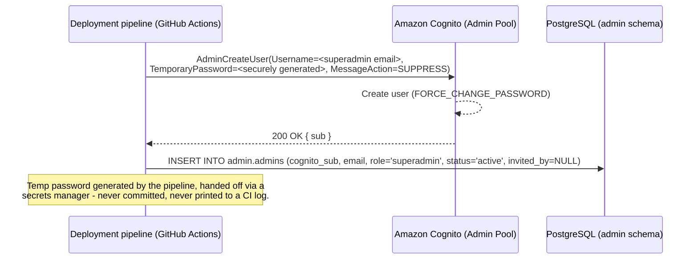
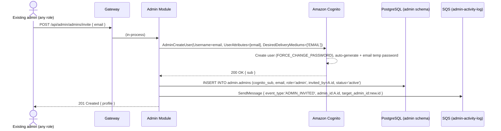
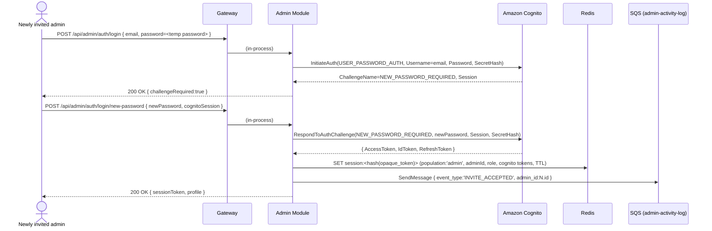
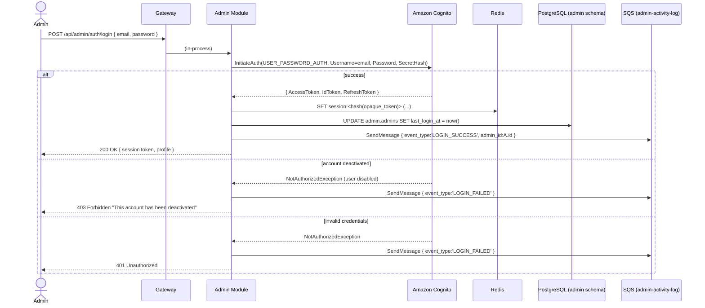
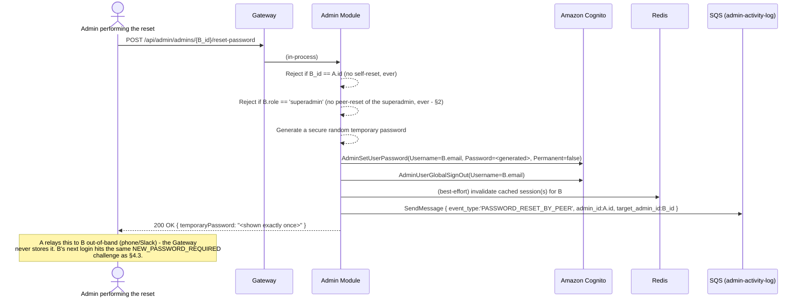
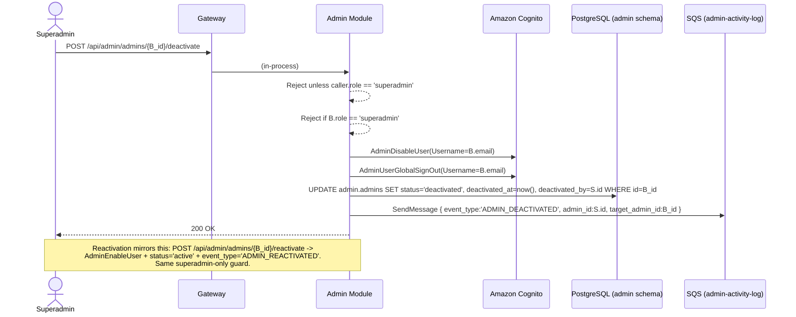

# Groway Admin Module — Registration & Authentication Workflow

**Architecture:** see `groway-v1-architecture.md` for the shared Gateway, one Postgres instance (this module owns the `admin` schema), one Redis (sessions tagged `population: "admin"`), the `AdminSession` authentication scheme, route-group fail-closed enforcement (`/api/admin/*`), and the module-boundary/extraction pattern. Not re-derived here.

**Scope:** how a Groway admin account comes to exist, how an admin logs in, how a forgotten password gets reset (peer-assisted, not self-service — see §2), and how an admin account is deactivated/reactivated. What admins actually *do* once logged in (the cross-tenant dashboard) is out of scope, same boundary as the other two modules draw around their own features.

**Production status:** production design, first version — modest scale assumed (tens of internal admins), rigor not relaxed for that.

---

## 1. Identity boundary within the shared platform

Groway admins are the highest-privilege population: authenticated on this module's routes at all *is* the "can see every chain's data" grant — there is no additional per-request tenant-scoping logic here, unlike the Store Module needs (`growayshop-registration-workflow.md` §2). This module still gets its **own Cognito Pool** (per the architecture doc §6.1) even though it shares the Gateway, Postgres instance, and Redis with the other two modules.

---

## 2. Roles and the permission matrix

Exactly two roles, no finer-grained permissions in this first version:

- **`superadmin`** — exactly **one**, ever. Created only by a one-time deployment seed (§4.1). Never producible through the invite flow. Can never be deactivated, by anyone, including itself.
- **`admin`** — any number, each invited by an existing admin (any admin, not just the superadmin).

| Action | superadmin | admin |
|---|---|---|
| Invite a new admin | yes | yes |
| Reset another (non-superadmin) admin's password | yes | yes |
| Reset **own** password | no | no |
| **Reset the superadmin's password** | never | **never** |
| Deactivate an admin | **yes** | no |
| Reactivate a deactivated admin | **yes** | no |
| Deactivate/reactivate the superadmin | never | never |
| View all chains (implicit, by being authenticated here) | yes | yes |

**Why this row exists:** the peer-reset flow (§4.5) generates a one-time temporary password and hands it to whoever called the endpoint — that's exactly the access an attacker (or an overreaching admin) would want against the superadmin account. Without this row, "any admin can reset any other admin's password" plus "superadmin can only never be *deactivated*" combine into a takeover path that never touches deactivation at all: a plain `admin` peer-resets the superadmin's password, logs in with the generated temporary password, and has full superadmin access. "The superadmin can never be touched" has to include *credentials*, not just active/deactivated status, or it isn't actually an invariant.

**Nothing is ever hard-deleted** — an admin row is deactivated (`status='deactivated'`), never removed.

---

## 3. Endpoints

| Method & path | Purpose | Who can call it | Backing Cognito call |
|---|---|---|---|
| `POST /api/admin/auth/login` | Email + password login (also step 1 of accepting an invite) | anyone with valid credentials | `InitiateAuth (USER_PASSWORD_AUTH)` |
| `POST /api/admin/auth/login/new-password` | Set a real password after a `NEW_PASSWORD_REQUIRED` challenge | the account the challenge belongs to | `RespondToAuthChallenge` |
| `POST /api/admin/auth/logout` | End the session | any logged-in admin | `GlobalSignOut` |
| `GET /api/admin/admins/me` | Fetch the caller's own profile | any logged-in admin | Admin Module only |
| `GET /api/admin/admins` | List all admin accounts | any logged-in admin | Admin Module only |
| `POST /api/admin/admins/invite` | Invite a new admin by email | any admin | `AdminCreateUser` |
| `POST /api/admin/admins/{id}/reset-password` | Generate a new temp password for another admin | any admin, not targeting self **or the superadmin** | `AdminSetUserPassword` + `AdminUserGlobalSignOut` |
| `POST /api/admin/admins/{id}/deactivate` | Deactivate an admin | **superadmin only**, never the superadmin itself | `AdminDisableUser` + `AdminUserGlobalSignOut` |
| `POST /api/admin/admins/{id}/reactivate` | Reactivate a deactivated admin | **superadmin only** | `AdminEnableUser` |
| `POST /api/admin/chains` | Create a new chain — one `chain_admin` plus one `store_admin` per store, in one call | any admin | see `growayshop-registration-workflow.md` §7.1 — dispatches in-process into Store Module |
| `POST /api/admin/store-users` | Invite a `staff` member on a chain's behalf (ongoing, after chain creation) | any admin | see `growayshop-staff-invite-workflow.md` §1 — dispatches in-process into Store Module |

No phone number, no SMS OTP, no Google federation — admins are invited, never self-register, so there's nothing to verify beyond the email the invite reached.

---

## 4. Sequence diagrams

### 4.1 Bootstrap: seeding the superadmin (deployment-time, not a normal API call)



Runs exactly once, ever, for exactly one row.

### 4.2 Inviting a new admin



### 4.3 Accepting an invite / first login (forced password change)



### 4.4 Ordinary login (returning admin)



### 4.5 Peer password reset



**The superadmin's password can never be reset through this endpoint, by anyone** (§2) — not an edge case, a deliberate exclusion. If the superadmin forgets their password, there is no in-app recovery path at all, by design: someone with direct AWS access runs `AdminSetUserPassword` against the Admin Pool outside the application, documented as an ops runbook, not a feature. This is the accepted cost of not having a "reset the superadmin" button anywhere in the system for anyone to misuse.

### 4.6 Deactivate / reactivate an admin (superadmin only)



---

## 5. Data: PostgreSQL (`admin` schema) + Redis + SQS

### 5.1 PostgreSQL

```sql
CREATE TABLE admin.admins (
    id             UUID PRIMARY KEY DEFAULT gen_random_uuid(),
    cognito_sub    VARCHAR(64)  NOT NULL UNIQUE,
    email          VARCHAR(255) NOT NULL UNIQUE,
    display_name   VARCHAR(200),
    role           VARCHAR(20)  NOT NULL DEFAULT 'admin' CHECK (role IN ('superadmin', 'admin')),
    status         VARCHAR(20)  NOT NULL DEFAULT 'active' CHECK (status IN ('active', 'deactivated')),
    invited_by     UUID         REFERENCES admin.admins(id),  -- NULL only for the seeded superadmin
    created_at     TIMESTAMPTZ  NOT NULL DEFAULT now(),
    updated_at     TIMESTAMPTZ  NOT NULL DEFAULT now(),
    last_login_at  TIMESTAMPTZ,
    deactivated_at TIMESTAMPTZ,
    deactivated_by UUID         REFERENCES admin.admins(id)   -- always the superadmin, by rule
);

-- Enforces "exactly one superadmin, ever" at the database level.
CREATE UNIQUE INDEX one_superadmin_only ON admin.admins (role) WHERE role = 'superadmin';
CREATE INDEX idx_admins_invited_by ON admin.admins(invited_by);

CREATE TABLE admin.admin_activity_log (
    id               BIGSERIAL PRIMARY KEY,
    admin_id         UUID REFERENCES admin.admins(id),
    target_admin_id  UUID REFERENCES admin.admins(id),
    event_type       VARCHAR(30) NOT NULL,
    event_detail     JSONB,
    ip_address       VARCHAR(45),
    created_at       TIMESTAMPTZ NOT NULL DEFAULT now(),
    CONSTRAINT chk_admin_event_type CHECK (event_type IN (
        'ADMIN_INVITED', 'INVITE_ACCEPTED',
        'LOGIN_SUCCESS', 'LOGIN_FAILED', 'LOGOUT',
        'PASSWORD_RESET_BY_PEER',
        'ADMIN_DEACTIVATED', 'ADMIN_REACTIVATED'
    ))
);

CREATE INDEX idx_admin_activity_log_admin_id ON admin.admin_activity_log(admin_id);
CREATE INDEX idx_admin_activity_log_target_admin_id ON admin.admin_activity_log(target_admin_id);
```

Owned exclusively by `AdminDbContext`. Foreign keys stay within the `admin` schema (per architecture doc §5) — `admins.invited_by`/`deactivated_by` reference other rows in the same table, same schema, so they're real FKs.

### 5.2 Redis, SQS

Shared Redis, `population:'admin'` tag; dedicated `admin-activity-log` queue + its own KEDA-scaled consumer, per `groway-v1-architecture.md` §7–8. Session value shape:

```json
{
  "sessionId": "...", "population": "admin",
  "principalId": "...", "role": "admin",
  "cognitoAccessToken": "...", "cognitoIdToken": "...", "cognitoRefreshToken": "...",
  "createdAt": "...", "lastUsedAt": "...", "expiresAt": "..."
}
```

---

## 6. Test data

```sql
INSERT INTO admin.admins
    (id, cognito_sub, email, display_name, role, status, invited_by, created_at, last_login_at)
VALUES
    ('a1111111-1111-1111-1111-111111111111',
     'b1c2d3e4-0000-0000-0000-000000000001',
     'steven@groway.com', 'Steven Zhang', 'superadmin', 'active', NULL,
     '2026-08-01 00:00:00-04', '2026-09-25 08:00:00-04'),

    ('a2222222-2222-2222-2222-222222222222',
     'b1c2d3e4-0000-0000-0000-000000000002',
     'maria.ops@groway.com', 'Maria Ops', 'admin', 'active',
     'a1111111-1111-1111-1111-111111111111',
     '2026-08-15 10:00:00-04', '2026-09-24 09:15:00-04'),

    ('a3333333-3333-3333-3333-333333333333',
     'b1c2d3e4-0000-0000-0000-000000000003',
     'jordan.support@groway.com', 'Jordan Support', 'admin', 'active',
     'a2222222-2222-2222-2222-222222222222',              -- invited by Maria, not the superadmin
     '2026-09-01 12:00:00-04', '2026-09-20 16:40:00-04'),

    ('a4444444-4444-4444-4444-444444444444',
     'b1c2d3e4-0000-0000-0000-000000000004',
     'former.employee@groway.com', 'Former Employee', 'admin', 'deactivated',
     'a1111111-1111-1111-1111-111111111111',
     '2026-08-20 09:00:00-04', '2026-09-05 11:00:00-04');

UPDATE admin.admins SET deactivated_at = '2026-09-10 14:00:00-04',
                        deactivated_by = 'a1111111-1111-1111-1111-111111111111'
WHERE id = 'a4444444-4444-4444-4444-444444444444';

INSERT INTO admin.admin_activity_log (admin_id, target_admin_id, event_type, ip_address, created_at)
VALUES
    ('a1111111-1111-1111-1111-111111111111', 'a2222222-2222-2222-2222-222222222222', 'ADMIN_INVITED', '203.0.113.10', '2026-08-15 09:58:00-04'),
    ('a2222222-2222-2222-2222-222222222222', NULL, 'INVITE_ACCEPTED', '198.51.100.20', '2026-08-15 10:00:00-04'),
    ('a2222222-2222-2222-2222-222222222222', 'a3333333-3333-3333-3333-333333333333', 'ADMIN_INVITED', '198.51.100.20', '2026-09-01 11:55:00-04'),
    ('a3333333-3333-3333-3333-333333333333', NULL, 'LOGIN_SUCCESS', '198.51.100.44', '2026-09-20 16:40:00-04'),
    ('a3333333-3333-3333-3333-333333333333', 'a4444444-4444-4444-4444-444444444444', 'PASSWORD_RESET_BY_PEER', '198.51.100.44', '2026-09-05 10:30:00-04'),
    ('a1111111-1111-1111-1111-111111111111', 'a4444444-4444-4444-4444-444444444444', 'ADMIN_DEACTIVATED', '203.0.113.10', '2026-09-10 14:00:00-04'),
    (NULL, NULL, 'LOGIN_FAILED', '198.51.100.99', '2026-09-22 03:14:00-04');
```

*Row 4 (Former Employee, `status='deactivated'`) is the test case for §4.4's `else account deactivated` branch. Jordan Support was invited by Maria, not the superadmin — exercising "any admin can invite."*

---

## 7. Open questions

1. **Internal admin console platform** — assumed a single internal web app, no native mobile equivalent. Confirm.
2. **Invite email content** — uses Cognito's default invite template; a branded email would need a "Custom Message" Lambda trigger on the Admin Pool.
3. **Session lifetime for admins** — given the elevated access, possibly shorter than the customer session TTL; no number chosen yet.
4. **MFA** — not required for this first version, but `InitiateAuth`/`RespondToAuthChallenge` already accommodate it later with no redesign.
