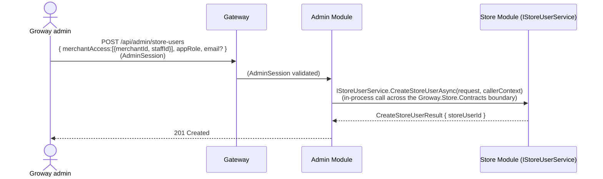
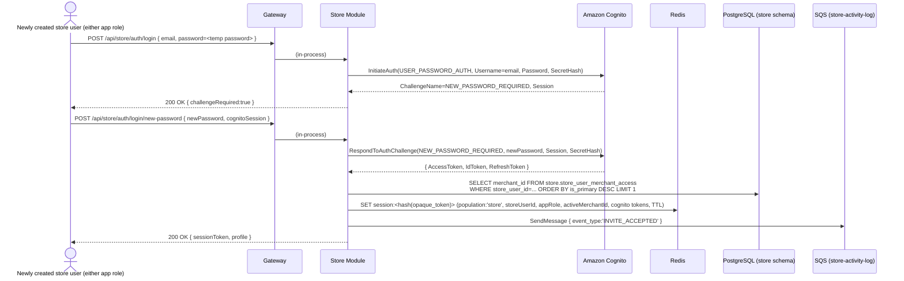
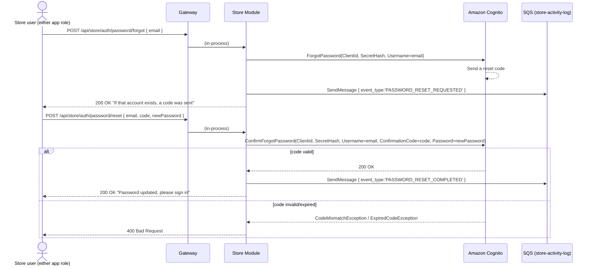
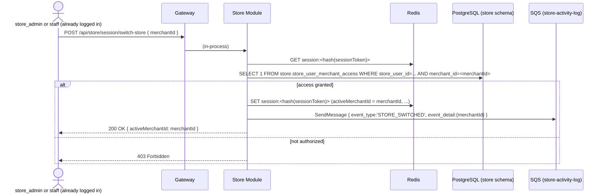

# Store Module — Account Creation Workflow

**Architecture:** see `groway-v1-architecture.md` for the shared Gateway, one Postgres instance (this module owns the `store` schema), one Redis (sessions tagged `population: "store"`), the `StoreSession` authentication scheme, route-group fail-closed enforcement (`/api/store/*`), and the compiler-enforced module-boundary/extraction pattern (`IStoreUserService` in `Groway.Store.Contracts`). Not re-derived here.

**Relationship to other documents:**
- `merchant-onboarding-v1-design.md` is treated as **fixed reference, not modified this round**. Its data model (`merchants`, `staff`, `services`, etc.) is implemented by **this same Store Module**, in the **same `store` schema** as everything in this document — real foreign keys within the schema, not a cross-service or cross-schema reference (architecture doc §5).
- `growayadmin-registration-workflow.md`: a Groway admin is the *actor* who can create the initial store-front account(s); the call reaches this module **in-process** (§3), not over the network.
- `growayshop-staff-invite-workflow.md`: covers the *ongoing* "invite a staff member" flow (by either a Groway admin or a `store_admin`, at any time) — this document covers only the *initial* batch created during onboarding.

**Scope — deliberately narrow.** How a Groway admin creates the initial store-front login account(s) for a newly onboarded merchant, plus the baseline login/session/password-reset mechanics. Out of scope: ongoing staff invitation (`growayshop-staff-invite-workflow.md`); any dashboard/calendar/booking feature API.

---

## 1. Two app roles — decoupled from the business-role label already in `staff`

`merchant-onboarding-v1-design.md`'s `staff.role` (`owner`/`manager`/`staff`, or free text like "CEO") is **descriptive**, not access-control. This document's **app role**, chosen by whoever creates the account, is separate:

| | `store_admin` | `staff` |
|---|---|---|
| App access | Higher | Lower |
| Sees the store's whole calendar | Yes | Yes |
| Can make/manage bookings | *(future feature)* | **No** |
| Can request their own time off | *(future feature)* | Yes — feeds `staff_time_offs` |
| Can invite additional `staff` accounts | Yes — `growayshop-staff-invite-workflow.md` | No |
| Number of merchants accessible | One or many, switchable (§6) | One or many, same mechanism |
| Who creates this account | Groway admin (this document) or ongoing via `growayshop-staff-invite-workflow.md` | Groway admin (this document, initial batch) or a `store_admin` (`growayshop-staff-invite-workflow.md`) |
| Password reset | Self-service, like a customer | Self-service, like a customer |

Each `store.store_users` row has exactly one `app_role` — a person needing different roles at different merchants needs two separate accounts (§8 item 1). A `store_admin` can **never** create another `store_admin` through any flow in this system — one admin per chain in this version.

---

## 2. Multi-merchant access and store-switching

A `store_admin` (or `staff`) account can be granted access to more than one merchant of the **same chain** (e.g. the same owner runs two locations). This is a many-to-many relationship (`store.store_user_merchant_access`, §5), not a single foreign key — never across unrelated companies, since a `store_admin` can only grant access to merchants they themselves already have access to. The session tracks **one active merchant at a time** (§4); switching (§6) updates context within the existing session, it never re-authenticates.

---

## 3. Why creating this account is an in-process call, not a network call

A Groway admin's session is tagged `population:"admin"` in the shared Redis (architecture doc §6.5); the `StoreSession` authentication scheme would reject it outright on any `/api/store/*` route. So a Groway admin never calls a Store Module route directly — they call an **Admin Module** endpoint, which invokes Store Module's public interface **in-process**:



`callerContext.Population == "admin"` here — Store Module's implementation still checks this explicitly (never assumes "Admin Module already authorized it," per architecture doc §6.5) before proceeding to §5.1's logic. This is the extraction seam: if Store Module is ever pulled out into its own service, this becomes an HTTP call with the same `CreateStoreUserRequest`/`CallerContext` shape — Admin Module's code does not change.

---

## 4. Session mechanism

Shared Redis, `population:"store"`, per architecture doc §7. The store-specific addition is `activeMerchantId`:

```json
{
  "sessionId": "...", "population": "store",
  "principalId": "...", "appRole": "store_admin",
  "activeMerchantId": "...",
  "cognitoAccessToken": "...", "cognitoIdToken": "...", "cognitoRefreshToken": "...",
  "createdAt": "...", "lastUsedAt": "...", "expiresAt": "..."
}
```

---

## 5. Database schema (`store` schema, `StoreDbContext`)

```sql
-- One row per store-front login account (either app role).
CREATE TABLE store.store_users (
    id                  UUID PRIMARY KEY DEFAULT gen_random_uuid(),
    cognito_sub         VARCHAR(64)  NOT NULL UNIQUE,   -- Cognito "sub" in the Store User Pool
    email               VARCHAR(255) NOT NULL UNIQUE,
    display_name        VARCHAR(200),
    app_role            VARCHAR(20)  NOT NULL CHECK (app_role IN ('store_admin', 'staff')),
    -- No staff_id here - which roster row this account corresponds to is a
    -- per-merchant fact (see store_user_merchant_access below), since the
    -- same login can map to a different staff row at each branch it works.
    status              VARCHAR(20)  NOT NULL DEFAULT 'active' CHECK (status IN ('active', 'deactivated')),
    -- Exactly one of the next two is set: who created this account. A Groway
    -- admin (admin.admins.id, cross-schema - no enforced FK per architecture
    -- doc §5) or another store_users row (store_admin invited them).
    created_by_admin_id      UUID,
    created_by_store_user_id UUID REFERENCES store.store_users(id),
    created_at          TIMESTAMPTZ  NOT NULL DEFAULT now(),
    updated_at          TIMESTAMPTZ  NOT NULL DEFAULT now(),
    last_login_at       TIMESTAMPTZ,
    CONSTRAINT chk_exactly_one_creator CHECK (
        (created_by_admin_id IS NOT NULL) <> (created_by_store_user_id IS NOT NULL)
    )
);

-- Many-to-many: which merchants a store_user can access.
-- merchant_id/staff_id are REAL foreign keys - merchants/staff live in this
-- same `store` schema (merchant-onboarding-v1-design.md's tables).
CREATE TABLE store.store_user_merchant_access (
    store_user_id       UUID NOT NULL REFERENCES store.store_users(id),
    merchant_id         UUID NOT NULL REFERENCES store.merchants(id),
    staff_id            UUID REFERENCES store.staff(id),  -- the roster row for THIS merchant.
                                          -- NULL for a store_admin with no service-performing role there.
    is_primary          BOOLEAN NOT NULL DEFAULT FALSE,  -- default activeMerchantId after login
    granted_at           TIMESTAMPTZ NOT NULL DEFAULT now(),
    granted_by_admin_id       UUID,  -- cross-schema reference to admin.admins.id, not enforced
    granted_by_store_user_id  UUID REFERENCES store.store_users(id),
    PRIMARY KEY (store_user_id, merchant_id),
    CONSTRAINT chk_exactly_one_granter CHECK (
        (granted_by_admin_id IS NOT NULL) <> (granted_by_store_user_id IS NOT NULL)
    )
);

CREATE TABLE store.store_user_activity_log (
    id             BIGSERIAL PRIMARY KEY,
    store_user_id  UUID REFERENCES store.store_users(id),
    event_type     VARCHAR(30) NOT NULL,
    event_detail   JSONB,
    ip_address     VARCHAR(45),
    created_at     TIMESTAMPTZ NOT NULL DEFAULT now(),
    CONSTRAINT chk_store_user_event_type CHECK (event_type IN (
        'ACCOUNT_CREATED', 'INVITE_ACCEPTED',
        'LOGIN_SUCCESS', 'LOGIN_FAILED', 'LOGOUT',
        'PASSWORD_RESET_REQUESTED', 'PASSWORD_RESET_COMPLETED',
        'STORE_SWITCHED'
    ))
);

CREATE INDEX idx_store_user_merchant_access_merchant ON store.store_user_merchant_access(merchant_id);
CREATE INDEX idx_store_user_activity_log_store_user_id ON store.store_user_activity_log(store_user_id);
```

Activity log delivery: dedicated `store-activity-log` SQS queue + its own KEDA-scaled consumer, per architecture doc §8 — a third, independent queue, unaffected by everything else being consolidated.

---

## 6. Sequence diagrams

### 6.1 Account creation (continuing from §3)

```mermaid
sequenceDiagram
    participant SM as Store Module (IStoreUserService)
    participant SCOG as Amazon Cognito (Store User Pool)
    participant DB as PostgreSQL (store schema)
    participant SQSQ as SQS (store-activity-log)

    Note over SM: entry: CreateStoreUserAsync(request, callerContext), §3
    SM->>SCOG: AdminCreateUser(Username=email, UserAttributes=[email], DesiredDeliveryMediums=['EMAIL'])
    SCOG-->>SCOG: Create user (FORCE_CHANGE_PASSWORD), auto-generate + email temp password
    SCOG-->>SM: 200 OK { sub }
    SM->>DB: INSERT INTO store.store_users (cognito_sub, email, app_role, created_by_admin_id, status='active')
    alt appRole == 'store_admin' (this is a new chain, not an additional staff member)
        SM->>DB: INSERT INTO store.billing_accounts<br/>(store_admin_id, plan='free')
        Note over SM,DB: See groway-billing-workflow.md - every merchant<br/>created under this store_admin gets this billing_account_id.<br/>Free is permanent by default; no expiry is set here.
    end
    loop for each { merchantId, staffId } in merchantAccess
        SM->>DB: INSERT INTO store.store_user_merchant_access (store_user_id, merchant_id, staff_id, is_primary)
        SM->>DB: UPDATE store.merchants SET billing_account_id = <the store_admin's billing_account_id> WHERE id = merchantId
    end
    SM->>SQSQ: SendMessage { event_type:'ACCOUNT_CREATED', store_user_id, ... }
    SM-->>SM: return CreateStoreUserResult { storeUserId }
```

The `email` for `AdminCreateUser` comes from `store.staff.email` if the roster already has one for that person; the caller can override it if the intake email didn't include one.

### 6.2 Accepting the invite / first login (forced password change)



### 6.3 Ordinary login (returning store user)

Same shape as the Admin Module's §4.4 — `InitiateAuth(USER_PASSWORD_AUTH)`, success/deactivated/invalid-credentials branches, `SendMessage` to `store-activity-log` — not re-diagrammed. **Billing state has no effect on login** (see `groway-billing-workflow.md`, which replaced an earlier version of that document that did gate login here). A Free-plan chain, a Paid-plan chain, and a chain that just got reverted from Paid to Free all log in exactly the same way — billing only ever affects whether a *new appointment* can be created (`groway-billing-workflow.md` §4), never authentication.

### 6.4 Forgot / reset password (self-service — the customer pattern, not the admin peer-reset pattern)



No Groway admin involved anywhere in this flow — deliberately the easier, self-service path, unlike the internal-admin document's peer-reset model.

### 6.5 Switching stores (multi-merchant accounts)



Session-context change only — no Cognito call, no new login.

---

## 7. Test data

```sql
INSERT INTO store.store_users (id, cognito_sub, email, display_name, app_role, created_by_admin_id, status, created_at, last_login_at)
VALUES
    ('c1111111-1111-1111-1111-111111111111',
     'd1e2f3a4-0000-0000-0000-000000000001',
     'owner@selahheadspa.com', 'Selah Head Spa Owner', 'store_admin',
     'a2222222-2222-2222-2222-222222222222',  -- Maria Ops, admin.admins
     'active', '2026-09-20 10:00:00-04', '2026-09-25 08:30:00-04'),

    ('c2222222-2222-2222-2222-222222222222',
     'd1e2f3a4-0000-0000-0000-000000000002',
     'anna@selahheadspa.com', 'Anna', 'staff',
     'a2222222-2222-2222-2222-222222222222',
     'active', '2026-09-20 10:05:00-04', '2026-09-24 09:00:00-04');

-- Owner runs a second branch of the same chain; Anna picks up shifts at both,
-- with a different staff_id per branch (different roster rows per branch).
INSERT INTO store.store_user_merchant_access (store_user_id, merchant_id, staff_id, is_primary, granted_by_admin_id)
VALUES
    ('c1111111-1111-1111-1111-111111111111', '99999999-0000-0000-0000-000000000001', NULL, TRUE,  'a2222222-2222-2222-2222-222222222222'),
    ('c1111111-1111-1111-1111-111111111111', '99999999-0000-0000-0000-000000000002', NULL, FALSE, 'a2222222-2222-2222-2222-222222222222'),
    ('c2222222-2222-2222-2222-222222222222', '99999999-0000-0000-0000-000000000001', 'b1000000-0000-0000-0000-000000000001', TRUE,  'a2222222-2222-2222-2222-222222222222'),
    ('c2222222-2222-2222-2222-222222222222', '99999999-0000-0000-0000-000000000002', 'b1000000-0000-0000-0000-000000000002', FALSE, 'a2222222-2222-2222-2222-222222222222');

INSERT INTO store.store_user_activity_log (store_user_id, event_type, event_detail, ip_address, created_at)
VALUES
    ('c1111111-1111-1111-1111-111111111111', 'ACCOUNT_CREATED', NULL, '203.0.113.10', '2026-09-20 10:00:00-04'),
    ('c1111111-1111-1111-1111-111111111111', 'INVITE_ACCEPTED', NULL, '198.51.100.30', '2026-09-20 10:12:00-04'),
    ('c1111111-1111-1111-1111-111111111111', 'STORE_SWITCHED', '{"merchantId":"99999999-0000-0000-0000-000000000002"}', '198.51.100.30', '2026-09-25 08:31:00-04'),
    ('c2222222-2222-2222-2222-222222222222', 'ACCOUNT_CREATED', NULL, '203.0.113.10', '2026-09-20 10:05:00-04'),
    ('c2222222-2222-2222-2222-222222222222', 'LOGIN_SUCCESS', NULL, '198.51.100.31', '2026-09-24 09:00:00-04');
```

*Both the owner and Anna have two `store_user_merchant_access` rows, one per branch. The owner's rows have no `staff_id` (pure management access, no service-performing role of her own); Anna's rows each carry a different `staff_id`, since her assignable services/schedule can differ by branch.*

---

## 8. Open questions

1. **One `app_role` per account, not per merchant** — a person who is `store_admin` at one merchant and `staff` at another needs two separate `store_users` rows/logins. Not solved; a real limitation of this first version.
2. **Session lifetime, MFA, device-management UX** — same open, unresolved status as the other two modules.
