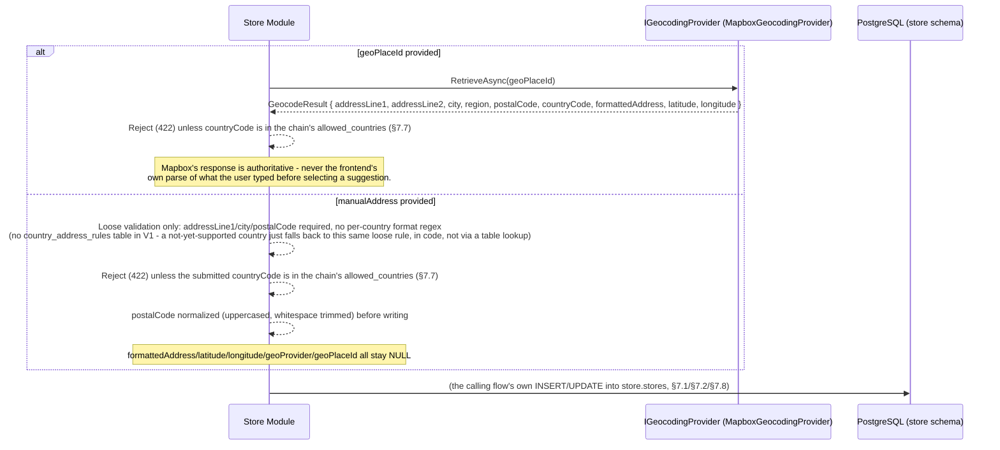
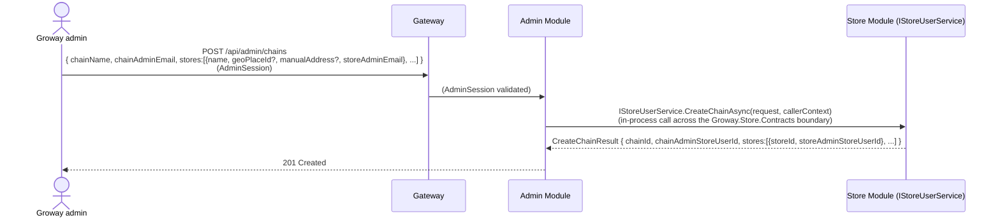
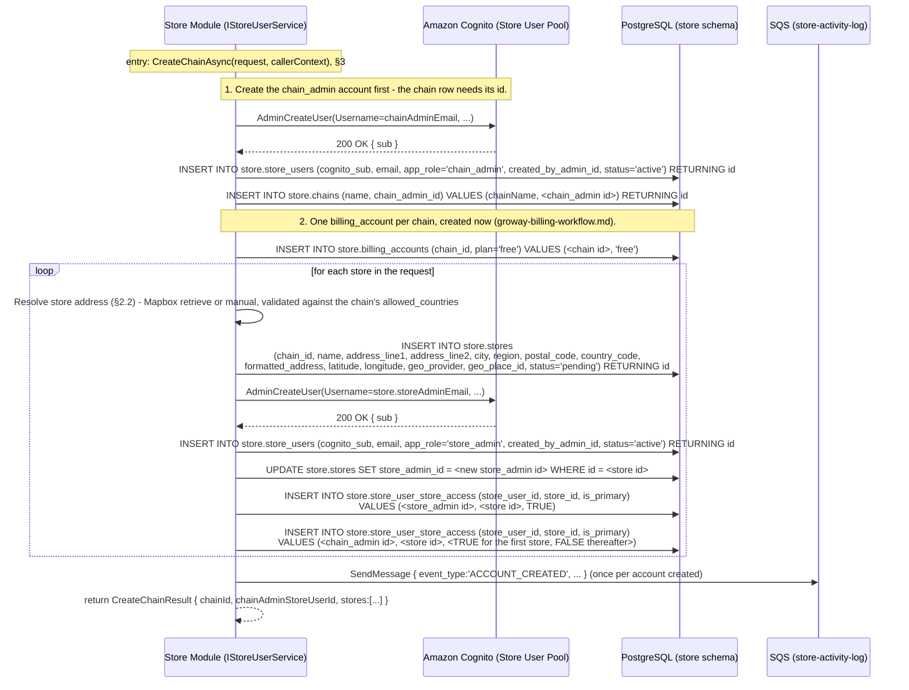
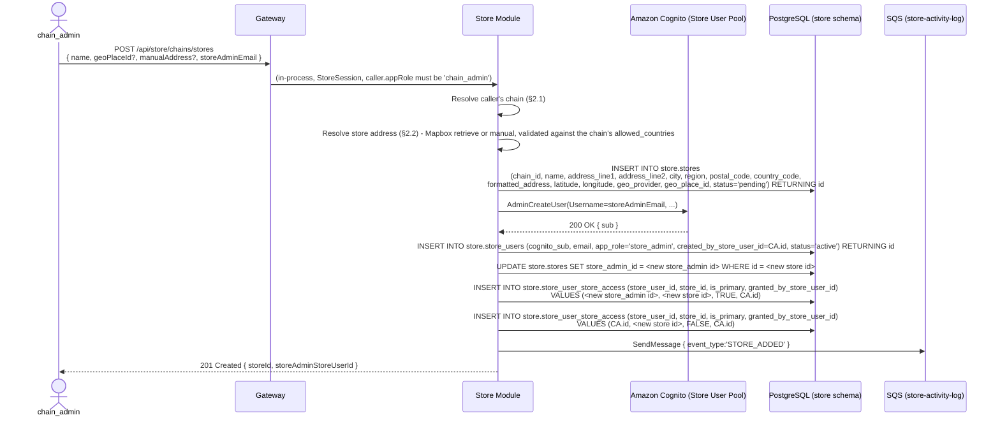
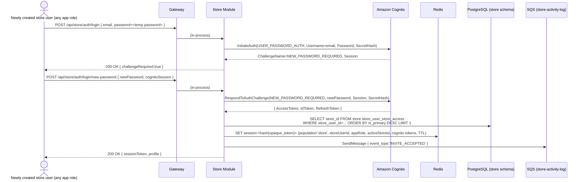
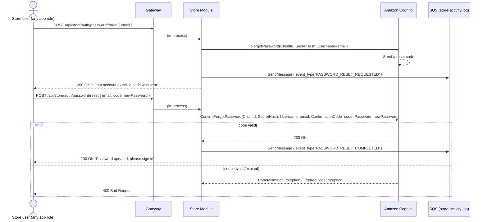
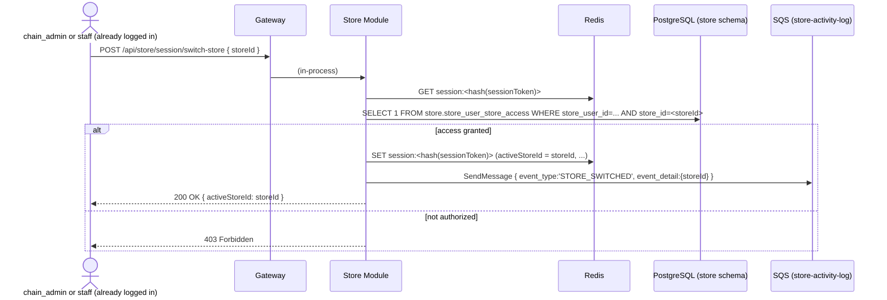
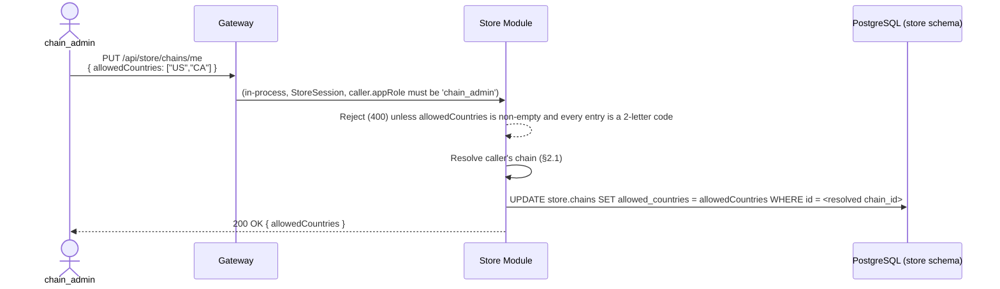
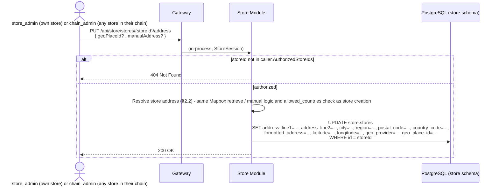

# Store Module — Chain & Account Creation Workflow

**Architecture:** see `groway-v1-architecture.md` for the shared Gateway, one Postgres instance (this module owns the `store` schema), one Redis (sessions tagged `population: "store"`), the `StoreSession` authentication scheme, route-group fail-closed enforcement (`/api/store/*`), and the compiler-enforced module-boundary/extraction pattern (`IStoreUserService` in `Groway.Store.Contracts`). Not re-derived here.

**Relationship to other documents:**
- `store-onboarding-v1-design.md` is the fixed reference for the booking domain (`store.stores`, `staff`, `services`, `appointments`, etc.), implemented by this same Store Module, same `store` schema. This document owns the *account/identity* layer on top of it and adds its own columns to `store.stores` via `ALTER TABLE` (§5) rather than redefining that table.
- `growayadmin-registration-workflow.md`: a Groway admin is the actor who creates a chain (§7.1); the call reaches this module **in-process**, not over the network.
- `growayshop-staff-invite-workflow.md`: covers the *ongoing* "invite a staff member" flow — this document covers chain creation (§7.1) and a chain_admin's own ongoing "add a store" flow (§7.2).
- `groway-billing-workflow.md`: reads `store.chains`/`store.stores` created here; billing is anchored to `chain_id` (created here, §7.1), never to any individual store or store_admin.
- `store-onboarding-v1-design.md`: owns `store.stores`' address columns (§4 there); this document owns how those columns get populated — Mapbox address resolution (§2.2) — since that's an identity/data-entry concern, not a booking-domain one.

**Terminology (2026-09-28, unifying prior inconsistent usage — `groway-architecture-decisions.md`):** **Chain** = the business as a whole, one or more stores, one billing account. **Store** = one physical location or one independent practitioner. "Merchant" is retired.

**Scope — deliberately narrow.** How a Groway admin creates a new chain (its `chain_admin` account plus one `store_admin` per store), how a `chain_admin` can self-service add a further store later, and the baseline login/session/password-reset mechanics shared by all three app roles. Out of scope: ongoing staff invitation (`growayshop-staff-invite-workflow.md`); any dashboard/calendar/booking feature API (`store-onboarding-v1-design.md` §6).

---

## 1. Three app roles

`store-onboarding-v1-design.md`'s `staff_store_assignments.role` (`owner`/`manager`/`staff`, or free text like "CEO") is **descriptive**, not access-control. This document's **app role** is separate:

| | `chain_admin` | `store_admin` | `staff` |
|---|---|---|---|
| Stores accessible | **Every store in the chain** | Exactly one (their own store) | One or many, switchable |
| Sees a store's whole calendar | Yes, any store in the chain | Yes, own store | Yes |
| Can make/manage bookings | *(future feature)* | *(future feature)* | No |
| Can request own time off | *(future feature)* | *(future feature)* | Yes — feeds `staff_time_offs` |
| Can invite `staff` | Yes, any store in the chain | Yes, own store only | No |
| Can create a new `store_admin` | Yes — **only** when adding a new store (§7.2); no ongoing management power over it afterward | No | No |
| Can add a new store to the chain | Yes, self-service (§7.2) | No | No |
| Billing self-service (start-trial / cancel / status) | **Yes — the only role that can** (`groway-billing-workflow.md`) | No — a store has no billing concept of its own | No |
| Change the chain's `allowed_countries` (§7.7) | **Yes — the only role that can** | No (read-only, §7.7) | No |
| Edit a store's address (§7.8) | Yes, any store in the chain | Yes, own store only | No |
| Can deactivate/reactivate a `chain_admin` or `store_admin` | No — **only a Groway admin can** (`growayadmin-registration-workflow.md`) | No | No |
| Who creates this account | Groway admin only (§7.1) | Groway admin (§7.1) or `chain_admin` (§7.2) | Groway admin, `chain_admin`, or `store_admin` (`growayshop-staff-invite-workflow.md`) |
| Password reset | Self-service, like a customer | Self-service, like a customer | Self-service, like a customer |
| How many per chain | **Exactly one, ever** | One per store | Any number |

Each `store.store_users` row has exactly one `app_role` — a person needing two roles needs two accounts, though in practice this is rarely necessary since `chain_admin` already has every `store_admin` capability (just applied across the whole chain instead of one store).

---

## 2. Chain and store structure

```text
store.chains (1) ──chain_admin_id (UNIQUE)──> store.store_users (exactly one chain_admin)
      │
      └── store.stores (many) ──store_admin_id (UNIQUE)──> store.store_users (exactly one store_admin each)
                │
                └── store.store_user_store_access (many-to-many: which store_users can act on which store)
```

**One store, one operational admin** — enforced at the database level (`store.stores.store_admin_id UNIQUE`, §5). **One chain, one chain_admin** — also DB-enforced (`store.chains.chain_admin_id UNIQUE NOT NULL`, §5), a genuinely separate account, not a store_admin wearing a second hat. A `chain_admin` gets one `store_user_store_access` row per store in their chain (one marked `is_primary = TRUE` as their default store, per §7.1); a `store_admin` gets exactly one such row, for their own store. `staff` accounts are unaffected — still many-to-many, since one person can work shifts at more than one store of the same chain (never across unrelated chains).

The session tracks **one active store at a time** (§4); switching (§7.6) updates context within the existing session, it never re-authenticates. For a `store_admin` there is only one store to be active on, so switching is a no-op for them; `chain_admin` and multi-store `staff` are the ones who actually switch.

### 2.1 Resolving "the caller's chain"

Some `chain_admin`-only actions (adding a store, §7.2; every billing self-service endpoint in `groway-billing-workflow.md`) need the caller's chain, not just their authorized stores:

```sql
SELECT id FROM store.chains WHERE chain_admin_id = <caller.PrincipalId>
```

Since `chain_admin_id` is `UNIQUE NOT NULL` on `store.chains`, and the only way to become a `chain_admin` is §7.1/§7.2's flow, this always resolves to exactly one row for a genuine `chain_admin` caller — no ambiguity case to handle here (unlike the merchant-anchored resolution this document used briefly before the chain model existed).

### 2.2 Resolving a store's address — Mapbox, used by §7.1, §7.2, and §7.8

**Client side (not designed here):** the store-creation/edit form's address field is a single autocomplete input calling Mapbox's Search Box "suggest" endpoint directly from the browser, with a restricted public token — no backend round-trip per keystroke. `country=<chain's allowed_countries>` (§7.7) is passed to keep suggestions scoped to countries this chain actually operates in. A "enter it manually" fallback is always available, for addresses Mapbox can't complete.

**Server side — one Mapbox call per store created/edited, not per keystroke.** Every request that sets a store's address carries **either** `geoPlaceId` (the user picked a suggestion) **or** `manualAddress` (the fallback form):

```csharp
// internal to Groway.Store - single consumer today (Store Module); if a
// second module ever needs geocoding, promote this to Groway.Shared then,
// not preemptively now (architecture doc §10).
internal interface IGeocodingProvider
{
    Task<GeocodeResult> RetrieveAsync(string placeId);
}
internal sealed record GeocodeResult(
    string AddressLine1, string? AddressLine2, string City, string Region,
    string PostalCode, string CountryCode, string FormattedAddress,
    decimal Latitude, decimal Longitude);

services.AddScoped<IGeocodingProvider, MapboxGeocodingProvider>(); // V1: the only implementation
```



**Why retrieve, not the frontend's own parse:** Mapbox's suggestion payload during typing is optimized for display, not guaranteed to carry every structured field the same way `retrieve` does. Calling `retrieve` once, server-side, at the moment of commit gets the authoritative, current components and coordinates for that exact `place_id` — and gives the backend one true point to enforce `allowed_countries` against, rather than trusting whatever the client claims it parsed.

**Why no `country_address_rules` table:** North America (`CA`/`US`) needs nothing beyond "required fields present" — a real rules table today would hold two identical "no rule" rows, which is noise, not extensibility. The *code* is still structured to check for a per-country override and fall back to the loose default if none exists — so a future country with real requirements (a stricter postal format, a different required-fields set) is a code change that adds one case, not a restructuring of this flow. The table itself is deferred until a country actually needs one.

**Refreshing a stale address:** there is no periodic re-geocode job — addresses don't move on their own, and a store's address changes exactly when someone edits it (§7.8), which already re-runs this same resolution. `geo_place_id` is kept for the one scenario a recurring job can't help with anyway: migrating to a different geocoding provider, which is a one-time, manually-run ops script over existing rows, not a schedule.

---

## 3. Why creating these accounts is an in-process call, not a network call

A Groway admin's session is tagged `population:"admin"` in the shared Redis (architecture doc §6.5); the `StoreSession` authentication scheme would reject it outright on any `/api/store/*` route. So a Groway admin never calls a Store Module route directly — they call an **Admin Module** endpoint, which invokes Store Module's public interface **in-process**:



`callerContext.Population == "admin"` here — Store Module's implementation still checks this explicitly (never assumes "Admin Module already authorized it," per architecture doc §6.5). This is the extraction seam: if Store Module is ever pulled out into its own service, this becomes an HTTP call with the same DTO/`CallerContext` shape — Admin Module's code does not change.

---

## 4. Session mechanism

Shared Redis, `population:"store"`, per architecture doc §7. The store-specific addition is `activeStoreId`:

```json
{
  "sessionId": "...", "population": "store",
  "principalId": "...", "appRole": "chain_admin",
  "activeStoreId": "...",
  "cognitoAccessToken": "...", "cognitoIdToken": "...", "cognitoRefreshToken": "...",
  "createdAt": "...", "lastUsedAt": "...", "expiresAt": "..."
}
```

`appRole` is one of `chain_admin` / `store_admin` / `staff`.

---

## 5. Database schema (`store` schema, `StoreDbContext`)

```sql
-- One row per login account (any of the three app roles).
CREATE TABLE store.store_users (
    id                  UUID PRIMARY KEY DEFAULT gen_random_uuid(),
    cognito_sub         VARCHAR(64)  NOT NULL UNIQUE,   -- Cognito "sub" in the Store User Pool
    email               VARCHAR(255) NOT NULL UNIQUE,
    display_name        VARCHAR(200),
    app_role            VARCHAR(20)  NOT NULL CHECK (app_role IN ('chain_admin', 'store_admin', 'staff')),
    -- No staff_id here - which roster row this account corresponds to is a
    -- per-store fact (see store_user_store_access below).
    status              VARCHAR(20)  NOT NULL DEFAULT 'active' CHECK (status IN ('active', 'deactivated')),
    -- Exactly one of the next two is set: who created this account. A Groway
    -- admin (admin.admins.id, cross-schema - no enforced FK per architecture
    -- doc §5) or another store_users row (a chain_admin adding a store's
    -- store_admin, §7.2, or a store_admin/chain_admin inviting staff).
    created_by_admin_id      UUID,
    created_by_store_user_id UUID REFERENCES store.store_users(id),
    created_at          TIMESTAMPTZ  NOT NULL DEFAULT now(),
    updated_at          TIMESTAMPTZ  NOT NULL DEFAULT now(),
    last_login_at       TIMESTAMPTZ,
    CONSTRAINT chk_exactly_one_creator CHECK (
        (created_by_admin_id IS NOT NULL) <> (created_by_store_user_id IS NOT NULL)
    )
);

-- The chain itself - a real, first-class entity (2026-09-28 decision), not an
-- implicit grouping. Exactly one chain_admin, ever, DB-enforced.
CREATE TABLE store.chains (
    id              UUID PRIMARY KEY DEFAULT gen_random_uuid(),
    name            VARCHAR(200) NOT NULL,
    chain_admin_id  UUID NOT NULL UNIQUE REFERENCES store.store_users(id),
    -- Which countries this chain's stores can be in - filters the Mapbox
    -- suggest box's country= param and validates every address resolution
    -- (§2.2). A commercial/market-expansion setting, not a platform gate -
    -- chain_admin manages it themselves (§7.7). ISO 3166-1 alpha-2 codes.
    allowed_countries TEXT[] NOT NULL DEFAULT '{US,CA}' CHECK (cardinality(allowed_countries) > 0),
    created_at      TIMESTAMPTZ NOT NULL DEFAULT now(),
    updated_at      TIMESTAMPTZ NOT NULL DEFAULT now()
);

-- `store.stores` is defined in store-onboarding-v1-design.md; this document
-- adds the identity columns. One operational store_admin per store, DB-enforced.
ALTER TABLE store.stores
    ADD COLUMN chain_id       UUID NOT NULL REFERENCES store.chains(id),
    ADD COLUMN store_admin_id UUID UNIQUE REFERENCES store.store_users(id);

-- Many-to-many: which store_users can act on which store, and in what roster capacity.
CREATE TABLE store.store_user_store_access (
    store_user_id       UUID NOT NULL REFERENCES store.store_users(id),
    store_id            UUID NOT NULL REFERENCES store.stores(id),
    staff_id            UUID REFERENCES store.staff(id),  -- the person-level roster identity behind this login (store-onboarding-v1-design.md §4);
                                          -- the same value across all of this person's store_user_store_access rows.
                                          -- NULL for chain_admin/store_admin rows (pure admin access, no service-performing role).
    is_primary          BOOLEAN NOT NULL DEFAULT FALSE,  -- default activeStoreId after login
    granted_at           TIMESTAMPTZ NOT NULL DEFAULT now(),
    granted_by_admin_id       UUID,  -- cross-schema reference to admin.admins.id, not enforced
    granted_by_store_user_id  UUID REFERENCES store.store_users(id),
    PRIMARY KEY (store_user_id, store_id),
    CONSTRAINT chk_exactly_one_granter CHECK (
        (granted_by_admin_id IS NOT NULL) <> (granted_by_store_user_id IS NOT NULL)
    )
);

CREATE TABLE store.store_user_activity_log (
    id             BIGSERIAL PRIMARY KEY,
    store_user_id  UUID REFERENCES store.store_users(id),
    event_type     VARCHAR(30) NOT NULL,
    event_detail   JSONB,
    ip_address     VARCHAR(45),
    created_at     TIMESTAMPTZ NOT NULL DEFAULT now(),
    CONSTRAINT chk_store_user_event_type CHECK (event_type IN (
        'ACCOUNT_CREATED', 'INVITE_ACCEPTED',
        'LOGIN_SUCCESS', 'LOGIN_FAILED', 'LOGOUT',
        'PASSWORD_RESET_REQUESTED', 'PASSWORD_RESET_COMPLETED',
        'STORE_SWITCHED', 'STORE_ADDED'
    ))
);

CREATE INDEX idx_store_user_store_access_store ON store.store_user_store_access(store_id);
CREATE INDEX idx_store_user_activity_log_store_user_id ON store.store_user_activity_log(store_user_id);
CREATE INDEX idx_stores_chain_id ON store.stores(chain_id);
```

Activity log delivery: dedicated `store-activity-log` SQS queue + its own KEDA-scaled consumer, per architecture doc §8.

---

## 7. Sequence diagrams

### 7.1 Chain creation (Groway admin, continuing from §3)

One request creates the chain, its one `chain_admin`, and one store + one `store_admin` per store the intake email listed:



The `chain_admin`'s default store (`is_primary = TRUE`) is the first store in the request list unless the caller says otherwise — a UI convenience, not a meaningful business choice, since `chain_admin` can see and switch to any of them regardless.

### 7.2 Self-service: `chain_admin` adds a store



**`chain_admin` can create this `store_admin`, but gains no ongoing authority over it** (§1) — `created_by_store_user_id` records who set the account up, purely for audit; deactivating or resetting it afterward is Groway-admin-only, same as any other `store_admin` (`growayadmin-registration-workflow.md`). This is a deliberate asymmetry: creation is a narrow, one-time act bundled into "adding a store," not a general management capability.

Right after this call, `store-onboarding-v1-design.md` §8 offers an optional next step: copying the whole service catalog (categories/services/options) from another store in the same chain, instead of re-entering it by hand.

### 7.3 Accepting the invite / first login (forced password change)



### 7.4 Ordinary login (returning store user)

Same shape as the Admin Module's §4.4 — `InitiateAuth(USER_PASSWORD_AUTH)`, success/deactivated/invalid-credentials branches, `SendMessage` to `store-activity-log` — not re-diagrammed. **Billing state has no effect on login** (`groway-billing-workflow.md`) — a Free-plan chain, a Paid-plan chain, and a chain reverted from Paid to Free all log in exactly the same way, regardless of app role.

### 7.5 Forgot / reset password (self-service — the customer pattern, not the admin peer-reset pattern)



No Groway admin involved anywhere in this flow — deliberately the easier, self-service path, unlike the internal-admin document's peer-reset model.

### 7.6 Switching stores (`chain_admin` and multi-store `staff`)



Session-context change only — no Cognito call, no new login. A `store_admin` holds exactly one access row, so switching is a no-op for them.

### 7.7 Chain settings: reading and changing `allowed_countries`

```mermaid
sequenceDiagram
    actor U as store_admin or chain_admin
    participant GW as Gateway
    participant SM as Store Module
    participant DB as PostgreSQL (store schema)

    U->>GW: GET /api/store/chains/me
    GW->>SM: (in-process, StoreSession)
    SM->>SM: Resolve caller's chain (§2.1 for chain_admin; via caller's store's chain_id for store_admin)
    SM->>DB: SELECT id, name, allowed_countries FROM store.chains WHERE id = <resolved chain_id>
    SM-->>U: 200 OK { id, name, allowedCountries }
```



Read is open to both roles (a `store_admin` may reasonably want to see why the address box only offers certain countries); write is `chain_admin`-only — a market-expansion decision belongs to the chain, and this field carries no billing/compliance weight in V1, so it needs no Groway-admin gate. Changing it has **no retroactive effect** — existing stores' addresses are untouched; it only changes what the address box offers, and what `§2.2`'s validation accepts, for stores created or edited *after* the change.

### 7.8 Editing a store's address



**404, not 403, for out-of-scope stores** — deliberately: a caller outside their scope shouldn't be able to distinguish "this store doesn't exist" from "this store exists but isn't yours" by the status code alone. This is a plain CRUD action with no business-policy baggage (unlike deactivating a store, §9 item 2) — it doesn't touch billing, doesn't affect existing appointments, and reuses §2.2's resolution logic exactly as store creation does.

---

## 8. Test data

```sql
-- Selah Head Spa: one chain, two stores, one chain_admin, two store_admins.
INSERT INTO store.store_users (id, cognito_sub, email, display_name, app_role, created_by_admin_id, status, created_at, last_login_at)
VALUES
    ('c0000000-0000-0000-0000-000000000000',
     'd1e2f3a4-0000-0000-0000-000000000000',
     'owner@selahheadspa.com', 'Selah Head Spa Owner', 'chain_admin',
     'a2222222-2222-2222-2222-222222222222',  -- Maria Ops, admin.admins
     'active', '2026-09-20 10:00:00-04', '2026-09-25 08:30:00-04'),

    ('c1111111-1111-1111-1111-111111111111',
     'd1e2f3a4-0000-0000-0000-000000000001',
     'manager.kingwest@selahheadspa.com', 'King West Manager', 'store_admin',
     'a2222222-2222-2222-2222-222222222222',
     'active', '2026-09-20 10:00:00-04', '2026-09-25 08:35:00-04'),

    ('c1111112-1111-1111-1111-111111111112',
     'd1e2f3a4-0000-0000-0000-000000000004',
     'manager.yorkville@selahheadspa.com', 'Yorkville Manager', 'store_admin',
     'a2222222-2222-2222-2222-222222222222',
     'active', '2026-09-20 10:00:00-04', NULL),

    ('c2222222-2222-2222-2222-222222222222',
     'd1e2f3a4-0000-0000-0000-000000000002',
     'anna@selahheadspa.com', 'Anna', 'staff',
     'a2222222-2222-2222-2222-222222222222',
     'active', '2026-09-20 10:05:00-04', '2026-09-24 09:00:00-04');

INSERT INTO store.chains (id, name, chain_admin_id, allowed_countries, created_at)
VALUES ('cc111111-1111-1111-1111-111111111111', 'Selah Head Spa',
        'c0000000-0000-0000-0000-000000000000', '{CA}', '2026-09-20 10:00:00-04');

-- store.stores rows themselves (99999999-...0001/0002) are assumed already
-- present per store-onboarding-v1-design.md; this document only sets their
-- identity columns.
UPDATE store.stores SET chain_id = 'cc111111-1111-1111-1111-111111111111', store_admin_id = 'c1111111-1111-1111-1111-111111111111'
WHERE id = '99999999-0000-0000-0000-000000000001';
UPDATE store.stores SET chain_id = 'cc111111-1111-1111-1111-111111111111', store_admin_id = 'c1111112-1111-1111-1111-111111111112'
WHERE id = '99999999-0000-0000-0000-000000000002';

-- Anna: ONE person-level store.staff row (store-onboarding-v1-design.md §4 -
-- name/phone/email live here exactly once), plus one staff_store_assignments
-- row per branch she actually works (this is where "which branches" lives).
INSERT INTO store.staff (id, name, phone, status)
VALUES ('b1000000-0000-0000-0000-000000000001', 'Anna', '416-555-0142', 'active');

INSERT INTO store.staff_store_assignments (staff_id, store_id, role)
VALUES
    ('b1000000-0000-0000-0000-000000000001', '99999999-0000-0000-0000-000000000001', 'staff'),
    ('b1000000-0000-0000-0000-000000000001', '99999999-0000-0000-0000-000000000002', 'staff');

INSERT INTO store.store_user_store_access (store_user_id, store_id, staff_id, is_primary, granted_by_admin_id)
VALUES
    -- chain_admin: one row per store, King West is the default.
    ('c0000000-0000-0000-0000-000000000000', '99999999-0000-0000-0000-000000000001', NULL, TRUE,  'a2222222-2222-2222-2222-222222222222'),
    ('c0000000-0000-0000-0000-000000000000', '99999999-0000-0000-0000-000000000002', NULL, FALSE, 'a2222222-2222-2222-2222-222222222222'),
    -- each store_admin: exactly one row, their own store.
    ('c1111111-1111-1111-1111-111111111111', '99999999-0000-0000-0000-000000000001', NULL, TRUE, 'a2222222-2222-2222-2222-222222222222'),
    ('c1111112-1111-1111-1111-111111111112', '99999999-0000-0000-0000-000000000002', NULL, TRUE, 'a2222222-2222-2222-2222-222222222222'),
    -- Anna (staff) works both branches - same staff_id both times, now that
    -- store.staff is person-level (not a different roster row per branch).
    ('c2222222-2222-2222-2222-222222222222', '99999999-0000-0000-0000-000000000001', 'b1000000-0000-0000-0000-000000000001', TRUE,  'a2222222-2222-2222-2222-222222222222'),
    ('c2222222-2222-2222-2222-222222222222', '99999999-0000-0000-0000-000000000002', 'b1000000-0000-0000-0000-000000000001', FALSE, 'a2222222-2222-2222-2222-222222222222');

INSERT INTO store.store_user_activity_log (store_user_id, event_type, event_detail, ip_address, created_at)
VALUES
    ('c0000000-0000-0000-0000-000000000000', 'ACCOUNT_CREATED', NULL, '203.0.113.10', '2026-09-20 10:00:00-04'),
    ('c0000000-0000-0000-0000-000000000000', 'STORE_SWITCHED', '{"storeId":"99999999-0000-0000-0000-000000000002"}', '198.51.100.30', '2026-09-25 08:31:00-04'),
    ('c2222222-2222-2222-2222-222222222222', 'ACCOUNT_CREATED', NULL, '203.0.113.10', '2026-09-20 10:05:00-04'),
    ('c2222222-2222-2222-2222-222222222222', 'LOGIN_SUCCESS', NULL, '198.51.100.31', '2026-09-24 09:00:00-04');
```

*The owner is `chain_admin`, a genuinely separate account from either store's `store_admin` — this is the current design, not a store_admin wearing two hats. Anna (staff) works both branches with the **same** `staff_id` both times (2026-09-29 fix, `store-onboarding-v1-design.md` §4) — her name/phone live in one `store.staff` row; which branches she works and her per-branch role live in `store.staff_store_assignments`, not in a duplicated `staff` row per branch.*

---

## 9. Open questions

1. **One `app_role` per account, not per store** — a person who is `store_admin` at one store and `staff` at another needs two separate `store_users` rows/logins. Not solved; a real limitation of this first version.
2. **Deactivating/closing a store** (as opposed to adding one, §7.2) isn't designed — only the store-onboarding lifecycle's `suspended` status exists as a label; no endpoint sets it yet.
3. **Session lifetime, MFA, device-management UX** — same open, unresolved status as the other two modules.
