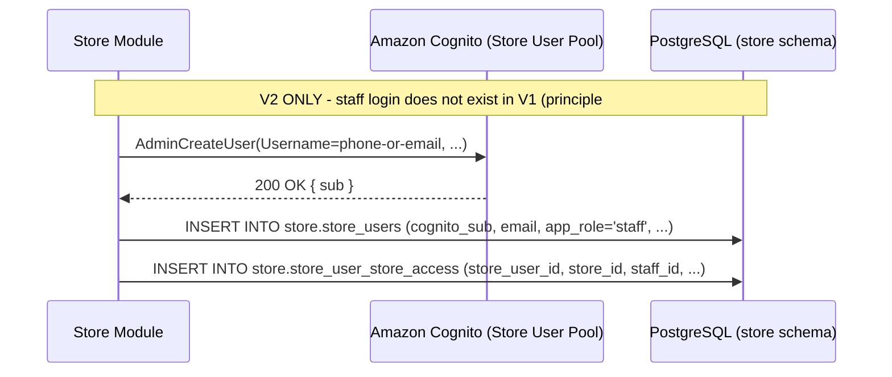

# Store Module — Staff Roster & Timetable Workflow

**Architecture:** see `groway-v1-architecture.md`. Lives inside the **Store Module**, same `store` schema, same `StoreSession` scheme as `growayshop-registration-workflow.md`.

**Terminology (2026-09-28):** "merchant" is retired; this document uses **store** (one location) and **chain** (the business as a whole).

**2026-10-03 (Batch 4) — this document was substantially rewritten.** The retired version designed a staff *invitation*: an email, a Cognito login, a per-store `staff_store_assignments` row with a `status`, and dedicated deactivate/reactivate endpoints. None of that survives. Per Steven's principle #1 (**staff never touch the system in V1**) there is no staff login to invite anyone *into* — "adding a person to a store" is now pure back-office data entry by `store_admin`/`chain_admin`: a chain-level roster row, a store-scoped service assignment, and schedule entries, nothing more. Per principle #2 (**contract and timetable are chain-level**) there is no per-store assignment or status to create or flip — "removing" a person from a store is an ordinary edit to their timetable (`staff-schedule-entry-workflow.md` §0/§4), not a dedicated action designed here.

**Scope:** (1) adding a person to a store's roster (chain-wide phone dedup, then a `staff_services` row + initial schedule entries); (2) a `store_admin`/`chain_admin` adding themselves as bookable staff (the owner-operator case). Explicitly **not** in scope: creating another `chain_admin` or `store_admin` (that's `growayshop-registration-workflow.md` §6.1/§6.2); any staff login, invitation email, or Cognito account (V2 staff-portal groundwork only, gated off in §4, not built in V1); removing a person from a store, which is `staff-schedule-entry-workflow.md`'s ordinary schedule-edit flow, not a separate action designed here.

---

## 1. Adding a person to a store — one flow, chain-wide dedup

"Add person to store" always does the same three things, regardless of whether the person is brand new or already works elsewhere in the chain — there is no "link-existing vs. create-new" choice to make up front anymore (that distinction, and the `staff_store_assignments` row it used to create, are both gone, Batch 4 Decision 1):

1. **Resolve the `store.staff` row** — chain-wide dedup by phone (2026-10-03, Batch 4 Decision 2's "generally useful, not just for self-add" rule): `SELECT id FROM store.staff WHERE chain_id = :chainId AND normalize_phone(phone) = normalize_phone(:phone) ORDER BY id ASC LIMIT 1`. A match reuses that row (`already_on_roster` in the response); no match inserts a new one (`created`). Comparison goes through the same `normalize_phone()` already used by the phone-cap logic (`create-appointment-transaction-design.md` §6.3) — a raw string compare would miss `(416) 602-7342` vs `4166027342` being the same number. If more than one existing row already shares the phone (pre-existing dirty data from before this rule existed — not expected going forward), the deterministic `ORDER BY id ASC LIMIT 1` just picks one; no error, no merge tooling. Cleaning up historical duplicate phones is out of scope.
2. **Add the store-scoped service assignment** — `staff_services` rows at `(staff_id, store_id)` (`store-onboarding-v1-design.md` §7.5).
3. **Add initial schedule entries** — materialized from the store's current `business_hours` as a starting point, then adjusted by the admin (`staff-schedule-entry-workflow.md` §2.2/§3.3).

**Why no login is created.** The retired version of this flow created a Cognito user and a `store_users` row on every invite, on the theory that the person would eventually log in to set their own services/schedule. Per principle #1, that never happens in V1 — `store_admin`/`chain_admin` enters everything, on the person's behalf, every time. Building a login nobody can use is pure V2 groundwork; §4 below shows the shape and marks it explicitly not executed in V1.

---

## 2. Endpoint

```
POST /api/store/staff
{ storeId, phone, name, businessRoleLabel? }
```

Caller: `store_admin` (own store only) or `chain_admin` (any store in their chain) — the usual `storeId ∈ caller.AuthorizedStoreIds` rule, `404` (not `403`) if `storeId` is out of the caller's scope, same "never confirm existence" convention used everywhere else in this project. A Groway admin reaches the same logic via `POST /api/admin/store-staff`, in-process, the same dispatch pattern as every other admin-side action in this codebase.

```json
// response 201
{ "staffId": "...", "status": "created" | "already_on_roster" }
```

`businessRoleLabel` is a purely descriptive, **person-level** display value now (`store.staff.title`, per `staff-profile-design.md`) — not per-store. The old per-store `role` column died with `staff_store_assignments`; do not reintroduce a per-store title or role anywhere (Batch 4 Decision 1).

Immediately after this call, the caller proceeds to `staff-schedule-entry-workflow.md`'s own endpoints (§7.5-referenced services endpoint, §4 for the schedule) to finish setting the person up at this store — this endpoint only ever resolves the roster row, nothing else.

---

## 3. Self-add as staff (new, 2026-10-03 Batch 4 Decision 2)

The owner-operator case — "independent practitioner = a store with exactly one staff member (themself)" (`store-onboarding-v1-design.md` §1) — had no flow before this. Now it does:

**Flow:** team page → "Add myself as staff" → a form pre-filled from the admin's own profile (name, phone) → confirm → calls the same `POST /api/store/staff` as §2, with the admin's own name/phone — the chain-wide phone dedup (§1 step 1) naturally reuses an existing roster row if the admin was already added as staff somewhere else in the chain, or creates a new one if not. The admin then fills in schedule + services exactly like onboarding anyone else. The resulting roster row is a completely ordinary `store.staff` row afterward — nothing marks it as "the owner's."

**No separate staff login** — consistent with principle #1, the human keeps using their existing `store_admin`/`chain_admin` login; the roster row is purely the bookable entry that lets them appear in the slot engine and on the public team page. **No explicit FK between the admin's login (`store_users`) and this `store.staff` row in V1** — the phone-dedup rule plus the activity log are enough to connect them if anyone ever needs to; revisit only if a real need for a hard link emerges.

---

## 4. V2 groundwork — staff login (recorded as intent, NOT executed in V1)

So a future staff-portal project has somewhere to start — **nothing below this line runs in V1**:



`store_user_store_access` itself is untouched by this document in V1 — the table exists today only for `chain_admin`/`store_admin` logins (`growayshop-registration-workflow.md` §5). V2 would derive which stores a staff login can access from "stores where this `staff_id` has a live schedule entry," not from a separately-granted access row — recorded here so the eventual design doesn't reinvent that question.

---

## 5. Test data

```sql
-- Jordan Lee, added to King West by the chain_admin after chain creation.
-- Person-level, chain-level roster row - no login exists for this person in
-- V1 (principle #1).
INSERT INTO store.staff (id, chain_id, name, phone)
VALUES ('b1000000-0000-0000-0000-000000000009',
        'cc111111-1111-1111-1111-111111111111',  -- Selah Head Spa
        'Jordan Lee', '416-555-0199');

-- Service assignment and schedule entries at King West are added through
-- store-onboarding-v1-design.md §7.5 and staff-schedule-entry-workflow.md §4
-- respectively - not reproduced here, this table only resolves the roster row.
```

*Jordan has no `staff_services`/`staff_schedules` rows yet immediately after this `INSERT` — shown in the back office as "待设置" (set up pending, `staff-schedule-entry-workflow.md` §6), not bookable anywhere until both are added.*

---

## 6. Open questions

1. Everything already open in `growayshop-registration-workflow.md` §8 (one `app_role` per account, session lifetime/MFA/device-management) remains open and unaffected by this document.
2. Historical duplicate phones within a chain (pre-dating the §1 dedup rule) are not cleaned up — `ORDER BY id ASC LIMIT 1` is a deterministic workaround, not a fix.
