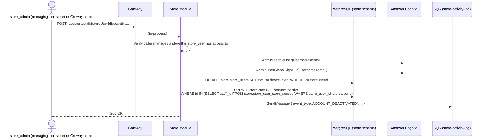

# Store Module — Staff Invitation Workflow

**Architecture:** see `groway-v1-architecture.md`. This document extends `growayshop-registration-workflow.md` (same Store Module, same `store` schema, same `StoreSession` scheme) with the *ongoing* invite/deactivate flows, as opposed to that document's one-time initial-onboarding batch.

**Scope:** (1) inviting a staff member, in two modes — attach a login to an existing, already-onboarded roster entry, or create a brand-new person from scratch — usable by both a Groway admin and a `store_admin`; (2) deactivating/reactivating a `staff` account. Explicitly **not** in scope: a `store_admin` can never create another `store_admin` (one admin per store, more deferred); assigning services/setting a schedule (the "complete your profile" step, §2 — narrative only, not designed at the API level here).

---

## 1. One shared implementation, two entry points, two creation modes

**Two entry points, same underlying `IStoreUserService.CreateStoreUserAsync` call:**
- A `store_admin` calls `POST /api/store/staff/invite` directly, with their own `StoreSession` Bearer token.
- A Groway admin calls `POST /api/admin/store-users`, which Admin Module dispatches in-process into the same Store Module interface (`growayshop-registration-workflow.md` §3) — still the one place a `CallerContext.Population` other than `"store"` reaches this logic, and Store Module still independently re-checks authorization for that case rather than trusting the caller.

**Two creation modes, chosen per store in the request:**
- **Link-existing** — the person is already a row in `store.staff` (e.g. entered during onboarding, never given a login). Provide their `staffId`; no new roster row is created.
- **Create-new** — never entered anywhere. Provide `name`/`phone`/a business-role label; Store Module creates the `store.staff` row itself, in the same schema, then the login — a single local transaction, no cross-module or cross-schema call, per architecture doc §5's "FKs within a schema are normal" rule.

A single request's `storeAccess` array can mix both modes across different stores.

---

## 2. What happens after the invite is accepted (narrative only, not designed here)

Fill in name/email/role (+ optional phone) → invite email sent → they set their password → **they then complete their own profile** — which services they can perform, their working hours. Until both are set, they can log in but are never offered to a customer booking (empty `staff_services`/`staff_schedules` — a naturally derived state, not a status flag).

Calling `store-onboarding-v1-design.md`'s `PUT /admin/staff/{staffId}/services` / `/schedule` from a `staff` account's own session is not designed here — a small, mechanical follow-up once this pattern exists (§6 item 1), not a new design problem.

---

## 3. Endpoints

| Method & path | Caller | Purpose |
|---|---|---|
| `POST /api/store/staff/invite` | `store_admin` | Invite a staff member — link-existing or create-new, per store (§1) |
| `POST /api/admin/store-users` *(existing, `growayshop-registration-workflow.md` §3)* | Groway admin | Same underlying action, reached in-process the other way |
| `POST /api/store/staff/{storeUserId}/deactivate` | `store_admin` managing that store, or Groway admin (via `/api/admin/store-users/{id}/deactivate`) | Deactivate a `staff` account (§4.2) |
| `POST /api/store/staff/{storeUserId}/reactivate` | Same as deactivate | Reactivate one |

Both invite routes accept the same body:

```json
{
  "appRole": "staff",
  "email": "jordan@example.com",
  "storeAccess": [
    { "storeId": "...", "staffId": "<existing staff.id>" },
    { "storeId": "...", "newStaff": { "name": "Jordan Lee", "phone": "416-xxx-xxxx", "businessRoleLabel": "staff" } }
  ]
}
```

`businessRoleLabel` is the purely descriptive `store.staff.role` value — no bearing on `appRole`, which is fixed at `'staff'` for anything created through this endpoint.

---

## 4. Sequence diagrams

### 4.1 Invite — create-new mode (link-existing is a subset, see the note after)

```mermaid
sequenceDiagram
    actor SA as store_admin (or Groway admin, via §1's other entry point)
    participant GW as Gateway
    participant SM as Store Module
    participant DB as PostgreSQL (store schema)
    participant SCOG as Amazon Cognito (Store User Pool)
    participant SQSQ as SQS (store-activity-log)

    SA->>GW: POST /api/store/staff/invite<br/>{ appRole:'staff', email, storeAccess:[{storeId, newStaff:{name,phone,businessRoleLabel}}] }
    GW->>SM: (in-process; CallerContext carries population + authorized store set)
    SM-->>SM: Verify caller has access to every storeId in the request
    loop for each entry with newStaff
        SM->>DB: INSERT INTO store.staff (store_id, name, phone, role, status='active') RETURNING id
    end
    SM->>DB: INSERT INTO store.store_users (email, app_role='staff', status='active',<br/>created_by_admin_id or created_by_store_user_id - whichever caller invited)
    Note over SM,DB: cognito_sub still NULL - filled in next
    SM->>SCOG: AdminCreateUser(Username=email, UserAttributes=[email], DesiredDeliveryMediums=['EMAIL'])
    SCOG-->>SCOG: Create user (FORCE_CHANGE_PASSWORD), email a temp password
    SCOG-->>SM: 200 OK { sub }
    SM->>DB: UPDATE store.store_users SET cognito_sub = sub WHERE id = ...
    loop for each { storeId, staffId } resolved above
        SM->>DB: INSERT INTO store.store_user_store_access (store_user_id, store_id, staff_id, is_primary)
    end
    SM->>SQSQ: SendMessage { event_type:'ACCOUNT_CREATED', ... }
    SM-->>SA: 201 Created { storeUserId }
```

**Link-existing mode** skips the `store.staff` INSERT loop entirely — the provided `staffId` is used directly, after verifying it belongs to a `store_id` the caller has access to (so a `store_admin` can't grant a login against another Chain's roster row).

**The one honest edge case:** if the Cognito call fails after the `staff`/`store_users` rows are committed, you get a `store_users` row with `cognito_sub = NULL` — a clearly-identifiable, retryable "failed invite," not a silent inconsistency. Deliberately simple — no distributed saga — appropriate for how infrequently this happens.

### 4.2 Deactivate a staff account



Both the login side (`store_users.status`) and the roster side (`staff.status`, every store this person has a row at) flip together — a single transaction, same schema. Reactivation is the exact mirror (`AdminEnableUser`, both back to `active`), same caller rule.

---

## 5. Test data

```sql
-- Jordan Lee, a brand-new hire invited by the Selah Head Spa owner (store_admin,
-- c1111111-...) after the initial onboarding batch - exercises create-new mode.
INSERT INTO store.staff (id, store_id, name, phone, role, status)
VALUES ('b1000000-0000-0000-0000-000000000009',
        '99999999-0000-0000-0000-000000000001', 'Jordan Lee', '416-555-0199', 'staff', 'active');

INSERT INTO store.store_users (id, cognito_sub, email, display_name, app_role, created_by_store_user_id, status, created_at)
VALUES ('c3333333-3333-3333-3333-333333333333',
        'd1e2f3a4-0000-0000-0000-000000000003', 'jordan.lee@selahheadspa.com', 'Jordan Lee', 'staff',
        'c1111111-1111-1111-1111-111111111111',  -- created by the owner, not a Groway admin
        'active', '2026-09-26 09:00:00-04');

INSERT INTO store.store_user_store_access (store_user_id, store_id, staff_id, is_primary, granted_by_store_user_id)
VALUES ('c3333333-3333-3333-3333-333333333333', '99999999-0000-0000-0000-000000000001',
        'b1000000-0000-0000-0000-000000000009', TRUE, 'c1111111-1111-1111-1111-111111111111');

INSERT INTO store.store_user_activity_log (store_user_id, event_type, created_at)
VALUES ('c3333333-3333-3333-3333-333333333333', 'ACCOUNT_CREATED', '2026-09-26 09:00:00-04');
```

*Jordan has no `staff_services`/`staff_schedules` rows yet — matching §2, logged in but not yet bookable until that profile step is completed.*

---

## 6. Open questions

1. **Assigning services/schedule ("complete your profile," §2)** is still undesigned at the API level — flagged, not solved.
2. Everything already open in `growayshop-registration-workflow.md` §8 (one `app_role` per account, session lifetime/MFA/device-management) remains open and unaffected by this document.
