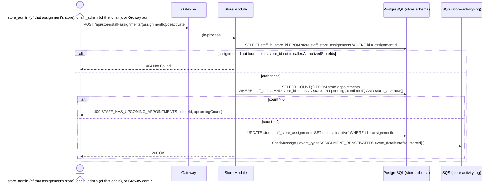

# Store Module — Staff Invitation Workflow

**Architecture:** see `groway-v1-architecture.md`. This document extends `growayshop-registration-workflow.md` (same Store Module, same `store` schema, same `StoreSession` scheme) with the *ongoing* invite/deactivate flows, as opposed to that document's one-time chain-creation batch.

**Terminology (2026-09-28):** "merchant" is retired; this document uses **store** (one location) and **chain** (the business as a whole).

**Scope:** (1) inviting a staff member, in two modes — attach a login to an existing, already-onboarded roster entry, or create a brand-new person from scratch — usable by a `store_admin` (their own store only), a `chain_admin` (any store in their chain), or a Groway admin; (2) deactivating/reactivating a `staff` account. Explicitly **not** in scope: creating another `chain_admin` or `store_admin` through this flow (that's `growayshop-registration-workflow.md` §6.1/§6.2, a different and much narrower-purpose action); assigning services/setting a schedule (the "complete your profile" step, §2 — narrative only, not designed at the API level here).

---

## 1. One shared implementation, three entry points, two creation modes

**Three entry points, same underlying `IStoreUserService.CreateStoreUserAsync` call:**
- A `store_admin` calls `POST /api/store/staff/invite` with their own `StoreSession` — their `CallerContext.AuthorizedStoreIds` contains exactly one store, so they can only target that one.
- A `chain_admin` calls the **same** `POST /api/store/staff/invite` — no separate endpoint needed, since their `AuthorizedStoreIds` already covers every store in their chain, and the authorization check (§4.1) is the same set-membership test either way.
- A Groway admin calls `POST /api/admin/store-users`, which Admin Module dispatches in-process into the same Store Module interface — still the one place a `CallerContext.Population` other than `"store"` reaches this logic, and Store Module still independently re-checks authorization for that case rather than trusting the caller.

**Two creation modes, chosen per store in the request:**
- **Link-existing** — the person already exists as a (person-level) `store.staff` row — e.g. entered during onboarding at another store of the same chain, or invited there before. Provide their `staffId`; if they don't already have a `store.staff_store_assignments` row for *this* store, one is created as part of the call (store-onboarding-v1-design.md §4) — no new `store.staff` row is ever created in this mode, since the person already exists.
- **Create-new** — never entered anywhere. Provide `name`/`phone`/a business-role label; Store Module creates the `store.staff` row **and** its first `staff_store_assignments` row, in the same schema, then the login — a single local transaction, no cross-module or cross-schema call, per architecture doc §5's "FKs within a schema are normal" rule.

A single request's `storeAccess` array can mix both modes across different stores (relevant for a `chain_admin` inviting one person to work at two of their stores at once).

---

## 2. What happens after the invite is accepted (narrative only, not designed here)

Fill in name/email/role (+ optional phone) → invite email sent → they set their password → **they then complete their own profile** — which services they can perform, their working hours. Until both are set, they can log in but are never offered to a customer booking (empty `staff_services`/`staff_schedules` — a naturally derived state, not a status flag).

These two steps already have real routes, both callable from a `staff` account's own session: assigning services is `PUT /api/store/staff/{staffId}/services` (`store-onboarding-v1-design.md` §7.5), setting the weekly schedule is `PUT /api/store/stores/{storeId}/staff/{staffId}/schedule` (`staff-schedule-entry-workflow.md` §4). Neither is designed *in this document* — they're cross-referenced, not reproduced.

---

## 3. Endpoints

| Method & path | Caller | Purpose |
|---|---|---|
| `POST /api/store/staff/invite` | `store_admin` (own store) or `chain_admin` (any store in their chain) | Invite a staff member — link-existing or create-new, per store (§1) |
| `POST /api/admin/store-users` *(existing, `growayshop-registration-workflow.md` §3)* | Groway admin | Same underlying action, reached in-process the other way |
| `POST /api/store/staff-assignments/{assignmentId}/deactivate` | `store_admin` of *that* assignment's store, `chain_admin` of that chain, or Groway admin | Deactivate one `staff_store_assignments` row — this person's relationship with *this one store* (§4.2) |
| `POST /api/store/staff-assignments/{assignmentId}/reactivate` | Same as deactivate | Reactivate one assignment |
| `POST /api/store/staff/{staffId}/deactivate` | `chain_admin` (of that person's chain) or Groway admin **only** | Deactivate **every** active assignment this person has, in one transaction — "deactivate entirely" (§4.2) |
| `POST /api/store/staff/{staffId}/reactivate` | Same as the bulk deactivate | Reactivate every currently-inactive assignment this person has |

Both invite routes accept the same body:

```json
{
  "appRole": "staff",
  "email": "jordan@example.com",
  "storeAccess": [
    { "storeId": "...", "staffId": "<existing staff.id>" },
    { "storeId": "...", "newStaff": { "name": "Jordan Lee", "phone": "416-xxx-xxxx", "businessRoleLabel": "staff" } }
  ]
}
```

`businessRoleLabel` is the purely descriptive `store.staff_store_assignments.role` value (`store-onboarding-v1-design.md` §4 — per-store, since the same person's role can differ by location) — no bearing on `appRole`, which is fixed at `'staff'` for anything created through this endpoint.

---

## 4. Sequence diagrams

### 4.1 Invite — create-new mode (link-existing is a subset, see the note after)

```mermaid
sequenceDiagram
    actor A as store_admin, chain_admin, or Groway admin (§1's other entry point)
    participant GW as Gateway
    participant SM as Store Module
    participant DB as PostgreSQL (store schema)
    participant SCOG as Amazon Cognito (Store User Pool)
    participant SQSQ as SQS (store-activity-log)

    A->>GW: POST /api/store/staff/invite<br/>{ appRole:'staff', email, storeAccess:[{storeId, newStaff:{name,phone,businessRoleLabel}}] }
    GW->>SM: (in-process; CallerContext carries population + authorized store set)
    SM-->>SM: Verify caller has access to every storeId in the request (AuthorizedStoreIds)
    loop for each entry with newStaff
        SM->>DB: INSERT INTO store.staff (name, phone, status='active') RETURNING id
        SM->>DB: INSERT INTO store.staff_store_assignments (staff_id, store_id, role)
    end
    SM->>SCOG: AdminCreateUser(Username=email, UserAttributes=[email], DesiredDeliveryMediums=['EMAIL'])
    SCOG-->>SCOG: Create user (FORCE_CHANGE_PASSWORD), email a temp password
    SCOG-->>SM: 200 OK { sub }
    SM->>DB: INSERT INTO store.store_users (cognito_sub, email, app_role='staff', status='active',<br/>created_by_admin_id or created_by_store_user_id - whichever caller invited)
    loop for each { storeId, staffId } resolved above
        SM->>DB: INSERT INTO store.store_user_store_access (store_user_id, store_id, staff_id, is_primary)
    end
    SM->>SQSQ: SendMessage { event_type:'ACCOUNT_CREATED', ... }
    SM-->>A: 201 Created { storeUserId }
```

**Link-existing mode** skips the `store.staff` INSERT entirely — the provided `staffId` is used directly, after verifying the caller has access to the target `storeId` (so a `store_admin` can't grant a login against another chain's roster person, and a `chain_admin` can't reach outside their own chain). It runs `INSERT INTO store.staff_store_assignments (staff_id, store_id, role) VALUES (...) ON CONFLICT (staff_id, store_id) DO UPDATE SET status = 'active'` (2026-10-02, Batch 2 F2 — changed from `DO NOTHING`) — this now covers **three** cases with the same call: "this person already works here, just add a login," "this person works elsewhere in the chain, now also assign them here," and "this person's assignment here was previously deactivated, and inviting them again means exactly one thing — they're back." Forcing an invite followed by a separate reactivate call for that third case would be pointless friction; re-inviting someone already expresses the only plausible intent. The response distinguishes which of the three happened (`"assignmentStatus": "created" | "reactivated" | "unchanged"`) so the caller and the activity log can tell them apart.

**Why Cognito comes first (2026-09-29 fix):** an earlier version of this diagram inserted `store.store_users` before calling Cognito, leaving `cognito_sub` to be filled in by a later `UPDATE` — but `store_users.cognito_sub` is `NOT NULL` (`growayshop-registration-workflow.md` §5), so that initial `INSERT` would simply fail. The fix is Cognito-first, matching every other account-creation flow in this codebase (`growayshop-registration-workflow.md` §6.1's chain creation, §6.2's self-service add-store, `growayadmin-registration-workflow.md`'s admin invite) — one `INSERT` with `cognito_sub` already populated, never a nullable column and a two-step dance for this one flow alone.

**The one honest edge case:** if `AdminCreateUser` succeeds (the invite email is already sent) but the subsequent `store.store_users` `INSERT` then fails, you get an orphaned Cognito user with no corresponding row in this system — nothing to query for here, since the DB never learned about it. Rare (it requires a local DB failure in the instant right after a remote call already succeeded) and not worth a distributed saga for — the same category of problem as superadmin password recovery (`growayadmin-registration-workflow.md` §4.5): accepted as a manual cleanup via the AWS Cognito console, not engineered around. A cheap, optional hardening if it ever becomes a real annoyance: a best-effort `AdminDeleteUser` call when the `INSERT` fails, cleaning up the orphan without changing this flow's overall shape — not required for V1.

**The mirror case, in create-new mode:** `store.staff` and `store.staff_store_assignments` are still inserted *before* the Cognito call (in the `loop` above) — if `AdminCreateUser` then fails, you're left with a roster row and an assignment but no login. This is harmless, not a bug needing the same fix as `store_users`: neither table has any constraint tying it to a `store_users` row existing, so nothing fails or conflicts. It's also directly recoverable with a feature this document already has — retry the invite in **link-existing** mode using the `staffId` that was just created, which skips the roster `INSERT` and goes straight to Cognito.

### 4.2 Deactivation — moved from the person to the relationship (2026-10-02, Batch 2 Change 1)

**What changed and why.** The retired version of this section flipped a person-level `store.staff.status` (plus the login's `store_users.status`) — deactivating a `staff` account meant deactivating that person *everywhere*, with no way to remove them from just one store while they kept working at another (`store-onboarding-v1-design.md` §9 item 3, now resolved). `store.staff.status` is gone; status now lives on `staff_store_assignments` — the actual relationship between a person and a store. "Remove from store A, keep store B" and "deactivate entirely" are the same operation at different scopes: the latter is just deactivating every one of a person's active assignments in one transaction (§4.2.2 below), not a separate code path.

**`store_users` rows are left untouched by either endpoint in this version.** There is no staff login interface in V1 (nothing a `staff` account can do by logging in yet), so flipping a login nobody can use is pointless — Cognito is never called by either endpoint below. V2 will derive login validity from "≥1 active assignment" when a staff login interface actually exists; that's recorded as intent, not built here.

#### 4.2.1 Per-assignment deactivate/reactivate (any store, scoped to its own admin)



`POST /api/store/staff-assignments/{assignmentId}/reactivate` is the exact mirror (`status='active'`, no appointment check — reactivating can never strand a booking). Caller rule: `store_admin` of *that* assignment's own store, `chain_admin` of the chain, or Groway admin — note the consequence as a feature, not a limitation: store A's admin cannot touch Anna's assignment at store B. Each store's admin governs only their own store's relationships; only `chain_admin` or Groway admin can act across stores, which is exactly why "deactivate entirely" needs its own endpoint below rather than being "call this N times."

**In-flight appointments rule:** deactivating an assignment is rejected with `409 STAFF_HAS_UPCOMING_APPOINTMENTS` when the person has appointments **at that store** with `status IN ('pending','confirmed') AND starts_at > now()`. The admin must cancel or reassign those first. Past, cancelled, and no-show appointments never block — appointment history follows the person (`appointments.staff_id` stays person-level, unchanged) regardless of their current assignment status anywhere.

#### 4.2.2 "Deactivate entirely" — a dedicated bulk endpoint, not a UI loop

```mermaid
sequenceDiagram
    actor A as chain_admin (of that person's chain) or Groway admin
    participant GW as Gateway
    participant SM as Store Module
    participant DB as PostgreSQL (store schema)
    participant SQSQ as SQS (store-activity-log)

    A->>GW: POST /api/store/staff/{staffId}/deactivate
    GW->>SM: (in-process; caller.appRole must be chain_admin or a Groway admin)
    SM->>DB: SELECT id, store_id FROM store.staff_store_assignments WHERE staff_id = staffId AND status = 'active'
    SM-->>SM: Verify every returned store_id is in caller.AuthorizedStoreIds (Groway admin: unconditional)
    SM->>DB: SELECT store_id, COUNT(*) AS upcoming FROM store.appointments<br/>WHERE staff_id = staffId AND store_id = ANY(:activeAssignmentStoreIds)<br/>AND status IN ('pending','confirmed') AND starts_at > now()<br/>GROUP BY store_id
    alt any store has upcoming appointments
        SM-->>A: 409 STAFF_HAS_UPCOMING_APPOINTMENTS { blockingStores: [{storeId, storeName, upcomingCount}, ...] }
        Note over SM,DB: whole transaction rolls back - NOTHING is deactivated,<br/>not even the assignments that had zero upcoming appointments
    else none blocked
        SM->>DB: UPDATE store.staff_store_assignments SET status='inactive' WHERE staff_id = staffId AND status = 'active'
        SM->>SQSQ: SendMessage { event_type:'STAFF_DEACTIVATED', event_detail:{assignmentsDeactivated: N} }
        SM-->>A: 200 OK { assignmentsDeactivated: N }
    end
```

`POST /api/store/staff/{staffId}/reactivate` is the mirror — reactivates every one of that person's currently-`inactive` assignments, same caller rule, no appointment check.

**Why a dedicated endpoint instead of the UI calling §4.2.1 once per store:** termination is a single-intent operation. A UI fanning out N per-assignment calls has no transaction holding them together — it can get a person deactivated at 2 of their 3 stores and stop there (a crashed tab, a dropped connection), leaving a silently inconsistent state with no indication anything went wrong. A `store_admin` keeps only the per-assignment endpoint for their own store and structurally cannot reach this one — they're not authorized across the other stores a multi-store person works at, so "deactivate entirely" is, correctly, `chain_admin`/Groway-admin-only.

**The `409` collects every blocker before failing, it never fails fast.** The pre-check queries every active assignment's upcoming appointments in one pass and reports **all** blocking stores with their counts in a single response — an admin's job here is "resolve every blocker, then retry once," not "fix one store, resubmit, discover the next blocker, repeat." All-or-nothing on the write itself follows from the same reasoning in the other direction: a `409` that still deactivated the *unblocked* stores would leave the exact inconsistent, partially-terminated state this redesign exists to avoid — termination is rare enough that correctness is worth more here than saving the admin a retry.

**If the same physical person also holds a separate `store_admin`/`chain_admin` login** (`growayshop-registration-workflow.md` §8 item 1's "one `app_role` per account" limitation) — neither endpoint here touches that other, structurally different `store_users` row at all. Deactivating every one of someone's `staff` assignments has no effect on a `store_admin` login they separately hold; the two remain unrelated.

---

## 5. Test data

```sql
-- Jordan Lee, a brand-new hire invited by the King West store_admin
-- (c1111111-..., growayshop-registration-workflow.md) after chain creation -
-- exercises create-new mode. Person-level staff row, plus one assignment.
INSERT INTO store.staff (id, name, phone, status)
VALUES ('b1000000-0000-0000-0000-000000000009', 'Jordan Lee', '416-555-0199', 'active');

INSERT INTO store.staff_store_assignments (staff_id, store_id, role)
VALUES ('b1000000-0000-0000-0000-000000000009', '99999999-0000-0000-0000-000000000001', 'staff');

INSERT INTO store.store_users (id, cognito_sub, email, display_name, app_role, created_by_store_user_id, status, created_at)
VALUES ('c3333333-3333-3333-3333-333333333333',
        'd1e2f3a4-0000-0000-0000-000000000003', 'jordan.lee@selahheadspa.com', 'Jordan Lee', 'staff',
        'c1111111-1111-1111-1111-111111111111',  -- created by the King West store_admin, not a Groway admin
        'active', '2026-09-26 09:00:00-04');

INSERT INTO store.store_user_store_access (store_user_id, store_id, staff_id, is_primary, granted_by_store_user_id)
VALUES ('c3333333-3333-3333-3333-333333333333', '99999999-0000-0000-0000-000000000001',
        'b1000000-0000-0000-0000-000000000009', TRUE, 'c1111111-1111-1111-1111-111111111111');

INSERT INTO store.store_user_activity_log (store_user_id, event_type, created_at)
VALUES ('c3333333-3333-3333-3333-333333333333', 'ACCOUNT_CREATED', '2026-09-26 09:00:00-04');
```

*Jordan has no `staff_services`/`staff_schedules` rows yet — matching §2, logged in but not yet bookable until that profile step is completed.*

---

## 6. Open questions

1. ~~Assigning services/schedule ("complete your profile," §2) is still undesigned at the API level~~ — **resolved**: both routes now exist (`store-onboarding-v1-design.md` §7.5, `staff-schedule-entry-workflow.md` §4), cross-referenced in §2 above.
2. Everything already open in `growayshop-registration-workflow.md` §8 (one `app_role` per account, session lifetime/MFA/device-management) remains open and unaffected by this document.
