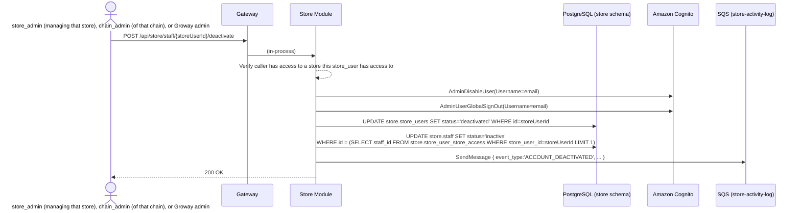

# Store Module — Staff Invitation Workflow

**Architecture:** see `groway-v1-architecture.md`. This document extends `growayshop-registration-workflow.md` (same Store Module, same `store` schema, same `StoreSession` scheme) with the *ongoing* invite/deactivate flows, as opposed to that document's one-time chain-creation batch.

**Terminology (2026-09-28):** "merchant" is retired; this document uses **store** (one location) and **chain** (the business as a whole).

**Scope:** (1) inviting a staff member, in two modes — attach a login to an existing, already-onboarded roster entry, or create a brand-new person from scratch — usable by a `store_admin` (their own store only), a `chain_admin` (any store in their chain), or a Groway admin; (2) deactivating/reactivating a `staff` account. Explicitly **not** in scope: creating another `chain_admin` or `store_admin` through this flow (that's `growayshop-registration-workflow.md` §6.1/§6.2, a different and much narrower-purpose action); assigning services/setting a schedule (the "complete your profile" step, §2 — narrative only, not designed at the API level here).

---

## 1. One shared implementation, three entry points, two creation modes

**Three entry points, same underlying `IStoreUserService.CreateStoreUserAsync` call:**
- A `store_admin` calls `POST /api/store/staff/invite` with their own `StoreSession` — their `CallerContext.AuthorizedStoreIds` contains exactly one store, so they can only target that one.
- A `chain_admin` calls the **same** `POST /api/store/staff/invite` — no separate endpoint needed, since their `AuthorizedStoreIds` already covers every store in their chain, and the authorization check (§4.1) is the same set-membership test either way.
- A Groway admin calls `POST /api/admin/store-users`, which Admin Module dispatches in-process into the same Store Module interface — still the one place a `CallerContext.Population` other than `"store"` reaches this logic, and Store Module still independently re-checks authorization for that case rather than trusting the caller.

**Two creation modes, chosen per store in the request:**
- **Link-existing** — the person already exists as a (person-level) `store.staff` row — e.g. entered during onboarding at another store of the same chain, or invited there before. Provide their `staffId`; if they don't already have a `store.staff_store_assignments` row for *this* store, one is created as part of the call (store-onboarding-v1-design.md §4) — no new `store.staff` row is ever created in this mode, since the person already exists.
- **Create-new** — never entered anywhere. Provide `name`/`phone`/a business-role label; Store Module creates the `store.staff` row **and** its first `staff_store_assignments` row, in the same schema, then the login — a single local transaction, no cross-module or cross-schema call, per architecture doc §5's "FKs within a schema are normal" rule.

A single request's `storeAccess` array can mix both modes across different stores (relevant for a `chain_admin` inviting one person to work at two of their stores at once).

---

## 2. What happens after the invite is accepted (narrative only, not designed here)

Fill in name/email/role (+ optional phone) → invite email sent → they set their password → **they then complete their own profile** — which services they can perform, their working hours. Until both are set, they can log in but are never offered to a customer booking (empty `staff_services`/`staff_schedules` — a naturally derived state, not a status flag).

These two steps already have real routes, both callable from a `staff` account's own session: assigning services is `PUT /api/store/staff/{staffId}/services` (`store-onboarding-v1-design.md` §7.5), setting the weekly schedule is `PUT /api/store/stores/{storeId}/staff/{staffId}/schedule` (`staff-schedule-entry-workflow.md` §4). Neither is designed *in this document* — they're cross-referenced, not reproduced.

---

## 3. Endpoints

| Method & path | Caller | Purpose |
|---|---|---|
| `POST /api/store/staff/invite` | `store_admin` (own store) or `chain_admin` (any store in their chain) | Invite a staff member — link-existing or create-new, per store (§1) |
| `POST /api/admin/store-users` *(existing, `growayshop-registration-workflow.md` §3)* | Groway admin | Same underlying action, reached in-process the other way |
| `POST /api/store/staff/{storeUserId}/deactivate` | `store_admin` managing that store, `chain_admin` of that chain, or Groway admin | Deactivate a `staff` account (§4.2) |
| `POST /api/store/staff/{storeUserId}/reactivate` | Same as deactivate | Reactivate one |

Both invite routes accept the same body:

```json
{
  "appRole": "staff",
  "email": "jordan@example.com",
  "storeAccess": [
    { "storeId": "...", "staffId": "<existing staff.id>" },
    { "storeId": "...", "newStaff": { "name": "Jordan Lee", "phone": "416-xxx-xxxx", "businessRoleLabel": "staff" } }
  ]
}
```

`businessRoleLabel` is the purely descriptive `store.staff_store_assignments.role` value (`store-onboarding-v1-design.md` §4 — per-store, since the same person's role can differ by location) — no bearing on `appRole`, which is fixed at `'staff'` for anything created through this endpoint.

---

## 4. Sequence diagrams

### 4.1 Invite — create-new mode (link-existing is a subset, see the note after)

```mermaid
sequenceDiagram
    actor A as store_admin, chain_admin, or Groway admin (§1's other entry point)
    participant GW as Gateway
    participant SM as Store Module
    participant DB as PostgreSQL (store schema)
    participant SCOG as Amazon Cognito (Store User Pool)
    participant SQSQ as SQS (store-activity-log)

    A->>GW: POST /api/store/staff/invite<br/>{ appRole:'staff', email, storeAccess:[{storeId, newStaff:{name,phone,businessRoleLabel}}] }
    GW->>SM: (in-process; CallerContext carries population + authorized store set)
    SM-->>SM: Verify caller has access to every storeId in the request (AuthorizedStoreIds)
    loop for each entry with newStaff
        SM->>DB: INSERT INTO store.staff (name, phone, status='active') RETURNING id
        SM->>DB: INSERT INTO store.staff_store_assignments (staff_id, store_id, role)
    end
    SM->>SCOG: AdminCreateUser(Username=email, UserAttributes=[email], DesiredDeliveryMediums=['EMAIL'])
    SCOG-->>SCOG: Create user (FORCE_CHANGE_PASSWORD), email a temp password
    SCOG-->>SM: 200 OK { sub }
    SM->>DB: INSERT INTO store.store_users (cognito_sub, email, app_role='staff', status='active',<br/>created_by_admin_id or created_by_store_user_id - whichever caller invited)
    loop for each { storeId, staffId } resolved above
        SM->>DB: INSERT INTO store.store_user_store_access (store_user_id, store_id, staff_id, is_primary)
    end
    SM->>SQSQ: SendMessage { event_type:'ACCOUNT_CREATED', ... }
    SM-->>A: 201 Created { storeUserId }
```

**Link-existing mode** skips the `store.staff` INSERT entirely — the provided `staffId` is used directly, after verifying the caller has access to the target `storeId` (so a `store_admin` can't grant a login against another chain's roster person, and a `chain_admin` can't reach outside their own chain). It still runs `INSERT INTO store.staff_store_assignments ... ON CONFLICT (staff_id, store_id) DO NOTHING` — covers both "this person already works here, just add a login" and "this person works elsewhere in the chain, now also assign them here" with the same call.

**Why Cognito comes first (2026-09-29 fix):** an earlier version of this diagram inserted `store.store_users` before calling Cognito, leaving `cognito_sub` to be filled in by a later `UPDATE` — but `store_users.cognito_sub` is `NOT NULL` (`growayshop-registration-workflow.md` §5), so that initial `INSERT` would simply fail. The fix is Cognito-first, matching every other account-creation flow in this codebase (`growayshop-registration-workflow.md` §6.1's chain creation, §6.2's self-service add-store, `growayadmin-registration-workflow.md`'s admin invite) — one `INSERT` with `cognito_sub` already populated, never a nullable column and a two-step dance for this one flow alone.

**The one honest edge case:** if `AdminCreateUser` succeeds (the invite email is already sent) but the subsequent `store.store_users` `INSERT` then fails, you get an orphaned Cognito user with no corresponding row in this system — nothing to query for here, since the DB never learned about it. Rare (it requires a local DB failure in the instant right after a remote call already succeeded) and not worth a distributed saga for — the same category of problem as superadmin password recovery (`growayadmin-registration-workflow.md` §4.5): accepted as a manual cleanup via the AWS Cognito console, not engineered around. A cheap, optional hardening if it ever becomes a real annoyance: a best-effort `AdminDeleteUser` call when the `INSERT` fails, cleaning up the orphan without changing this flow's overall shape — not required for V1.

**The mirror case, in create-new mode:** `store.staff` and `store.staff_store_assignments` are still inserted *before* the Cognito call (in the `loop` above) — if `AdminCreateUser` then fails, you're left with a roster row and an assignment but no login. This is harmless, not a bug needing the same fix as `store_users`: neither table has any constraint tying it to a `store_users` row existing, so nothing fails or conflicts. It's also directly recoverable with a feature this document already has — retry the invite in **link-existing** mode using the `staffId` that was just created, which skips the roster `INSERT` and goes straight to Cognito.

### 4.2 Deactivate a staff account



Both the login side (`store_users.status`) and the roster side (`staff.status`) flip together — a single transaction, same schema. Since `store.staff` is person-level (2026-09-29 fix, `store-onboarding-v1-design.md` §4), this is now a single-row update, not a loop over every store this person has a row at — `staff_id` is the same value across all of that person's `store_user_store_access` rows, so `LIMIT 1` is enough (any row gives the same `staff_id`). This deactivates the person entirely, at every store — it is not "remove them from just this one store" (`store-onboarding-v1-design.md` §9 item 3, still open). Reactivation is the exact mirror (`AdminEnableUser`, both back to `active`), same caller rule.

**Scope of this action, worth being explicit about:** this only ever touches the one `store_users` row being deactivated (a `staff`-role login) and the person-level `store.staff` row it points to. If that same physical human *also* holds a separate `store_admin` (or `chain_admin`) login elsewhere — a structurally different `store_users` row, per `growayshop-registration-workflow.md` §8 item 1's "one `app_role` per account" limitation — deactivating their `staff` account has no effect on that other account at all; the two are unrelated rows with independent `status` fields. Fine for V1, but worth stating rather than leaving implicit: "deactivate this person's staff access everywhere" and "deactivate this person, full stop" are not the same operation here.

---

## 5. Test data

```sql
-- Jordan Lee, a brand-new hire invited by the King West store_admin
-- (c1111111-..., growayshop-registration-workflow.md) after chain creation -
-- exercises create-new mode. Person-level staff row, plus one assignment.
INSERT INTO store.staff (id, name, phone, status)
VALUES ('b1000000-0000-0000-0000-000000000009', 'Jordan Lee', '416-555-0199', 'active');

INSERT INTO store.staff_store_assignments (staff_id, store_id, role)
VALUES ('b1000000-0000-0000-0000-000000000009', '99999999-0000-0000-0000-000000000001', 'staff');

INSERT INTO store.store_users (id, cognito_sub, email, display_name, app_role, created_by_store_user_id, status, created_at)
VALUES ('c3333333-3333-3333-3333-333333333333',
        'd1e2f3a4-0000-0000-0000-000000000003', 'jordan.lee@selahheadspa.com', 'Jordan Lee', 'staff',
        'c1111111-1111-1111-1111-111111111111',  -- created by the King West store_admin, not a Groway admin
        'active', '2026-09-26 09:00:00-04');

INSERT INTO store.store_user_store_access (store_user_id, store_id, staff_id, is_primary, granted_by_store_user_id)
VALUES ('c3333333-3333-3333-3333-333333333333', '99999999-0000-0000-0000-000000000001',
        'b1000000-0000-0000-0000-000000000009', TRUE, 'c1111111-1111-1111-1111-111111111111');

INSERT INTO store.store_user_activity_log (store_user_id, event_type, created_at)
VALUES ('c3333333-3333-3333-3333-333333333333', 'ACCOUNT_CREATED', '2026-09-26 09:00:00-04');
```

*Jordan has no `staff_services`/`staff_schedules` rows yet — matching §2, logged in but not yet bookable until that profile step is completed.*

---

## 6. Open questions

1. ~~Assigning services/schedule ("complete your profile," §2) is still undesigned at the API level~~ — **resolved**: both routes now exist (`store-onboarding-v1-design.md` §7.5, `staff-schedule-entry-workflow.md` §4), cross-referenced in §2 above.
2. Everything already open in `growayshop-registration-workflow.md` §8 (one `app_role` per account, session lifetime/MFA/device-management) remains open and unaffected by this document.
