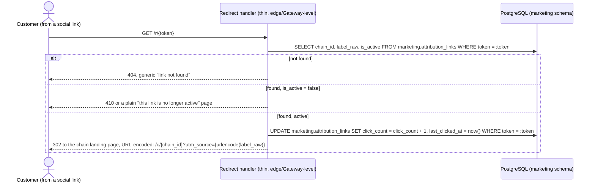

# Marketing Attribution — Short Links Design

**Status:** NEW, 2026-10-03 (Steven, #11). Back-office social-media attribution: a merchant types any label, gets a short link to post on social media, and every booking that comes through it is attributed back to that label.

**Relationship to other documents:** `public-booking-end-to-end-design.md` §1 decision 11/§5 already supports `?utm_source=` on `/book/{store_id}`, writing `appointments.utm_source` (`create-appointment-transaction-design.md` §1 decision 14). This document is the generator/redirect layer that sits in front of that existing mechanism — it never bypasses it, and direct `?utm_source=` links keep working exactly as before. Two deltas land in `public-booking-end-to-end-design.md` itself (§1) rather than here, since they're changes to the existing flow, not new surface.

## 1. Flow

Back-office text field → merchant types any label (e.g. "Redbook", "小红书", anything — no validation, any characters) → [Generate] → short link `groway.app/r/{token}` → merchant posts it on social media → customer clicks → the redirect server resolves the token → `302` to the chain booking page with `?utm_source={label}` appended → attribution recorded on whichever booking results.

**Why a short link instead of a raw `?utm_source=` link directly:**
1. Chinese/emoji labels need no URL-encoding in what the merchant actually posts — clean for a social bio, which often has strict character/length limits.
2. The redirect through our own server is a free click-counting hook — we see every tap, not just the ones that convert to a booking.
3. The opaque token doesn't expose the merchant's internal labeling scheme to whoever inspects the URL.

## 2. Schema

```sql
CREATE TABLE marketing.attribution_links (
  id             UUID PRIMARY KEY DEFAULT gen_random_uuid(),
  chain_id       UUID NOT NULL,  -- application-level reference to store.chains.id, no cross-schema FK (architecture doc §5)
  label_raw      TEXT NOT NULL,  -- stored exactly as typed, no validation, no normalization
  token          TEXT NOT NULL UNIQUE,  -- first 12 hex chars of SHA-256(chain_id || label_raw)
  is_active      BOOLEAN NOT NULL DEFAULT true,
  click_count    INT NOT NULL DEFAULT 0,
  last_clicked_at TIMESTAMPTZ,
  created_at     TIMESTAMPTZ NOT NULL DEFAULT now()
);
CREATE UNIQUE INDEX idx_attribution_links_chain_label ON marketing.attribution_links(chain_id, label_raw);
```

- **`token = SHA-256(chain_id || label_raw)[:12]`, deterministic.** `chain_id` is part of the hash input specifically so two different chains typing the same label (e.g. both using "Instagram") never collide on the same token. Deterministic generation means clicking [Generate] twice for the same label returns the **same** link — idempotent, no duplicate rows, no "which one is the real link" confusion for the merchant.
- **No validation on `label_raw`.** Any characters, any length within the column's practical limits — this is an internal merchant label, not public-facing text that needs sanitizing for display (it only ever appears back-office, to the merchant who typed it).
- **`is_active`** lets a merchant deactivate a leaked or retired link without deleting its click history — a deactivated token's redirect returns a generic "this link is no longer active" page instead of `302`-ing anywhere.
- **`click_count`/`last_clicked_at`** are updated on every redirect (one `UPDATE`, below) — recorded now even though the stats *dashboard* showing them is V1.1 (§5). Recording them from day one means V1.1's dashboard needs no backfill.
- **Owned by a new `marketing` schema** — this isn't Store-domain data (it doesn't describe a booking, a staff member, or a store setting) and isn't Customer-domain either; a small dedicated schema keeps it from being awkwardly bolted onto either existing one, consistent with the project's per-domain schema convention (architecture doc §4).

## 3. Endpoints

### 3.1 Generate (or retrieve) a link

`POST /api/store/attribution-links` `{ label }` — `store_admin`/`chain_admin`, `StoreSession`.

```json
// response 200 (created or retrieved — same shape either way, idempotent)
{ "id": "uuid", "label": "小红书", "shortUrl": "https://groway.app/r/a1b2c3d4e5f6", "clickCount": 0, "isActive": true }
```

Resolves the caller's chain (same pattern as every other chain-scoped action, `growayshop-registration-workflow.md` §2.1), computes the deterministic token, `INSERT ... ON CONFLICT (chain_id, label_raw) DO NOTHING` then re-reads — a second call with the identical label returns the existing row and its real click count, not a fresh zero.

### 3.2 List

`GET /api/store/attribution-links` — same caller, lists this chain's links. Minimal generator UI in V1: a label field, [Generate], [Copy] — **no click/booking stats dashboard, no link regeneration UI** (both V1.1, §5). The list endpoint itself does return `clickCount`/`lastClickedAt` (they're already being recorded, §2) — V1 just has no dedicated dashboard screen built around displaying them prominently; a merchant can still see the raw numbers in the generator list if they look.

### 3.3 Deactivate

`POST /api/store/attribution-links/{id}/deactivate` — same caller. Sets `is_active = false`. No reactivate designed in V1 (generate a new link instead) — deliberately minimal, since "I leaked a link" is rare enough not to need a polished undo.

### 3.4 Redirect (public, unauthenticated)

```
GET https://groway.app/r/{token}
```



**Server URL-encodes `label_raw` when appending it** — never raw-concatenates it into the redirect URL. This is the one place `label_raw`'s "no validation on input" posture meets a context (a URL) that does need escaping; the escaping happens here, at output, not by restricting what a merchant can type in the first place.

**This is a thin redirect handler, not a Store Module route** (2026-10-03, Steven — deliberate, approved exception to the project's `/api/store/*` prefix convention, `availability-slot-engine.md` §7's "everything under `/api/store` now" rule). A short, shareable link is the entire point of this feature — `groway.app/r/{token}` has to be short to be worth putting in a social bio; nesting it under the usual API prefix would defeat that. Implemented as a thin edge/Gateway-level redirect (a lookup + a `302`), not a Store Module business endpoint — it owns no domain logic beyond "resolve a token, redirect, count a click." This is the **one** named exception to the route-prefix rule in this project; it is not a precedent for any other route to also break the convention without its own explicit justification.

## 4. Two deltas pulled into the existing public-booking flow (2026-10-03, #11)

Both land in `public-booking-end-to-end-design.md` directly, not here — listed for visibility since they're what makes this feature actually work for multi-store chains:

1. **The chain landing page (`/c/{chain_id}`) now accepts `?utm_source=` and forwards it to each listed store's `[Book]` link.** Previously an explicitly-deferred V1.1 gap (`public-booking-end-to-end-design.md` §1 decision 11's "known V1 gap" note) — without this, a social link pointing at the chain page (the whole reason the chain page exists) lost attribution the moment a customer picked a store. Now: `/c/{chain_id}?src=xiaohongshu` → every `[Book]` link on that page resolves to `/book/{store_id}?src=xiaohongshu`.
2. **The single-store chain's `302` preserves query params.** A single-store chain's `/c/{chain_id}` already `302`s straight to `/book/{store_id}` (decision 10) — that redirect now carries `?src=` through unchanged, same reasoning as #1.

Direct `?utm_source=`/`?src=` links (not generated through this document's short-link flow) keep working exactly as they did before — this document adds a generator and a redirect layer in front of an unchanged underlying mechanism, it doesn't replace it.

## 5. Deferred (V1.1)

1. Click/booking-conversion stats dashboard (the raw counters are recorded from V1, §2 — just no dedicated UI built around them).
2. Link regeneration (issuing a new token for the same label, invalidating the old one — V1's `deactivate` is the only lifecycle action).
3. Any analytics beyond the raw click count (conversion rate, booking value attributed, etc.).

## 6. Test cases

1. Generate a link with label "小红书" twice → both calls return the same `shortUrl`/token, `clickCount` reflects actual clicks, not a new row per call.
2. Two different chains both generate a link labeled "Instagram" → two different tokens (chain_id is part of the hash).
3. `GET /r/{token}` for an unknown token → `404`, generic copy.
4. `GET /r/{token}` for a deactivated link → not a `302`, a plain "no longer active" response; `click_count` is not incremented for a deactivated link (the handler resolves `is_active` before doing anything else).
5. A label containing `&`/`?`/emoji → the redirect's `?utm_source=` is correctly URL-encoded; the resulting `appointments.utm_source` (once a booking completes) matches `label_raw` exactly, decoded.
6. A multi-store chain's attribution link → `/c/{chain_id}?utm_source=...` → clicking any store's `[Book]` carries the same `utm_source` through to that store's `/book/{store_id}`.
7. A single-store chain's attribution link → the `302` straight to `/book/{store_id}` carries `?utm_source=` through, not dropped.
