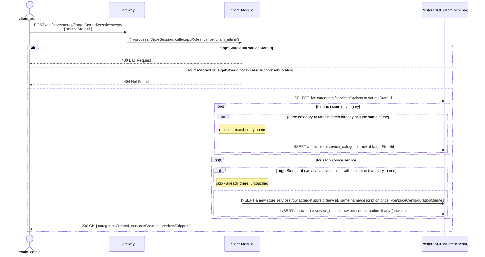

# Store Onboarding & Booking Domain — V1 Design

**Status:** replaces `merchant-onboarding-v1-design.md` entirely. That document used "merchant" for a single store location; Groway's terminology was unified on 2026-09-28 (`groway-architecture-decisions.md`) — **"chain"** is the top-level business, **"store"** is one location. "Merchant" is retired from this codebase and reserved for a different future use. This document is written fresh under the new terminology, not derived from the retired one.

**Architecture:** see `groway-v1-architecture.md`. Owned by the **Store Module**, `store` schema. `store.appointments.customer_id` is an **application-level reference** to `customer.customers` (Customer Module's schema) — never a cross-schema FK, per architecture doc §5.

**Relationship to other documents:** this is the fixed reference for the booking-domain tables (stores, staff, services, schedules, appointments) and the Back Office / public booking APIs. `growayshop-registration-workflow.md` owns the *account/identity* layer (chains, chain_admin/store_admin/staff logins) and adds its own columns to `store.stores` via `ALTER TABLE` (`chain_id`, `store_admin_id`) rather than redefining this table — same pattern `groway-billing-workflow.md` uses for `billing_account_id`.

**V1 decision, unchanged from the retired document:** no self-service store registration. A chain's owner emails Groway → Groway admin enters everything into the Back Office (`growayshop-registration-workflow.md` §6.1 now does this at chain-creation time, one or more stores at once).

---

## 1. Terminology

| Term | Meaning |
|---|---|
| **Chain** | The business as a whole — one owner, one or more stores, one billing account (`groway-billing-workflow.md`). Modeled as `store.chains` (`growayshop-registration-workflow.md` §5). |
| **Store** | One physical location or one independent practitioner. Independent practitioner = a store with exactly one staff member (themself). This document's `store.stores` table. |
| **Staff** | A person working at a store. Business-role label (`owner`/`manager`/`staff`, or free text like "CEO") is descriptive only — no bearing on app access (`growayshop-registration-workflow.md` §1 draws the real access-control line). |
| **Service** | A bookable offering, e.g. "Head massage + scalp treatment + neck & shoulder." |
| **Staff ↔ Service** | Many-to-many: which services a given staff member can perform. |
| **Slot** | Booking time granularity, default 15 minutes. |

---

## 2. Onboarding flow

```
Chain owner emails Groway (intake template, §3)
↓
Groway admin creates the chain in Back Office (growayshop-registration-workflow.md §6.1) —
one or more stores, one chain_admin, one store_admin per store, all in one pass
↓
Per store: enter basic info → add services → add staff → assign staff↔service → set business hours / booking rules
↓
Generate each store's public booking link → hand off to the chain
```

Store lifecycle (`store.stores.status`): `pending` (created) → `active` (delivered, bookable) → `suspended`.

---

## 3. Intake email template

```
Subject: {Chain name}

1. Chain name (public-facing):
2. Owner contact / phone / email:
3. Number of stores, and per store:
   - Store name / address (street, city, region/province/state, postal code, country — default CA) / timezone (default America/Toronto)
   - Store type: [] solo practitioner (1 person) [] team store (multiple people)
   - Services (name | duration(min), if applicable | price | price type (free/fixed/from) | category)
   - Staff (name | phone | which of the above services they perform)
   - Business hours (Mon–Sun, open–close, "closed" if none)
   - Booking rules: slot granularity (default 15 min) / advance-booking window in days (default 90) / auto-confirm (default yes)
```

Fields are stable enough to become a self-service web form later (V2) — the intake email is V1's substitute for that form, not a permanent design.

---

## 4. Database schema (`store` schema)

```sql
-- One row per store location. chain_id/store_admin_id are added by
-- growayshop-registration-workflow.md §5 via ALTER TABLE, not here.
CREATE TABLE store.stores (
    id               UUID PRIMARY KEY DEFAULT gen_random_uuid(),
    name             VARCHAR(200) NOT NULL,
    -- Structured, not a single text blob (2026-09-29 decision, revised same
    -- day for the Mapbox integration - see growayshop-registration-workflow.md
    -- §2.2). formatted_address/latitude/longitude/geo_provider/geo_place_id
    -- are populated by a Mapbox "retrieve" call when the address comes from
    -- the autocomplete suggestion box; they stay NULL for a manually-typed
    -- fallback address (no coordinates is an accepted, valid state).
    address_line1    VARCHAR(255) NOT NULL,
    address_line2    VARCHAR(255),
    city             VARCHAR(100) NOT NULL,
    region           VARCHAR(50)  NOT NULL,  -- province/state; kept country-neutral, not called "province"
    postal_code      VARCHAR(20)  NOT NULL,  -- stored as-typed/as-returned, not format-validated per country (growayshop-registration-workflow.md §2.2)
    country_code     VARCHAR(2)   NOT NULL DEFAULT 'CA',  -- ISO 3166-1 alpha-2
    formatted_address TEXT,        -- provider's display string, cached; NULL for manual entry
    latitude         DECIMAL(9,6), -- NULL until geocoded via Mapbox, or if manually entered
    longitude        DECIMAL(9,6), -- NULL until geocoded via Mapbox, or if manually entered
    geo_provider     VARCHAR(20),  -- 'mapbox' once resolved; NULL for manual entry
    geo_place_id     VARCHAR(255), -- Mapbox's id for this place - used to re-retrieve if the provider is ever migrated (a one-time ops script, not a recurring job)
    timezone         VARCHAR(64)  NOT NULL DEFAULT 'America/Toronto',
    status           VARCHAR(20)  NOT NULL DEFAULT 'pending' CHECK (status IN ('pending', 'active', 'suspended')),
    created_at       TIMESTAMPTZ  NOT NULL DEFAULT now(),
    updated_at       TIMESTAMPTZ  NOT NULL DEFAULT now()
);

-- Person-level identity - one row per person, ever, regardless of how many
-- stores (of the same chain) they work at. name/phone/email live here exactly
-- once (2026-09-29 fix: an earlier version put store_id NOT NULL directly on
-- this table, meaning one physical person needed a separate row - and a
-- separate copy of their name - per store; updating a name meant updating
-- multiple rows. That's a normalization bug, not a real business rule).
CREATE TABLE store.staff (
    id               UUID PRIMARY KEY DEFAULT gen_random_uuid(),
    name             VARCHAR(200) NOT NULL,
    phone            VARCHAR(20),
    email            VARCHAR(255),
    status           VARCHAR(20)  NOT NULL DEFAULT 'active' CHECK (status IN ('active', 'inactive')),
    created_at       TIMESTAMPTZ  NOT NULL DEFAULT now(),
    updated_at       TIMESTAMPTZ  NOT NULL DEFAULT now()
);

-- Which store(s) this person is on the roster for, and their descriptive
-- business-role label AT that store (can differ per store - e.g. manager at
-- one branch, regular staff at another). This is the actual multi-store
-- relationship; store.staff itself is never store-scoped.
CREATE TABLE store.staff_store_assignments (
    id          UUID PRIMARY KEY DEFAULT gen_random_uuid(),
    staff_id    UUID NOT NULL REFERENCES store.staff(id),
    store_id    UUID NOT NULL REFERENCES store.stores(id),
    role        VARCHAR(50) NOT NULL DEFAULT 'staff',  -- descriptive only, e.g. 'owner' | 'manager' | 'staff' | free text
    created_at  TIMESTAMPTZ NOT NULL DEFAULT now(),
    UNIQUE (staff_id, store_id)
);

-- Categories, added 2026-09-29 (store-service-catalog-workflow.md) - store-scoped,
-- like services. Chain-wide shared categories are a v2 "copy to other stores"
-- feature (§8), not a shared catalog now. Soft-deleted (deleted_at, not a status
-- flag) so a deleted category's name becomes reusable immediately - the partial
-- unique index below only guards live rows.
CREATE TABLE store.service_categories (
    id          UUID PRIMARY KEY DEFAULT gen_random_uuid(),
    store_id    UUID NOT NULL REFERENCES store.stores(id),
    name        VARCHAR(64) NOT NULL,
    description TEXT,
    sort_order  INT NOT NULL DEFAULT 0,
    deleted_at  TIMESTAMPTZ,
    created_at  TIMESTAMPTZ NOT NULL DEFAULT now(),
    updated_at  TIMESTAMPTZ NOT NULL DEFAULT now()
);
CREATE UNIQUE INDEX uq_service_categories_store_name ON store.service_categories(store_id, name) WHERE deleted_at IS NULL;
CREATE INDEX idx_service_categories_store_id ON store.service_categories(store_id);

CREATE TABLE store.services (
    id               UUID PRIMARY KEY DEFAULT gen_random_uuid(),
    store_id         UUID NOT NULL REFERENCES store.stores(id),
    category_id      UUID REFERENCES store.service_categories(id),  -- nullable: NULL = uncategorized
    name             VARCHAR(200) NOT NULL,
    description      TEXT,
    -- Nullable: a 'from' service has no service-level duration - each option
    -- (below) carries its own. free/fixed services always set this.
    duration_minutes INT CHECK (duration_minutes BETWEEN 5 AND 720),
    -- For 'from', this column is ignored (kept at 0) - the displayed "from"
    -- price is computed at read time as MIN(service_options.price_cents) for
    -- that service's non-deleted options (2026-09-29: deliberately NOT cached -
    -- a v1 single store's service count makes the join cost negligible, and a
    -- cache that some write path forgets to recompute becomes a wrong
    -- displayed price, which is a customer-facing booking bug. Revisit only if
    -- this join is ever shown to be a real hot path).
    price_cents      INT NOT NULL DEFAULT 0 CHECK (price_cents >= 0),
    price_type       VARCHAR(10) NOT NULL DEFAULT 'fixed' CHECK (price_type IN ('free', 'fixed', 'from')),
    status           VARCHAR(20) NOT NULL DEFAULT 'active' CHECK (status IN ('active', 'inactive')),
    deleted_at       TIMESTAMPTZ,  -- soft delete (default DELETE); a separate hard "purge" is §8's concern, not a flag here
    created_at       TIMESTAMPTZ NOT NULL DEFAULT now(),
    updated_at       TIMESTAMPTZ NOT NULL DEFAULT now()
);

-- Priced/timed variants under a 'from' service (e.g. "60 min" / "Deep tissue
-- 90 min") - what a customer actually picks. Only valid under a 'from'
-- service; free/fixed services never have rows here (enforced at the API
-- layer, §8, not by a CHECK spanning two tables). Soft-deleted like everything
-- else in this catalog - ON DELETE CASCADE only ever fires from a service
-- *purge* (§8), never from an ordinary soft-delete (which is just an UPDATE).
CREATE TABLE store.service_options (
    id               UUID PRIMARY KEY DEFAULT gen_random_uuid(),
    service_id       UUID NOT NULL REFERENCES store.services(id) ON DELETE CASCADE,
    name             VARCHAR(128) NOT NULL,
    duration_minutes INT NOT NULL CHECK (duration_minutes BETWEEN 5 AND 720),
    price_cents      INT NOT NULL CHECK (price_cents >= 0),
    sort_order       INT NOT NULL DEFAULT 0,
    deleted_at       TIMESTAMPTZ,
    created_at       TIMESTAMPTZ NOT NULL DEFAULT now()
);
CREATE INDEX idx_service_options_service_id ON store.service_options(service_id);

-- Which services this person can perform, AT a specific store (services are
-- themselves store-scoped, services.store_id) - keyed off the assignment, not
-- staff_id directly, so "can do X at store A" can't be confused with "at store B".
CREATE TABLE store.staff_services (
    staff_store_assignment_id  UUID NOT NULL REFERENCES store.staff_store_assignments(id),
    service_id                 UUID NOT NULL REFERENCES store.services(id),
    assigned_at                TIMESTAMPTZ NOT NULL DEFAULT now(),
    assigned_by                UUID REFERENCES store.store_users(id),
    PRIMARY KEY (staff_store_assignment_id, service_id)
    -- Application-level invariant, not DB-enforced: the referenced service's
    -- store_id must equal the assignment's store_id - same category of
    -- cross-table rule as appointments.customer_id (architecture doc §5).
);

-- Working hours differ per store for the same person, so this is keyed off
-- the assignment too, not staff_id directly.
CREATE TABLE store.staff_schedules (
    id                         UUID PRIMARY KEY DEFAULT gen_random_uuid(),
    staff_store_assignment_id  UUID NOT NULL REFERENCES store.staff_store_assignments(id),
    day_of_week                SMALLINT NOT NULL CHECK (day_of_week BETWEEN 0 AND 6),  -- 0 = Sunday
    start_time                 TIME NOT NULL,
    end_time                   TIME NOT NULL
);

CREATE TABLE store.staff_time_offs (
    id          UUID PRIMARY KEY DEFAULT gen_random_uuid(),
    staff_id    UUID NOT NULL REFERENCES store.staff(id),
    starts_at   TIMESTAMPTZ NOT NULL,
    ends_at     TIMESTAMPTZ NOT NULL,
    reason      VARCHAR(200),
    created_at  TIMESTAMPTZ NOT NULL DEFAULT now()
);

CREATE TABLE store.business_hours (
    id          UUID PRIMARY KEY DEFAULT gen_random_uuid(),
    store_id    UUID NOT NULL REFERENCES store.stores(id),
    day_of_week SMALLINT NOT NULL CHECK (day_of_week BETWEEN 0 AND 6),
    open_time   TIME,   -- NULL means closed that day
    close_time  TIME
);

CREATE TABLE store.booking_settings (
    store_id                UUID PRIMARY KEY REFERENCES store.stores(id),
    slot_granularity_minutes INT NOT NULL DEFAULT 15,
    advance_booking_days     INT NOT NULL DEFAULT 90,
    auto_confirm             BOOLEAN NOT NULL DEFAULT TRUE
);

-- customer_id is an application-level reference to customer.customers - never
-- an enforced FK (architecture doc §5). Quota enforcement (groway-billing-workflow.md
-- §4.2) runs as one additive internal call at the start of whatever creates this row.
CREATE TABLE store.appointments (
    id            UUID PRIMARY KEY DEFAULT gen_random_uuid(),
    store_id      UUID NOT NULL REFERENCES store.stores(id),
    customer_id   UUID NOT NULL,  -- application-level reference to customer.customers.id
    staff_id      UUID NOT NULL REFERENCES store.staff(id),  -- app-level invariant: staff must have a staff_store_assignments row for this store_id
    status        VARCHAR(20) NOT NULL DEFAULT 'confirmed' CHECK (status IN ('confirmed', 'completed', 'cancelled', 'no_show')),
    starts_at     TIMESTAMPTZ NOT NULL,
    ends_at       TIMESTAMPTZ NOT NULL,
    is_test       BOOLEAN NOT NULL DEFAULT FALSE,  -- staff-marked test booking; see §5 on quota interaction
    created_at    TIMESTAMPTZ NOT NULL DEFAULT now()
);

CREATE TABLE store.appointment_items (
    id              UUID PRIMARY KEY DEFAULT gen_random_uuid(),
    appointment_id  UUID NOT NULL REFERENCES store.appointments(id),
    service_id      UUID NOT NULL REFERENCES store.services(id),
    price_cents     INT NOT NULL  -- snapshot of the price at booking time, not a live join to services
);

CREATE INDEX idx_staff_store_assignments_staff_id ON store.staff_store_assignments(staff_id);
CREATE INDEX idx_staff_store_assignments_store_id ON store.staff_store_assignments(store_id);
CREATE INDEX idx_services_store_id ON store.services(store_id);
CREATE INDEX idx_appointments_store_id_starts_at ON store.appointments(store_id, starts_at);
CREATE INDEX idx_appointments_customer_id ON store.appointments(customer_id);
```

---

## 5. `is_test` and the billing quota — the one place this document and `groway-billing-workflow.md` must stay in sync

`pricing-tiers-v1.md`'s billing rule excludes staff-marked test appointments from the Free-plan quota. That requires `store.appointments.is_test` (added above) to exist, and `groway-billing-workflow.md` §4.2's quota-check call to read it before deciding whether to consume a unit of quota. `is_test` is set by staff at creation time (a checkbox on the manual-booking screen) — never inferred.

---

## 6. APIs

- **Back Office (Groway admin / chain_admin / store_admin), `/api/store/back-office/*`** — CRUD for stores, staff, business hours, booking settings. Wireframes not reproduced here — same step-by-step wizard shape as before (basic info → services → staff → hours/rules → done).
- **Service catalog, `/api/store/*`** — categories, services, options, staff↔service assignment. §7.
- **Public booking, `/api/store/public/*`** — list a store's services/available slots, create an appointment (runs through `groway-billing-workflow.md` §4.2's quota check first).

All routes here follow the same authorization rule, uniformly: **`storeId ∈ caller.AuthorizedStoreIds`** grants write access, never a literal `caller.role == 'store_admin'` check — that set already covers `chain_admin` correctly (every store in their chain) without special-casing the role. A `staff` caller's set still grants only read access to the catalog (they need to see it while picking their own schedule); write endpoints reject `staff` regardless of set membership. A `storeId` outside the caller's set is **404**, not 403 — same reasoning as `growayshop-registration-workflow.md` §7.8: don't let the status code confirm whether a store outside your scope even exists.

---

## 7. Service catalog: categories, services, options, staff assignment (2026-09-29)

### 7.1 Categories

| Method & path | Purpose |
|---|---|
| `GET /api/store/service-categories` | List, with each category's live (non-deleted) service count |
| `POST /api/store/service-categories` | `{ name, description? }` |
| `PUT /api/store/service-categories/{id}` | Rename/re-describe |
| `PUT /api/store/service-categories/order` | `{ orderedIds: [...] }` — drag-reorder |
| `DELETE /api/store/service-categories/{id}` | Soft-delete (`deleted_at`). `409 CATEGORY_HAS_SERVICES` if it has live services and no `moveTo`. |
| `DELETE /api/store/service-categories/{id}?moveTo={targetId}` | Migrates live services to `targetId` (same store, `targetId ≠ id` — else `400`) in one transaction, appending them after `targetId`'s existing `sort_order`, then soft-deletes the source |

A category name is unique **among live categories** in a store (`uq_service_categories_store_name`, §4) — a soft-deleted category's name is immediately reusable.

### 7.2 Services

| Method & path | Purpose |
|---|---|
| `GET /api/store/services?categoryId=&q=&status=` | List/search/filter |
| `POST /api/store/services` | `{ categoryId?, name, description?, priceType, priceCents?, durationMinutes?, options?:[{name,durationMinutes,priceCents}] }` |
| `GET /api/store/services/{id}` | Detail, including live `options` and assigned staff |
| `PUT /api/store/services/{id}` | Edit. Switching `priceType` is validated per §7.4's rules (e.g. `fixed`→`from` requires supplying at least one option in the same call) |
| `PUT /api/store/services/order` | `{ categoryId, orderedIds: [...] }` — reorder within one category |
| `DELETE /api/store/services/{id}` | **Soft delete** (`deleted_at`) — idempotent, the everyday "take this off the menu" action. Existing appointments/`appointment_items` are untouched; `staff_services` rows are kept (so restoring brings staff assignments back too) |
| `DELETE /api/store/services/{id}/purge` | **Hard delete** — a separate, deliberately scary endpoint name, not a query flag on the endpoint above (a dangerous action should look dangerous in the route itself). `409 SERVICE_HAS_APPOINTMENTS` if any `appointment_items` row ever referenced it (any status, including cancelled/no-show); otherwise deletes the row, cascading to `service_options` and `staff_services` |
| `POST /api/store/services/{id}/restore` | Clears `deleted_at`, undoing a soft delete |

### 7.3 Options (only under a `from` service)

| Method & path | Purpose |
|---|---|
| `GET /api/store/services/{serviceId}/options` | List live options |
| `POST /api/store/services/{serviceId}/options` | `{ name, durationMinutes, priceCents }` — `400` if the service's `priceType` isn't `from` |
| `PUT /api/store/service-options/{id}` | Edit |
| `PUT /api/store/services/{serviceId}/options/order` | `{ orderedIds: [...] }` |
| `DELETE /api/store/service-options/{id}` | Soft delete (`deleted_at`) — the service's displayed "from" price (§7.4) is simply recomputed on the next read, nothing to reconcile |

### 7.4 Price semantics by `price_type`

| `price_type` | `price_cents` | `duration_minutes` | `service_options` |
|---|---|---|---|
| `free` | `0`, ignored | required | none |
| `fixed` | required, the actual price | required | none |
| `from` | ignored, stored `0` | `NULL` | ≥ 1 live row required; displayed price = `MIN(price_cents)` over live options, **computed at read time, not cached** (§4 — a v1 store's service count makes the join cost negligible, and a cache that one write path forgets to invalidate becomes a wrong customer-facing price, which is worse) |

### 7.5 Staff ↔ service (bidirectional, one table, full-replace semantics)

| Method & path | Purpose |
|---|---|
| `GET /api/store/staff/{staffId}/services` | A staff member's assignable services (their "Services" tab) |
| `PUT /api/store/staff/{staffId}/services` | `{ serviceIds: [...] }` — **full replacement**, not add/remove |
| `GET /api/store/services/{serviceId}/staff` | A service's assigned staff (its "Team members" tab) |
| `PUT /api/store/services/{serviceId}/staff` | `{ staffIds: [...] }` — full replacement |

Full-replace `PUT` instead of individual add/remove calls: idempotent, and matches the UI (a checkbox list) exactly — no client-side diffing needed.

### 7.6 Bookable status — derived, never a stored flag

A service is offered to customers only when **`services.deleted_at IS NULL AND status='active' AND EXISTS(≥1 staff_services row whose staff_store_assignment is at this store AND whose staff is 'active')`** — the same "derive it, don't store a flag for it" principle as `growayshop-staff-invite-workflow.md` §2. Deactivating the last assigned staff member, or unassigning a service from everyone, silently drops it from bookability with no separate action required.

---

## 8. Copying a store's service catalog to a new store (chain-wide expansion, not catalog CRUD)

This belongs here, not in §7, because it's an **onboarding** action — filling in a new store's catalog from an existing one — not a catalog-editing primitive. It's what makes opening a second, third, etc. store not mean re-typing dozens of services by hand; see `growayshop-registration-workflow.md` §7.2, whose "add a store" flow is this endpoint's typical caller (an optional step right after the new store is created).



**Name-matched idempotency, not sync.** Calling this twice never duplicates anything — categories are reused by name, services are skipped if a same-named one already exists in the matched category. It also never touches data already at the target: a service already customized at the target store is left alone, and a later price change at the source is **not** propagated (that would be a sync feature, not a copy — out of scope). **Never copies `staff_services`** — staff differ per store, so the admin re-assigns via the same checkbox UI (§7.5) after copying.

---

## 9. Open questions

1. **Wireframe detail** was intentionally not reproduced at the same fidelity as the retired document — this is the schema/API contract; pixel-level Back Office UI can be redrawn separately if needed.
2. **Multi-service, multi-staff appointments** (`appointment_items` allows several service lines per appointment) — whether they can span more than one staff member per appointment isn't addressed here.
3. **Leaving one store while staying at another** (2026-09-29, from the `staff`/`staff_store_assignments` split) — removing a `staff_store_assignments` row for one store, while the person's `store.staff` row (and their login, if they have one) stays active for their other store(s), isn't designed as an endpoint yet. `store.staff.status` is person-level (mirrors their login being deactivated entirely, `growayshop-staff-invite-workflow.md` §4.2) — it does not mean "inactive at this one store."
4. ~~Geocoding is not wired up~~ — **resolved 2026-09-29**: Groway uses **Mapbox only**, never Google Maps/Google Business Profile (confirmed explicitly — no Google integration is planned). The actual design — a Mapbox `retrieve` call at store creation/address-edit time, populating `formatted_address`/`latitude`/`longitude`/`geo_provider`/`geo_place_id` — lives in `growayshop-registration-workflow.md` §2.2, not here.
5. **Chain-wide shared catalog** (one price list, edited once, applying to every store) is explicitly a v2 idea — §8's copy is a one-time seed, deliberately not a live sync, per store (§1 in `groway-architecture-decisions.md`'s spirit of not over-building for a hypothetical future need).
6. Everything else the retired document left open (proration, etc.) is not reintroduced here unless it resurfaces.
