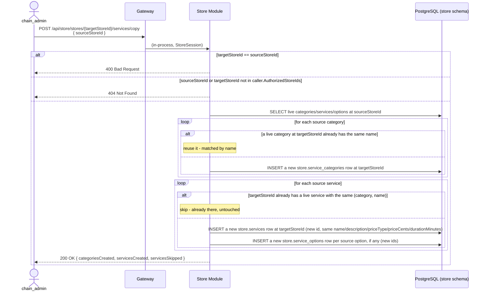

# Store Onboarding & Booking Domain — V1 Design

**Status:** replaces `merchant-onboarding-v1-design.md` entirely. That document used "merchant" for a single store location; Groway's terminology was unified on 2026-09-28 — **"chain"** is the top-level business, **"store"** is one location. "Merchant" is retired from this codebase and reserved for a different future use. This document is written fresh under the new terminology, not derived from the retired one.

**Architecture:** see `groway-v1-architecture.md`. Owned by the **Store Module**, `store` schema. `store.appointments.customer_id` is an **application-level reference** to `customer.customers` (Customer Module's schema) — never a cross-schema FK, per architecture doc §5.

**Relationship to other documents:** this is the fixed reference for the booking-domain tables (stores, staff, services, schedules, appointments) and the Back Office / public booking APIs. `growayshop-registration-workflow.md` owns the *account/identity* layer (chains, chain_admin/store_admin/staff logins) and adds its own columns to `store.stores` via `ALTER TABLE` (`chain_id`, `store_admin_id`) rather than redefining this table — same pattern `groway-billing-workflow.md` uses for `billing_account_id`. `staff-schedule-entry-workflow.md` (who fills `business_hours`/`staff_schedules`/`staff_time_offs`, and how) and `availability-slot-engine.md` (how those tables plus `services`/`appointments` get turned into bookable times, `GET /api/store/public/slots`) are separate documents built directly on the tables defined here — this document owns the schema, they own how it's populated and consumed.

**V1 decision (2026-10-02, superseding the retired document's assumption): self-service registration is the primary path onto Groway**, not Groway-admin-assisted onboarding. A chain owner signs up directly (`growayshop-registration-workflow.md` §6.0) — email, password, chain name, first store, address — with no Groway admin in the loop at all. The admin-assisted flow this document originally described (§2) still exists, but as the *exception* path for large customers or white-glove requests (`growayshop-registration-workflow.md` §6.1), not the default. See §2 for how the two paths both land on the same schema.

---

## 1. Terminology

| Term | Meaning |
|---|---|
| **Chain** | The business as a whole — one owner, one or more stores, one billing account (`groway-billing-workflow.md`). Modeled as `store.chains` (`growayshop-registration-workflow.md` §5). |
| **Store** | One physical location or one independent practitioner. Independent practitioner = a store with exactly one staff member (themself). This document's `store.stores` table. |
| **Staff** | A person working at a store. Business-role label (`owner`/`manager`/`staff`, or free text like "CEO") is descriptive only — no bearing on app access (`growayshop-registration-workflow.md` §1 draws the real access-control line). |
| **Service** | A bookable offering, e.g. "Head massage + scalp treatment + neck & shoulder." |
| **Staff ↔ Service** | Many-to-many: which services a given staff member can perform. |
| **Slot** | Booking time granularity, default 15 minutes. |

---

## 2. Onboarding flow

**Primary path — self-service** (`growayshop-registration-workflow.md` §6.0):

```
Chain owner registers directly: email + password + chain name + first store + address
↓
Email verification link sent; store created as status='pending' (invisible — excluded from the public map and booking flow the same way any non-`active` store is, `beauty-map-nearby-search-design.md` §1, `availability-slot-engine.md` §2)
↓
Verify → store.stores.status flips to 'active' automatically (no admin step — nobody's in the loop to flip it manually)
↓
Chain owner (now logged in, as both chain_admin and that store's store_admin) fills in the rest:
  services → staff → staff↔service → business hours / booking rules
↓
Store's public booking link is live once §2.3's derived readiness condition is also true
```

**Exception path — Groway-admin-assisted** (`growayshop-registration-workflow.md` §6.1), for large customers or white-glove onboarding, not the default:

```
Chain owner emails Groway (intake template, §3)
↓
Groway admin creates the chain in Back Office — one or more stores, one chain_admin,
one store_admin per store, all in one pass; status='pending', email_verified_at
set immediately (the admin creating the account from a real email thread already
is the verification — growayshop-registration-workflow.md §6.1)
↓
Per store: enter basic info → add services → add staff → assign staff↔service → set business hours / booking rules
↓
Groway admin or chain_admin manually flips status to 'active' when ready
↓
Generate each store's public booking link → hand off to the chain
```

Both paths land on the exact same schema and the same `pending → active → suspended` lifecycle (`store.stores.status`) — they differ only in *who* drives the flow and *what* flips `pending` to `active` (automatic on self-serve email verification; a manual decision by a Groway admin or `chain_admin` on the assisted path). That transition is orthogonal to (not a stand-in for) the derived operational-readiness condition in `staff-schedule-entry-workflow.md` §2.3 (business hours filled in, ≥1 bookable staff, ≥1 bookable service). A store only accepts real customer bookings when **both** hold: `status='active'` AND that derived condition is true. `active` with an incomplete setup still can't be booked (the UI nudges on what's missing); `suspended` is an unconditional kill switch regardless of how complete the setup is — an emergency close doesn't require touching schedules or the catalog.

### 2a. Setup checklist — the readiness gate made visible (NEW, 2026-10-03, Steven, #19)

A dashboard card makes the store-onboarding-v1-design.md §2/staff-schedule-entry-workflow.md §2.3 readiness condition legible instead of a silent gate a store owner has to discover by trial and error. **Fully derived, nothing stored** — every item below evaluates live from existing data on render, same philosophy as the readiness condition itself:

1. Basic information (store name, address, phone) — `store.stores` fields non-empty.
2. Business hours — all 7 days set, open or explicitly closed (`business_hours`).
3. ≥1 service — `service_is_bookable()` returns true for at least one (`beauty-map-postgis-schema-design.md` §4).
4. ≥1 staff member with live timetable entries at the store — per P2 (`staff-schedule-entry-workflow.md` §0): "works at store B" is live schedule entries tagged B, never a status flag.
5. ≥1 staff↔service qualification — `staff_services` has a row pairing a staffed person with a bookable service at this store.
6. ≥1 local service category mapped to `platform.category_taxonomy` — **discoverability, not bookability**: an unmapped category works fine in the store's own booking flow (the taxonomy join is nullable by design, `beauty-map-postgis-schema-design.md` §3), it just means the store is invisible in map category search. Checklist copy says so explicitly ("Affects map discoverability"), deep-linking to the per-category mapping UI (`beauty-map-ui-design.md` §6).

**Dashboard card**: progress bar + "Setup progress n/6," each item deep-linking to its own settings page. **Collapsible but not dismissible while incomplete** — reappears on every dashboard load until all 6 are green; this is deliberate, since a half-set-up store silently sitting unbookable is exactly the failure mode this checklist exists to prevent.

**Below the checklist, a "Recommended checks" row** — booking settings, deposit setup (paid-only, `payment-deposit-preauth-design.md` §5/#17) — not blocking, not counted toward the 6/6, but surfaced as the answer to "why can't my store take bookings yet?" once the hard gate is satisfied.

**One-time toast**: when the self-serve creation wizard first lands on the dashboard, a single "New store created" toast points at the checklist — not repeated on subsequent visits (the persistent card itself is the ongoing reminder, the toast is just the first-time orientation).

---

## 3. Intake email template (exception path only — `growayshop-registration-workflow.md` §6.1)

The self-service web form this section once deferred to "V2" already exists and is the primary path (§2, `growayshop-registration-workflow.md` §6.0). This template now only matters for the exception path — a large customer or white-glove request a Groway admin handles by hand:

```
Subject: {Chain name}

1. Chain name (public-facing):
2. Owner contact / phone / email:
3. Number of stores, and per store:
   - Store name / address (street, city, region/province/state, postal code, country — default CA) / timezone (default America/Toronto)
   - Store type: [] solo practitioner (1 person) [] team store (multiple people)
   - Services (name | duration(min), if applicable | price | price type (free/fixed/from) | category)
   - Staff (name | phone | which of the above services they perform)
   - Business hours (Mon–Sun, open–close, "closed" if none)
   - Booking rules: slot granularity (default 15 min) / advance-booking window in days (default 90) / auto-confirm (default yes)
```

---

## 4. Database schema (`store` schema)

```sql
-- One row per store location. chain_id/store_admin_id are added by
-- growayshop-registration-workflow.md §5 via ALTER TABLE, not here.
CREATE TABLE store.stores (
    id               UUID PRIMARY KEY DEFAULT gen_random_uuid(),
    name             VARCHAR(200) NOT NULL,
    -- Structured, not a single text blob (2026-09-29 decision, revised same
    -- day for the Mapbox integration - see growayshop-registration-workflow.md
    -- §2.2). formatted_address/latitude/longitude/geo_provider/geo_place_id
    -- are populated by a Mapbox "retrieve" call when the address comes from
    -- the autocomplete suggestion box; they stay NULL for a manually-typed
    -- fallback address (no coordinates is an accepted, valid state).
    address_line1    VARCHAR(255) NOT NULL,
    address_line2    VARCHAR(255),
    city             VARCHAR(100) NOT NULL,
    region           VARCHAR(50)  NOT NULL,  -- province/state; kept country-neutral, not called "province"
    postal_code      VARCHAR(20)  NOT NULL,  -- stored as-typed/as-returned, not format-validated per country (growayshop-registration-workflow.md §2.2)
    country_code     VARCHAR(2)   NOT NULL DEFAULT 'CA',  -- ISO 3166-1 alpha-2
    formatted_address TEXT,        -- provider's display string, cached; NULL for manual entry
    latitude         DECIMAL(9,6), -- NULL until geocoded via Mapbox, or if manually entered
    longitude        DECIMAL(9,6), -- NULL until geocoded via Mapbox, or if manually entered
    geo_provider     VARCHAR(20),  -- 'mapbox' once resolved; NULL for manual entry
    geo_place_id     VARCHAR(255), -- Mapbox's id for this place - used to re-retrieve if the provider is ever migrated (a one-time ops script, not a recurring job)
    timezone         VARCHAR(64)  NOT NULL DEFAULT 'America/Toronto',
    status           VARCHAR(20)  NOT NULL DEFAULT 'pending' CHECK (status IN ('pending', 'active', 'suspended')),
    created_at       TIMESTAMPTZ  NOT NULL DEFAULT now(),
    updated_at       TIMESTAMPTZ  NOT NULL DEFAULT now()
);

-- Person-level identity AND the chain-level employment contract (2026-10-03,
-- Batch 4 Decision 1). One row per human per chain - consistent with the
-- standing rule "one person, multiple chains = separate rows/logins"
-- (growayshop-registration-workflow.md §8 item 8). name/phone/email live here
-- exactly once (2026-09-29 fix: an earlier version put store_id NOT NULL
-- directly on this table, meaning one physical person needed a separate row -
-- and a separate copy of their name - per store; that was a normalization bug).
--
-- A staff member contracts with the CHAIN, never with a store - a store is
-- like a room in the shop, nobody signs a contract with a room. There is no
-- status column here and never was one that survived: "works at store B" is
-- derived entirely from staff_schedules (below), never stored as a flag on
-- this row or anywhere else. There is no "deactivation" domain concept - see
-- staff-schedule-entry-workflow.md §0.
CREATE TABLE store.staff (
    id               UUID PRIMARY KEY DEFAULT gen_random_uuid(),
    chain_id         UUID NOT NULL REFERENCES store.chains(id),
    name             VARCHAR(200) NOT NULL,
    phone            VARCHAR(20),
    email            VARCHAR(255),
    created_at       TIMESTAMPTZ  NOT NULL DEFAULT now(),
    updated_at       TIMESTAMPTZ  NOT NULL DEFAULT now()
);
CREATE INDEX idx_staff_chain_id ON store.staff(chain_id);

-- store.staff_store_assignments is GONE (2026-10-03, Batch 4 Decision 1 -
-- supersedes Batch 2's assignment-status machinery entirely: the status
-- column, this table, and store.active_staff_assignments are all dropped).
-- It reified a relationship staff_schedules already expresses: "works at
-- store B" <=> has >=1 live (deleted_at IS NULL) entry tagged store_id=B,
-- below. There is no per-store employment state anywhere in this schema -
-- not a status, not a membership table, not a per-store contract. The
-- contract is chain-level (staff.chain_id, above); the timetable is the only
-- place "where" lives (staff-schedule-entry-workflow.md §0).

-- Categories, added 2026-09-29 (this document's own §7, the service catalog design) - store-scoped,
-- like services. Chain-wide shared categories are a v2 "copy to other stores"
-- feature (§8), not a shared catalog now. Soft-deleted (deleted_at, not a status
-- flag) so a deleted category's name becomes reusable immediately - the partial
-- unique index below only guards live rows.
CREATE TABLE store.service_categories (
    id          UUID PRIMARY KEY DEFAULT gen_random_uuid(),
    store_id    UUID NOT NULL REFERENCES store.stores(id),
    name        VARCHAR(64) NOT NULL,
    description TEXT,
    sort_order  INT NOT NULL DEFAULT 0,
    deleted_at  TIMESTAMPTZ,
    created_at  TIMESTAMPTZ NOT NULL DEFAULT now(),
    updated_at  TIMESTAMPTZ NOT NULL DEFAULT now()
);
CREATE UNIQUE INDEX uq_service_categories_store_name ON store.service_categories(store_id, name) WHERE deleted_at IS NULL;
CREATE INDEX idx_service_categories_store_id ON store.service_categories(store_id);

CREATE TABLE store.services (
    id               UUID PRIMARY KEY DEFAULT gen_random_uuid(),
    store_id         UUID NOT NULL REFERENCES store.stores(id),
    category_id      UUID REFERENCES store.service_categories(id),  -- nullable: NULL = uncategorized
    name             VARCHAR(200) NOT NULL,
    description      TEXT,
    -- Nullable: a 'from' service has no service-level duration - each option
    -- (below) carries its own. free/fixed services always set this.
    duration_minutes INT CHECK (duration_minutes BETWEEN 5 AND 720),
    -- For 'from', this column is ignored (kept at 0) - the displayed "from"
    -- price is computed at read time as MIN(service_options.price_cents) for
    -- that service's non-deleted options (2026-09-29: deliberately NOT cached -
    -- a v1 single store's service count makes the join cost negligible, and a
    -- cache that some write path forgets to recompute becomes a wrong
    -- displayed price, which is a customer-facing booking bug. Revisit only if
    -- this join is ever shown to be a real hot path).
    price_cents      INT NOT NULL DEFAULT 0 CHECK (price_cents >= 0),
    price_type       VARCHAR(10) NOT NULL DEFAULT 'fixed' CHECK (price_type IN ('free', 'fixed', 'from')),
    status           VARCHAR(20) NOT NULL DEFAULT 'active' CHECK (status IN ('active', 'inactive')),
    deleted_at       TIMESTAMPTZ,  -- soft delete (default DELETE); a separate hard "purge" is §8's concern, not a flag here
    -- Doubles as menu display order within a category AND multi-service combo
    -- execution order (2026-10-02) - one column, not two. §7.2's PUT .../order
    -- endpoint had nowhere to persist to before this (services had no order
    -- column at all, unlike categories/options); it now writes here. Accepted
    -- V1 limitation: a service's menu position and its position in a combo
    -- can't diverge (e.g. "consultation" shown last as an add-on but always
    -- performed first) - split into a separate display_order if a real store
    -- ever needs that; YAGNI until then. Default 0 + name tie-break preserves
    -- today's display behavior for existing rows.
    sequence_order   INT NOT NULL DEFAULT 0,
    -- NULL = inherit the store's booking_settings.buffer_before/after_minutes;
    -- non-NULL overrides it for this service. Not split by option - a 'from'
    -- service's options share one buffer (2026-09-29 decision).
    buffer_before_minutes INT CHECK (buffer_before_minutes >= 0),
    buffer_after_minutes  INT CHECK (buffer_after_minutes >= 0),
    -- Store-level concurrent capacity (e.g. bed/chair count), 2026-09-30.
    -- Whether a booking of this service occupies one unit of the store's
    -- capacity (availability-slot-engine.md Step 5b). Default true; a
    -- non-occupying service (e.g. a phone consult) can turn it off.
    occupies_capacity BOOLEAN NOT NULL DEFAULT true,
    created_at       TIMESTAMPTZ NOT NULL DEFAULT now(),
    updated_at       TIMESTAMPTZ NOT NULL DEFAULT now()
);

-- Priced/timed variants under a 'from' service (e.g. "60 min" / "Deep tissue
-- 90 min") - what a customer actually picks. Only valid under a 'from'
-- service; free/fixed services never have rows here (enforced at the API
-- layer, §8, not by a CHECK spanning two tables). Soft-deleted like everything
-- else in this catalog - ON DELETE CASCADE only ever fires from a service
-- *purge* (§8), never from an ordinary soft-delete (which is just an UPDATE).
CREATE TABLE store.service_options (
    id               UUID PRIMARY KEY DEFAULT gen_random_uuid(),
    service_id       UUID NOT NULL REFERENCES store.services(id) ON DELETE CASCADE,
    name             VARCHAR(128) NOT NULL,
    duration_minutes INT NOT NULL CHECK (duration_minutes BETWEEN 5 AND 720),
    price_cents      INT NOT NULL CHECK (price_cents >= 0),
    sort_order       INT NOT NULL DEFAULT 0,
    deleted_at       TIMESTAMPTZ,
    created_at       TIMESTAMPTZ NOT NULL DEFAULT now()
);
CREATE INDEX idx_service_options_service_id ON store.service_options(service_id);

-- Which services this person can perform, AT a specific store (services are
-- themselves store-scoped, services.store_id) - keyed directly on (staff_id,
-- store_id) (2026-10-03, Batch 4 - rekeyed off the now-dropped assignment
-- table; follows staff_schedules's own rekey below). A genuine store-level
-- fact: which services someone may perform at store A says nothing about
-- store B, even though both the person and their timetable are chain-level.
CREATE TABLE store.staff_services (
    staff_id     UUID NOT NULL REFERENCES store.staff(id),
    store_id     UUID NOT NULL REFERENCES store.stores(id),
    service_id   UUID NOT NULL REFERENCES store.services(id),
    assigned_at  TIMESTAMPTZ NOT NULL DEFAULT now(),
    assigned_by  UUID REFERENCES store.store_users(id),
    PRIMARY KEY (staff_id, store_id, service_id)
    -- Application-level invariant, not DB-enforced: the referenced service's
    -- store_id must equal this row's store_id - same category of cross-table
    -- rule as appointments.customer_id (architecture doc §5).
);
CREATE INDEX idx_staff_services_staff_store ON store.staff_services(staff_id, store_id);

-- The chain's one timetable (2026-10-03, Batch 4; keying unchanged from
-- Batch 2's earlier person-level rekey). The chain owns exactly one
-- timetable - the set of every schedule entry of every one of its staff; a
-- store's view and a person's view are both just filtered reads over this one
-- table (staff-schedule-entry-workflow.md §0), never separate tables and
-- never a per-store copy that could drift. A person's shift at store A and
-- their shift at store B are two entries here, each tagged with the store it
-- belongs to. One row per shift segment; a day with no LIVE row at that store
-- is a day off there.
--
-- deleted_at (2026-10-03, Batch 4): there is no "deactivation" domain event
-- (staff-schedule-entry-workflow.md §0). "Won't be scheduled at store B
-- anymore" = that store's entries are soft-deleted through the normal
-- schedule-edit PUT/DELETE; they stay in the table as history, never read by
-- anything live. "Works at store B" <=> EXISTS a row here with store_id=B AND
-- deleted_at IS NULL. Re-adding time blocks (the PUT's upsert-with-restore
-- semantics, staff-schedule-entry-workflow.md §4) is reinstatement - there is
-- nothing else to "turn back on."
--
-- Concurrency note: because the same person's entries at different stores are
-- now one table written through independent store-scoped PUT endpoints
-- (staff-schedule-entry-workflow.md §4), any transaction that INSERTs,
-- UPDATEs, or DELETEs rows here for a given staff_id must hold
-- pg_advisory_xact_lock(hashtext('staff_schedule:' || staff_id)) before doing
-- so - without it, two concurrent store-scoped writes for the same person
-- could each pass the per-person overlap check (below) against a snapshot
-- that doesn't yet include the other's in-flight write, and both commit a
-- genuinely overlapping timetable. See staff-schedule-entry-workflow.md §5.1
-- for the full rule and which endpoints it covers.
CREATE TABLE store.staff_schedules (
    id          UUID PRIMARY KEY DEFAULT gen_random_uuid(),
    staff_id    UUID NOT NULL REFERENCES store.staff(id),
    store_id    UUID NOT NULL REFERENCES store.stores(id),  -- NOT NULL: no "unspecified store" entries
    day_of_week SMALLINT NOT NULL CHECK (day_of_week BETWEEN 0 AND 6),  -- 0 = Sunday
    start_time  TIME NOT NULL,
    end_time    TIME NOT NULL CHECK (end_time > start_time),
    deleted_at  TIMESTAMPTZ,  -- soft-delete (2026-10-03, Batch 4): NULL = live/scheduled; set = removed, kept as history
    created_at  TIMESTAMPTZ NOT NULL DEFAULT now()
    -- Overlap is checked per PERSON, not per (person, store), and only among
    -- LIVE rows (deleted_at IS NULL) - the same staff_id's live rows must not
    -- overlap on the same day_of_week regardless of which store they're
    -- tagged with; a person can't be in two places at once, so the cross-
    -- store case needs no special handling anywhere else in the system
    -- (staff-schedule-entry-workflow.md §5.1, 400 SCHEDULE_OVERLAP).
    -- Soft-deleted rows are invisible to this check - they're history, not
    -- live data. Still an application-level check, not a DB constraint (no
    -- native TIME-range exclusion type without a heavier composite gist index
    -- than this admin-only, near-zero-contention write path warrants, and it
    -- would need to exclude soft-deleted rows via a partial index anyway) -
    -- the advisory lock above is what actually closes the concurrency gap a
    -- bare app-level check would otherwise leave open.
);
CREATE INDEX idx_staff_schedules_staff_store ON store.staff_schedules(staff_id, store_id) WHERE deleted_at IS NULL;
-- Partial unique index, not a table-level UNIQUE (2026-10-03, Batch 4): only
-- one LIVE row may occupy a given (staff_id, store_id, day_of_week,
-- start_time) slot at a time; any number of soft-deleted historical rows may
-- have occupied it before. This is also the upsert-with-restore PUT's ON
-- CONFLICT target (staff-schedule-entry-workflow.md §4) - a resubmitted entry
-- at a previously-used slot revives the old soft-deleted row automatically,
-- without the client needing to know or pass its id:
--   INSERT INTO store.staff_schedules (staff_id, store_id, day_of_week, start_time, end_time)
--     VALUES (...)
--     ON CONFLICT (staff_id, store_id, day_of_week, start_time) WHERE deleted_at IS NULL
--     DO UPDATE SET deleted_at = NULL, end_time = EXCLUDED.end_time;
CREATE UNIQUE INDEX uq_staff_schedules_live_slot ON store.staff_schedules(staff_id, store_id, day_of_week, start_time) WHERE deleted_at IS NULL;

-- Person-level (staff_id, not assignment) - taking time off means being
-- unavailable at every store you work, not just one ("sick" doesn't have a
-- store). tstzrange, not date+time, so a time-off can span midnight.
CREATE EXTENSION IF NOT EXISTS btree_gist;
CREATE TABLE store.staff_time_offs (
    id          UUID PRIMARY KEY DEFAULT gen_random_uuid(),
    staff_id    UUID NOT NULL REFERENCES store.staff(id),
    starts_at   TIMESTAMPTZ NOT NULL,
    ends_at     TIMESTAMPTZ NOT NULL CHECK (ends_at > starts_at),
    reason      VARCHAR(200),
    created_at  TIMESTAMPTZ NOT NULL DEFAULT now(),
    -- Two time-off rows for the same person can never overlap, DB-enforced -
    -- harder than an application check (staff-schedule-entry-workflow.md §5.1);
    -- a violation raises Postgres's exclusion_violation, mapped to 409 TIME_OFF_OVERLAP.
    EXCLUDE USING gist (staff_id WITH =, tstzrange(starts_at, ends_at) WITH &&)
);
CREATE INDEX idx_staff_time_offs_staff_id ON store.staff_time_offs(staff_id);

-- One row per day; a day with no row (or NULL/NULL) is closed. Split/multi-segment
-- hours (e.g. closed for lunch) are explicitly not a v1 feature - single
-- continuous hours per day covers this business (a spa) well enough, and
-- adding split hours later is a UI + constraint change, not an engine change
-- (availability-slot-engine.md already operates on interval sets).
CREATE TABLE store.business_hours (
    id          UUID PRIMARY KEY DEFAULT gen_random_uuid(),
    store_id    UUID NOT NULL REFERENCES store.stores(id),
    day_of_week SMALLINT NOT NULL CHECK (day_of_week BETWEEN 0 AND 6),
    open_time   TIME,   -- NULL means closed that day
    close_time  TIME,
    CONSTRAINT chk_business_hours_null CHECK (
        (open_time IS NULL AND close_time IS NULL) OR
        (open_time IS NOT NULL AND close_time IS NOT NULL AND close_time > open_time)
    ),
    UNIQUE (store_id, day_of_week)
);

CREATE TABLE store.booking_settings (
    store_id                 UUID PRIMARY KEY REFERENCES store.stores(id),
    slot_granularity_minutes INT NOT NULL DEFAULT 15,
    advance_booking_days     INT NOT NULL DEFAULT 90,
    auto_confirm             BOOLEAN NOT NULL DEFAULT TRUE,
    -- Added 2026-09-29. min_lead_minutes: how soon
    -- before a slot it can still be booked today (now() + this, store tz).
    -- buffer_before/after: store-level default prep/cleanup time around every
    -- booking; a service can override via services.buffer_before/after_minutes.
    min_lead_minutes      INT NOT NULL DEFAULT 60 CHECK (min_lead_minutes >= 0),
    buffer_before_minutes INT NOT NULL DEFAULT 0  CHECK (buffer_before_minutes >= 0),
    buffer_after_minutes  INT NOT NULL DEFAULT 0  CHECK (buffer_after_minutes >= 0),
    -- payment_required/cancel_threshold_hours existed in an earlier draft,
    -- were cut in the 2026-09-29 rewrite, and are restored here (Steven
    -- confirmed): payment_required is what a future deposit/card-on-file
    -- feature hangs off; cancel_threshold_hours (0 = cancel any time) is
    -- consumed by the not-yet-written cancel/reschedule document.
    -- max_guests/allow_group (group bookings) and max_appointment_minutes
    -- (a redundant cap given service duration is already the cap) were
    -- deliberately dropped, not just forgotten.
    payment_required       BOOLEAN NOT NULL DEFAULT FALSE,
    cancel_threshold_hours INT NOT NULL DEFAULT 0 CHECK (cancel_threshold_hours >= 0),
    -- Per-store reschedule cap (2026-10-03, NEW - Part D), living next to
    -- cancel_threshold_hours since both are customer-self-serve throttles
    -- enforced the same way: customer channel only, staff exempt
    -- (create-appointment-transaction-design.md §10).
    max_reschedules        INT NOT NULL DEFAULT 3 CHECK (max_reschedules >= 0),
    -- Store-level concurrent capacity (2026-09-30) - e.g. a spa's bed/chair
    -- count. NULL = not configured = unlimited (deliberately no fake default,
    -- so an existing store migrates in with today's unlimited behavior
    -- unchanged). New stores are pushed by the onboarding UI to make an
    -- explicit choice (a number, or an explicit "unlimited") - that's a UI
    -- nudge, not a backend requirement; the column itself stays NULL-able.
    capacity INT CHECK (capacity IS NULL OR capacity >= 1)
);

-- customer_id is an application-level reference to customer.customers - never
-- an enforced FK (architecture doc §5). Quota enforcement (groway-billing-workflow.md
-- §4.2) runs as one additive internal call at the start of whatever creates this row.
-- Single-person, single-block model: one appointment = one staff_id + one
-- starts_at/ends_at at the header, even when it covers several services
-- (appointment_items, below) performed back-to-back by that same person.
-- staff_id is person-level; occupancy for the slot engine is read from this
-- header, never by drilling into appointment_items (availability-slot-engine.md §4 Step 5).
CREATE TABLE store.appointments (
    id            UUID PRIMARY KEY DEFAULT gen_random_uuid(),
    store_id      UUID NOT NULL REFERENCES store.stores(id),
    customer_id   UUID NOT NULL,  -- application-level reference to customer.customers.id
    staff_id      UUID NOT NULL REFERENCES store.staff(id),  -- app-level invariant: staff must have a LIVE staff_schedules entry at this store_id at creation time (create-appointment-transaction-design.md §7); not re-checked retroactively if those entries are later removed - appointment history follows the person regardless
    status        VARCHAR(20) NOT NULL DEFAULT 'confirmed' CHECK (status IN ('confirmed', 'completed', 'cancelled', 'no_show')),
    starts_at     TIMESTAMPTZ NOT NULL,
    ends_at       TIMESTAMPTZ NOT NULL,
    -- is_test REMOVED 2026-10-05 (Steven, #18 superseded) - not deferred,
    -- gone outright. No competitor (Fresha/Vagaro/Mindbody/Booker/Square/
    -- GlossGenius) has a test-appointment concept; see §5 below (now a
    -- removal note) for the full rationale.
    -- Buffer snapshot, added 2026-09-29: buffer_before
    -- is the first service's Bb, buffer_after is the last service's Ba (rule
    -- finalized in the not-yet-written create-appointment document). Snapshotted
    -- at booking time and never recomputed - a later change to a service's
    -- buffer doesn't retroactively touch existing appointments, same philosophy
    -- as price/duration snapshots below.
    buffer_before_minutes INT NOT NULL DEFAULT 0,
    buffer_after_minutes  INT NOT NULL DEFAULT 0,
    -- Store-level capacity snapshot (2026-09-30): true if ANY item's service
    -- had occupies_capacity=true at booking time (an OR across items, same
    -- creation-time-snapshot philosophy as the buffer/price/duration columns
    -- here and on appointment_items - a later change to a service's flag
    -- never retroactively touches an existing appointment). Every
    -- appointment occupies real capacity (real beds) - there is no
    -- exemption of any kind (is_test, which used to be mentioned here as a
    -- carve-out, was removed entirely 2026-10-05; see §5).
    occupies_capacity BOOLEAN NOT NULL DEFAULT true,
    created_at    TIMESTAMPTZ NOT NULL DEFAULT now()
);

-- Snapshot columns (added 2026-09-29, the "booking snapshot" decision):
-- a service's name/price/duration/option can all change
-- or soft-delete later without altering historical appointments. option_id is
-- kept (not just option_name) so "how many times was this option ever booked"
-- doesn't need joining a possibly-soft-deleted service_options row.
CREATE TABLE store.appointment_items (
    id                UUID PRIMARY KEY DEFAULT gen_random_uuid(),
    appointment_id    UUID NOT NULL REFERENCES store.appointments(id),
    service_id        UUID NOT NULL REFERENCES store.services(id),
    service_name      TEXT NOT NULL,           -- snapshot
    option_id         UUID,                    -- NULL for free/fixed services
    option_name       TEXT,                    -- snapshot; NULL for free/fixed services
    duration_minutes  INT NOT NULL CHECK (duration_minutes BETWEEN 5 AND 720),  -- snapshot, pure service time (buffer excluded - that's the appointment header's concern)
    price_cents       INT NOT NULL  -- snapshot of the price at booking time, not a live join to services
);

CREATE INDEX idx_services_store_id ON store.services(store_id);
CREATE INDEX idx_appointments_store_id_starts_at ON store.appointments(store_id, starts_at);
CREATE INDEX idx_appointments_customer_id ON store.appointments(customer_id);
```

---

## 5. ~~`is_test` and the billing quota — the one place this document and `groway-billing-workflow.md` must stay in sync~~ — removed 2026-10-05 (Steven)

This section used to describe `store.appointments.is_test` and the Free-plan quota exemption it fed into (`groway-billing-workflow.md` §4.2). **Both are gone — not deferred, removed outright** (#18 superseded): no competitor (Fresha/Vagaro/Mindbody/Booker/Square/GlossGenius) has a test-appointment concept, and the complexity a quota-exemption branch drags along (a slot-occupancy carve-out, a calendar badge, a future reporting-query branch) wasn't worth paying for a training-practice use case the 100/month pilot quota already tolerates. The section number is kept, not reclaimed, so every other cross-reference to "§5" elsewhere in the docs still lands in the right place.

**The one fact that survives, unchanged:** every appointment counts toward quota, no exemptions. This was already V1's actual behavior since the 2026-10-03 deferral; today's change only updates the documentation to say "removed" instead of "deferred" — no behavior changed.

---

## 6. APIs

- **Back Office, `/api/store/back-office/*`** — CRUD for stores, staff, business hours, booking settings, called directly by `chain_admin`/`store_admin` on their own `StoreSession`. A **Groway admin never calls these routes directly** — their session is `population:"admin"`, which the `StoreSession` handler rejects outright on any `/api/store/*` path (architecture doc §6.3; same reasoning as `growayshop-registration-workflow.md` §3). Whatever back-office actions a Groway admin needs reach Store Module the same way chain creation and staff invitation already do — an `/api/admin/*` endpoint dispatching in-process into the same underlying service methods — not by a Groway admin hitting `/api/store/*` itself. Individual `/api/admin/*` mirrors aren't enumerated here; add them following the existing pattern as each concrete need arises, rather than pre-building a parallel admin-side CRUD surface now. Wireframes not reproduced here — same step-by-step wizard shape as before (basic info → services → staff → hours/rules → done).
- **Service catalog, `/api/store/*`** — categories, services, options, staff↔service assignment. §7.
- **Public booking, `/api/store/public/*`** — list a store's services/available slots, create an appointment (runs through `groway-billing-workflow.md` §4.2's quota check first).

All routes here follow the same authorization rule, uniformly: **`storeId ∈ caller.AuthorizedStoreIds`** grants write access, never a literal `caller.role == 'store_admin'` check — that set already covers `chain_admin` correctly (every store in their chain) without special-casing the role. A `staff` caller's set still grants only read access to the catalog (they need to see it while picking their own schedule); write endpoints reject `staff` regardless of set membership. A `storeId` outside the caller's set is **404**, not 403 — same reasoning as `growayshop-registration-workflow.md` §6.8: don't let the status code confirm whether a store outside your scope even exists.

**`AuthorizedStoreIds`'s derived definition (2026-10-06 — `store.store_user_store_access` removed, no stored version):**

- `chain_admin`: `SELECT s.id FROM store.stores s WHERE s.chain_id = (SELECT id FROM store.chains WHERE chain_admin_id = :callerId) ORDER BY s.created_at`
- `store_admin`: `SELECT id FROM store.stores WHERE store_admin_id = :callerId`
- V1 has no staff login; a V2b staff login's scope would be every store in its chain (staff rows are chain-level, Batch 4).

This set is resolved once at login, ordered by `created_at`, and stored alongside `activeStoreId` in the Redis session (`growayshop-registration-workflow.md` §4) — `switch-store` is an in-memory membership check against it, never a DB query. The `storeId ∉ set → 404` rule above is unchanged.

- **Default store**: `activeStoreId = AuthorizedStoreIds[0]` (the first entry once ordered) — no extra DB query needed at login beyond the derivation itself.
- **Refresh rule**: adding a store (`growayshop-registration-workflow.md` §6.2) re-runs this derivation and replaces the cached set in the current session — the set is always exactly the derived query's live result, never an append. Any other authorization change (e.g. reassigning a store's `store_admin`) takes effect on the next login, the standard pattern for session-cached authorization everywhere else in this project.

---

## 7. Service catalog: categories, services, options, staff assignment (2026-09-29)

### 7.1 Categories

| Method & path | Purpose |
|---|---|
| `GET /api/store/service-categories` | List, with each category's live (non-deleted) service count |
| `POST /api/store/service-categories` | `{ name, description? }` |
| `PUT /api/store/service-categories/{id}` | Rename/re-describe |
| `PUT /api/store/service-categories/order` | `{ orderedIds: [...] }` — drag-reorder |
| `DELETE /api/store/service-categories/{id}` | Soft-delete (`deleted_at`). `409 CATEGORY_HAS_SERVICES` if it has live services and no `moveTo`. |
| `DELETE /api/store/service-categories/{id}?moveTo={targetId}` | Migrates live services to `targetId` (same store, `targetId ≠ id` — else `400`) in one transaction, appending them after `targetId`'s existing `sort_order`, then soft-deletes the source |

A category name is unique **among live categories** in a store (`uq_service_categories_store_name`, §4) — a soft-deleted category's name is immediately reusable.

### 7.2 Services

| Method & path | Purpose |
|---|---|
| `GET /api/store/services?categoryId=&q=&status=` | List/search/filter |
| `POST /api/store/services` | `{ categoryId?, name, description?, priceType, priceCents?, durationMinutes?, options?:[{name,durationMinutes,priceCents}] }` |
| `GET /api/store/services/{id}` | Detail, including live `options` and assigned staff |
| `PUT /api/store/services/{id}` | Edit. Switching `priceType` is validated per §7.4's rules (e.g. `fixed`→`from` requires supplying at least one option in the same call) |
| `PUT /api/store/services/order` | `{ categoryId, orderedIds: [...] }` — reorder within one category; writes each service's `sequence_order` (0-based index in `orderedIds`). This is also the execution-order editor for multi-service combos (`availability-slot-engine.md` §3, `create-appointment-transaction-design.md` §7) — the same drag-to-reorder UI, one column, both effects |
| `DELETE /api/store/services/{id}` | **Soft delete** (`deleted_at`) — idempotent, the everyday "take this off the menu" action. Existing appointments/`appointment_items` are untouched; `staff_services` rows are kept (so restoring brings staff assignments back too) |
| `DELETE /api/store/services/{id}/purge` | **Hard delete** — a separate, deliberately scary endpoint name, not a query flag on the endpoint above (a dangerous action should look dangerous in the route itself). `409 SERVICE_HAS_APPOINTMENTS` if any `appointment_items` row ever referenced it (any status, including cancelled/no-show); otherwise deletes the row, cascading to `service_options` and `staff_services` |
| `POST /api/store/services/{id}/restore` | Clears `deleted_at`, undoing a soft delete |

### 7.3 Options (only under a `from` service)

| Method & path | Purpose |
|---|---|
| `GET /api/store/services/{serviceId}/options` | List live options |
| `POST /api/store/services/{serviceId}/options` | `{ name, durationMinutes, priceCents }` — `400` if the service's `priceType` isn't `from` |
| `PUT /api/store/service-options/{id}` | Edit |
| `PUT /api/store/services/{serviceId}/options/order` | `{ orderedIds: [...] }` |
| `DELETE /api/store/service-options/{id}` | Soft delete (`deleted_at`) — the service's displayed "from" price (§7.4) is simply recomputed on the next read, nothing to reconcile |

### 7.4 Price semantics by `price_type`

| `price_type` | `price_cents` | `duration_minutes` | `service_options` |
|---|---|---|---|
| `free` | `0`, ignored | required | none |
| `fixed` | required, the actual price | required | none |
| `from` | ignored, stored `0` | `NULL` | ≥ 1 live row required; displayed price = `MIN(price_cents)` over live options, **computed at read time, not cached** (§4 — a v1 store's service count makes the join cost negligible, and a cache that one write path forgets to invalidate becomes a wrong customer-facing price, which is worse) |

### 7.5 Staff ↔ service (bidirectional, one table, full-replace semantics)

| Method & path | Purpose |
|---|---|
| `GET /api/store/staff/{staffId}/services` | A staff member's assignable services (their "Services" tab) |
| `PUT /api/store/staff/{staffId}/services` | `{ serviceIds: [...] }` — **full replacement**, not add/remove |
| `GET /api/store/services/{serviceId}/staff` | A service's assigned staff (its "Team members" tab) |
| `PUT /api/store/services/{serviceId}/staff` | `{ staffIds: [...] }` — full replacement |

Full-replace `PUT` instead of individual add/remove calls: idempotent, and matches the UI (a checkbox list) exactly — no client-side diffing needed.

### 7.6 Bookable status — derived, never a stored flag

A service is offered to customers only when **`services.deleted_at IS NULL AND status='active' AND EXISTS(≥1 staff_services row at this service's store AND a LIVE staff_schedules entry for that same staff_id at that same store)`** (2026-10-03, Batch 4: the staff-level check is no longer a status column anywhere — it's "does this person have a live schedule entry at this store," since that's the only thing "works here" means now; `store.service_is_bookable()`, `beauty-map-postgis-schema-design.md` §4, is the one shared implementation of this exact rule) — the same "derive it, don't store a flag for it" principle as `growayshop-staff-invite-workflow.md` §2. Removing the last qualified staff member's live entries at this store, or unassigning the service from everyone, silently drops it from bookability with no separate action required.

---

## 8. Copying a store's service catalog to a new store (chain-wide expansion, not catalog CRUD)

This belongs here, not in §7, because it's an **onboarding** action — filling in a new store's catalog from an existing one — not a catalog-editing primitive. It's what makes opening a second, third, etc. store not mean re-typing dozens of services by hand; see `growayshop-registration-workflow.md` §6.2, whose "add a store" flow is this endpoint's typical caller (an optional step right after the new store is created).



**No `caller.appRole == 'chain_admin'` check, deliberately** — an earlier version of this diagram had one, contradicting §6's rule that authorization is always `storeId ∈ caller.AuthorizedStoreIds`, never a literal role check. It's also redundant here: a `store_admin`'s `AuthorizedStoreIds` contains exactly one store, so no `store_admin` session can ever supply two *distinct* stores that are both in scope — the existing `alt`/`else` branches above already exclude them structurally, without needing to ask what role they hold.

**Name-matched idempotency, not sync.** Calling this twice never duplicates anything — categories are reused by name, services are skipped if a same-named one already exists in the matched category. It also never touches data already at the target: a service already customized at the target store is left alone, and a later price change at the source is **not** propagated (that would be a sync feature, not a copy — out of scope). **Never copies `staff_services`** — staff differ per store, so the admin re-assigns via the same checkbox UI (§7.5) after copying.

---

## 9. Open questions

1. **Wireframe detail** was intentionally not reproduced at the same fidelity as the retired document — this is the schema/API contract; pixel-level Back Office UI can be redrawn separately if needed.
2. ~~Multi-service, multi-staff appointments~~ — **narrowed 2026-09-29, sequencing resolved 2026-10-02**: the baseline model is single-person, single-block (`appointments.staff_id` is one person for the whole block) — a multi-service appointment is several `appointment_items` performed back-to-back by that *same* person, never split across staff. The sequencing rule (merchant-set order via `sequence_order` above, cursor-walked into one combined block) is `create-appointment-transaction-design.md` §7's normative definition, now also exposed as a public, customer-facing booking flow (2–5 services, `availability-slot-engine.md` §1/§3) — not just the staff-manual path this note originally scoped it to.
3. ~~**Leaving one store while staying at another**~~ — **resolved 2026-10-02 (Batch 2), superseded 2026-10-03 (Batch 4)**: Batch 2's answer moved status onto a `staff_store_assignments` row; Batch 4 removes that table entirely. The actual, final answer: there is no status anywhere, and no "deactivation" domain event. "Leave store A, stay at store B" means A's `staff_schedules` entries are soft-deleted through the ordinary schedule-edit `PUT`/`DELETE` (`staff-schedule-entry-workflow.md` §0/§4) — B's entries are untouched, because they were never the same row to begin with.
4. ~~Geocoding is not wired up~~ — **resolved 2026-09-29**: Groway uses **Mapbox only**, never Google Maps/Google Business Profile (confirmed explicitly — no Google integration is planned). The actual design — a Mapbox `retrieve` call at store creation/address-edit time, populating `formatted_address`/`latitude`/`longitude`/`geo_provider`/`geo_place_id` — lives in `growayshop-registration-workflow.md` §2.2, not here.
5. **Chain-wide shared catalog** (one price list, edited once, applying to every store) is explicitly a v2 idea — §8's copy is a one-time seed, deliberately not a live sync, per store, following the project's general principle of not over-building for a hypothetical future need.
6. Everything else the retired document left open (proration, etc.) is not reintroduced here unless it resurfaces.
