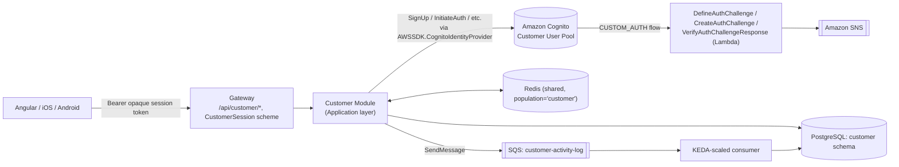
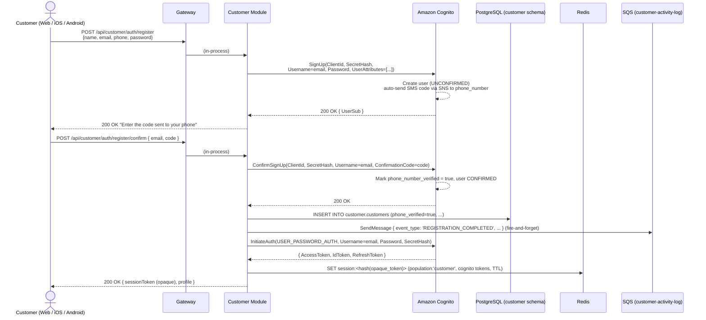
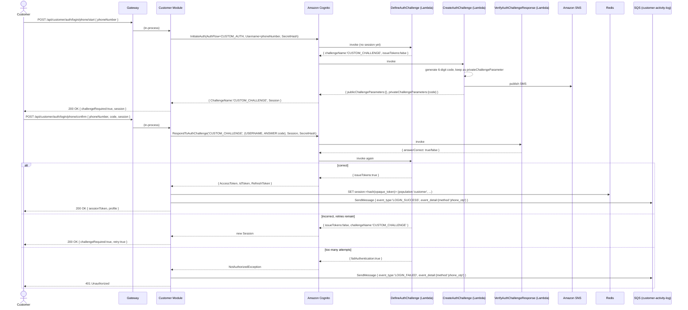
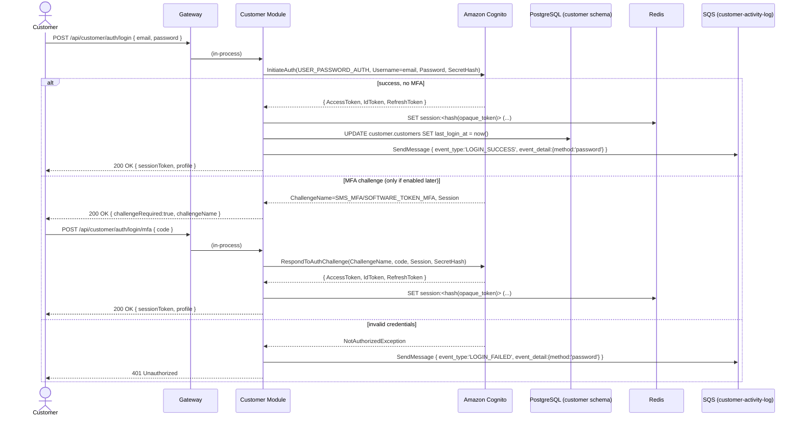
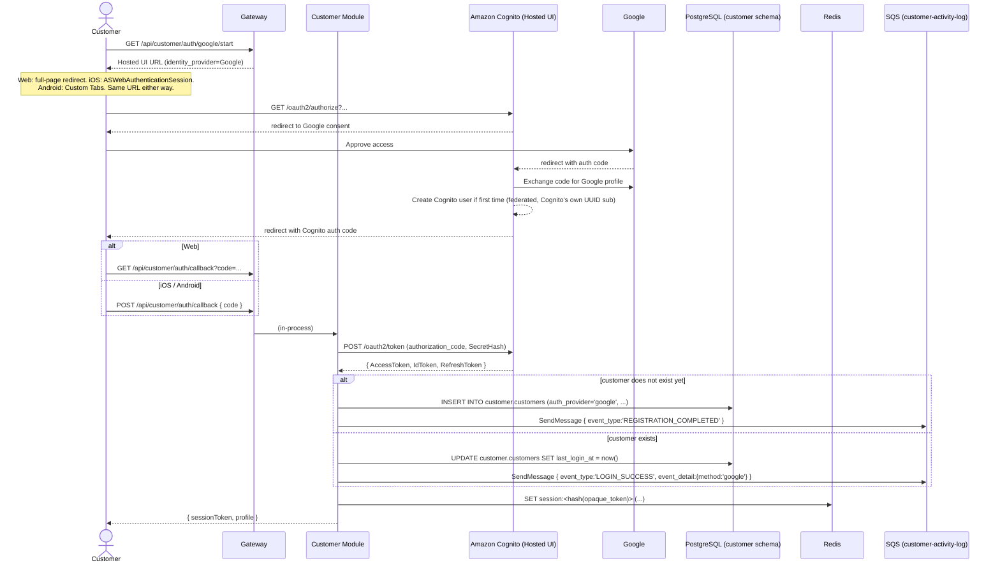
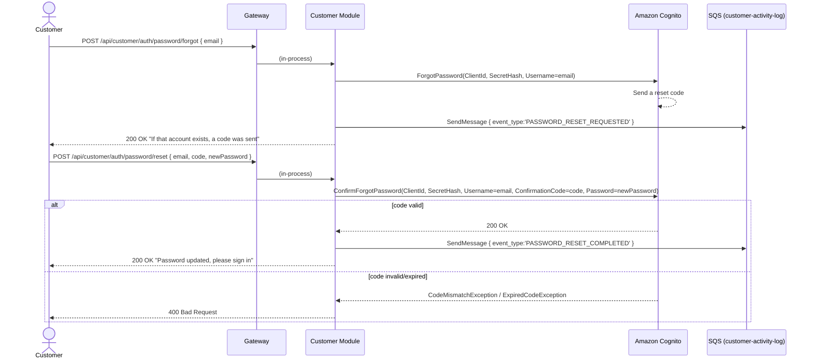
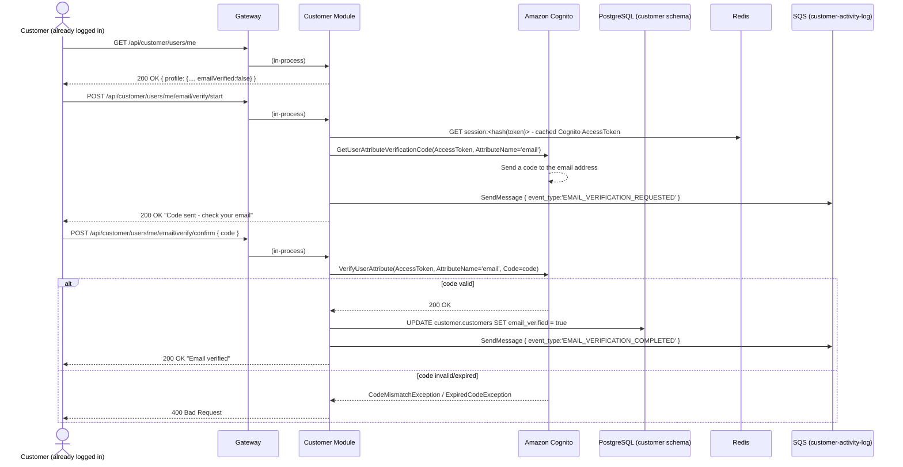
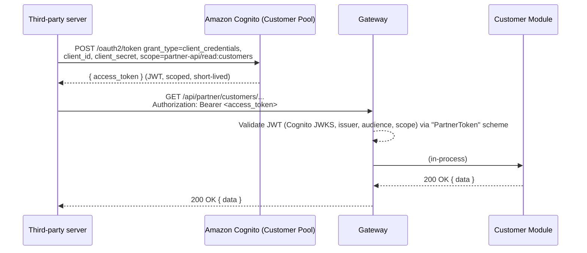

# Customer Module — Registration & Authentication Workflow

**Architecture:** see `groway-v1-architecture.md` for everything shared across all three populations — the one Gateway, one Postgres instance (this module owns the `customer` schema), one Redis (sessions tagged `population: "customer"`), the `CustomerSession` authentication scheme, route-group fail-closed enforcement, and the module-boundary/extraction pattern. Not re-derived here.

**Scope:** customer-facing registration, login (three switchable methods), and password reset. Staff/business login is a different population entirely (`growayadmin-registration-workflow.md`, `growayshop-registration-workflow.md`).

**Identity model:** Fresha-style — one global Groway customer identity per person. A customer does not belong to any tenant/business, in the data model or otherwise: a booking with a business is a transaction, not a membership. Anything business-relationship-shaped (loyalty, visit history) is out of scope, owned by a future Booking module, referencing `customer.customers.id` only by ID (no cross-schema FK, per the architecture doc §5).

**Production status:** this is a production design, first version — not a pilot. Modest scale is assumed; rigor is not relaxed because of that.

---

## 1. What the reference apps actually show

chronosclient's captured sign-in screen shows **three parallel options** — phone + SMS-OTP (shown first, most prominent), a "Sign in with email" button (no dedicated screen was captured, so its exact fields remain an assumption — §10 item 1), and "Continue with Google". Create-account bundles name/email/phone-OTP/password into one form. freshaclient has no captured registration screens; chronosbackoffice's staff login is a different population and out of scope. No "forgot password" screen was captured — designed from scratch in §6.4, using standard Cognito patterns.

---

## 2. Identity provider: Amazon Cognito (Customer Pool)

Same AWS billing/IAM boundary as the rest of the platform, a generous never-expiring free tier, native SNS/SES delivery, non-deprecated `USER_PASSWORD_AUTH`, code-based password reset.

**Passwordless phone login** is in scope via Cognito's custom-auth Lambda triggers — `DefineAuthChallenge`, `CreateAuthChallenge`, `VerifyAuthChallengeResponse` (§6.2, §8). This is the one genuinely serverless piece of this whole system: Cognito invokes Lambda triggers directly, with no in-process/module equivalent, so it sits outside the modular monolith by platform necessity, not by choice.

---

## 3. Login methods: one screen, three switchable paths

| | Phone + SMS code (**default**) | Email + password | Google |
|---|---|---|---|
| Shown | First, most prominent | Behind "Sign in with email" | "Continue with Google", always visible |
| Password required? | **No** | Yes | No (federated) |
| Mechanism | Cognito custom-auth challenge (§6.2) | `InitiateAuth USER_PASSWORD_AUTH` (§6.3) | Cognito Hosted UI redirect (§6.4... wait, see §6.5) |
| Works without a verified phone on file (e.g. Google-only account) | **No** — §10 item 1 | Yes, if it has a password | Yes |

All three are peers — the Gateway exposes three independent entry points (§5); which one the client shows first is a UI default, not a backend restriction.

---

## 4. Endpoints

| Method & path | Purpose | Backing Cognito call |
|---|---|---|
| `POST /api/customer/auth/register` | Create account: name, email, phone, password | `SignUp` |
| `POST /api/customer/auth/register/confirm` | Submit the SMS code, confirm the account, log in | `ConfirmSignUp`, then `InitiateAuth (USER_PASSWORD_AUTH)` |
| `POST /api/customer/auth/login/phone/start` | Start phone + SMS-code login (default method) | `InitiateAuth (CUSTOM_AUTH)` |
| `POST /api/customer/auth/login/phone/confirm` | Submit the SMS code | `RespondToAuthChallenge` |
| `POST /api/customer/auth/login` | Email + password login | `InitiateAuth (USER_PASSWORD_AUTH)` |
| `POST /api/customer/auth/login/mfa` | Submit an MFA code (only if a password login returned a challenge) | `RespondToAuthChallenge` |
| `GET /api/customer/auth/google/start` | Redirect to Cognito Hosted UI for Google | Hosted UI `/oauth2/authorize` |
| `GET`/`POST /api/customer/auth/callback` | Cognito redirects here after Google | `POST /oauth2/token (authorization_code)` |
| `POST /api/customer/auth/password/forgot` | Request a password-reset code | `ForgotPassword` |
| `POST /api/customer/auth/password/reset` | Submit code + new password | `ConfirmForgotPassword` |
| `POST /api/customer/auth/logout` | End the session | `GlobalSignOut` |
| `GET /api/customer/users/me` | Fetch the caller's profile | Customer Module only |
| `POST /api/customer/users/me/email/verify/start` / `/confirm` | Deferred email verification (§6.6) | `GetUserAttributeVerificationCode` / `VerifyUserAttribute` |

All under `/api/customer/*`, per the architecture doc's fail-closed route-group rule.

---

## 5. High-level flow of control



Everything here is in-process except the client-facing HTTP call and the two AWS-managed calls (Cognito, SNS). There is no cross-module call in the customer registration/login flow at all — `customer` schema is the only data this module touches.

---

## 6. Sequence diagrams

### 6.1 Registration
*(matches chronosclient's `11-create-account.html`)*



Phone is the only thing required to complete registration — the `email` in the confirm call is just Cognito's username identifier, not itself verified there. `email_verified` starts `FALSE` for `email_password` accounts (§6.6); a `google` account gets `TRUE` immediately, since Google already vouches for it.

### 6.2 Login — phone + SMS code (default, passwordless)



**Recommended Cognito setting:** "prevent user existence errors" on the Customer Pool, so an unregistered phone number still gets a fake challenge instead of an immediate error — otherwise this endpoint becomes a way to check whether a phone number has an account.

### 6.3 Login — email + password (behind "Sign in with email")



### 6.4 Login / registration via Google



### 6.5 Forgot / reset password



### 6.6 Post-login email verification (deferred, optional)

Since registration only requires phone verification, a customer can log in with an unverified email. The first authenticated screen checks `emailVerified` and, if false, shows a "Verify your email" banner — never blocks login or any feature.



---

## 7. Data: PostgreSQL (`customer` schema) + Redis + SQS + Lambda

### 7.1 PostgreSQL

```sql
CREATE TABLE customer.customers (
    id                 UUID PRIMARY KEY DEFAULT gen_random_uuid(),
    cognito_sub        VARCHAR(64)  NOT NULL UNIQUE,
    first_name         VARCHAR(100),
    last_name          VARCHAR(100),
    email              VARCHAR(255) NOT NULL UNIQUE,
    email_verified     BOOLEAN      NOT NULL DEFAULT FALSE,
    phone_number       VARCHAR(20)  UNIQUE,
    phone_verified     BOOLEAN      NOT NULL DEFAULT FALSE,
    auth_provider      VARCHAR(20)  NOT NULL,          -- 'email_password' | 'google'
    profile_picture_url TEXT,
    status             VARCHAR(20)  NOT NULL DEFAULT 'active',
    created_at         TIMESTAMPTZ  NOT NULL DEFAULT now(),
    updated_at         TIMESTAMPTZ  NOT NULL DEFAULT now(),
    last_login_at      TIMESTAMPTZ
);

CREATE TABLE customer.customer_activity_log (
    id            BIGSERIAL PRIMARY KEY,
    customer_id   UUID REFERENCES customer.customers(id),
    event_type    VARCHAR(30) NOT NULL,
    event_detail  JSONB,                                -- {"method": "phone_otp" | "password" | "google"}
    ip_address    VARCHAR(45),
    user_agent    TEXT,
    platform      VARCHAR(10),
    created_at    TIMESTAMPTZ NOT NULL DEFAULT now(),
    CONSTRAINT chk_event_type CHECK (event_type IN (
        'REGISTRATION_STARTED', 'REGISTRATION_COMPLETED',
        'LOGIN_SUCCESS', 'LOGIN_FAILED', 'LOGOUT',
        'PASSWORD_RESET_REQUESTED', 'PASSWORD_RESET_COMPLETED',
        'EMAIL_VERIFICATION_REQUESTED', 'EMAIL_VERIFICATION_COMPLETED'
    ))
);

CREATE INDEX idx_customer_activity_log_customer_id ON customer.customer_activity_log(customer_id);
CREATE INDEX idx_customer_activity_log_event_type ON customer.customer_activity_log(event_type);
```

Owned exclusively by `CustomerDbContext` (per the architecture doc §5) — no other module's `DbContext` references these tables.

### 7.2 Redis, SQS, Lambda

All per `groway-v1-architecture.md` §7, §8, and §2 above — the shared Redis with `population:'customer'`, the dedicated `customer-activity-log` queue + KEDA consumer, and the three Lambda triggers. Not re-derived here.

---

## 8. Test data

```sql
INSERT INTO customer.customers
    (id, cognito_sub, first_name, last_name, email, email_verified,
     phone_number, phone_verified, auth_provider, status, created_at, last_login_at)
VALUES
    ('11111111-1111-1111-1111-111111111111',
     'a1b2c3d4-5678-90ab-cdef-111111111111',
     'Steven', 'Zhang', 'zhangyidingchina@hotmail.com', TRUE,
     '+14166027342', TRUE, 'email_password', 'active',
     '2026-09-18 08:16:00-04', '2026-09-25 09:02:00-04'),

    ('22222222-2222-2222-2222-222222222222',
     'a1b2c3d4-5678-90ab-cdef-222222222222',
     'Victoria', 'Chai', 'chai.tori@gmail.com', TRUE,
     NULL, FALSE, 'google', 'active',                    -- no phone on file: §10 item 1
     '2026-09-04 14:12:00-04', '2026-09-18 11:00:00-04'),

    ('33333333-3333-3333-3333-333333333333',
     'a1b2c3d4-5678-90ab-cdef-333333333333',
     'JiHae', 'Jeon', 'jjhc0925@gmail.com', FALSE,
     '+16477780717', TRUE, 'email_password', 'disabled',
     '2026-09-09 19:13:00-04', NULL);

INSERT INTO customer.customer_activity_log (customer_id, event_type, event_detail, ip_address, platform, created_at)
VALUES
    ('11111111-1111-1111-1111-111111111111', 'REGISTRATION_COMPLETED', NULL, '203.0.113.10', 'web', '2026-09-18 08:16:00-04'),
    ('11111111-1111-1111-1111-111111111111', 'LOGIN_SUCCESS', '{"method":"password"}',  '203.0.113.10', 'web', '2026-09-20 09:00:00-04'),
    ('11111111-1111-1111-1111-111111111111', 'LOGIN_SUCCESS', '{"method":"phone_otp"}', '198.51.100.7', 'ios', '2026-09-25 09:35:00-04'),
    ('22222222-2222-2222-2222-222222222222', 'LOGIN_SUCCESS', '{"method":"google"}', '198.51.100.24', 'android', '2026-09-18 11:00:00-04'),
    (NULL, 'LOGIN_FAILED', '{"method":"phone_otp"}', '198.51.100.99', 'web', '2026-09-20 22:05:11-04');
```

*Victoria Chai (`google`) has `phone_number = NULL` — a realistic Google-registered customer who never provided one; she can log in via password or Google, but not phone+OTP until a settings feature (not designed here) lets her add and verify one.*

---

## 9. Third-party / machine-to-machine (M2M) API access

Case A only (a third party calling as itself, not on behalf of a specific customer). Cognito Resource Server + client-credentials App Client on the Customer Pool, authenticated via the `"PartnerToken"` scheme (architecture doc §6.3), under `/api/partner/*` — a real Cognito-issued JWT, deliberately the one case where that's presented directly, since the caller is a server, not a customer.



---

## 10. Open questions

1. **Google (or any federated) accounts with no verified phone number can't use phone-OTP login.** No "add and verify a phone number later" flow designed yet.
2. **Redis session payload doesn't record which login method created it** — only the Postgres activity log does. An additive field if you want the session itself to know (e.g. to require step-up auth for a sensitive action).
3. **Rate limiting for phone-OTP** beyond one challenge's own retry count (a customer-level "too many codes requested today" limit) needs Lambda-side state (e.g. DynamoDB) — not designed here.
4. **"Prevent user existence errors"** — recommended in §6.2, not yet confirmed as an actual Cognito User Pool setting.
5. Session lifetime policy, MFA, device/session-management UX, and the Google native-SDK upgrade option remain open, same as before.
